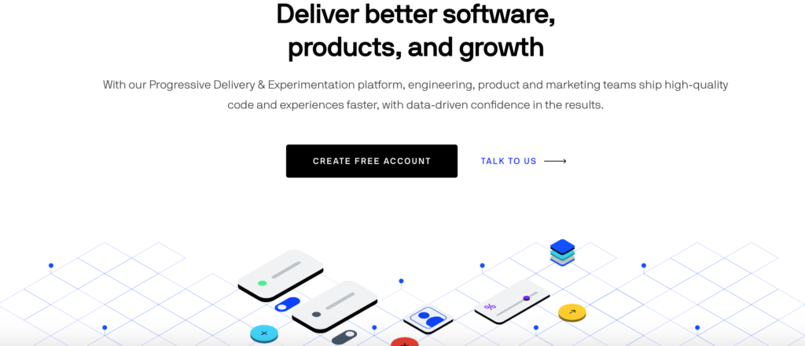
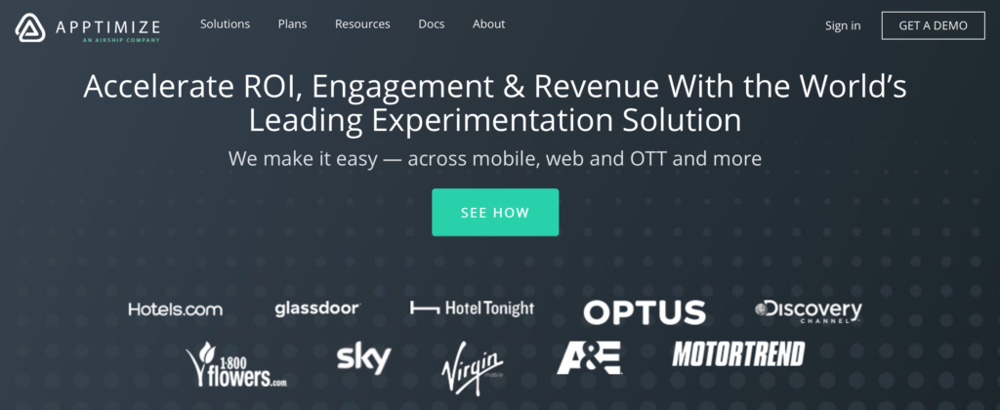
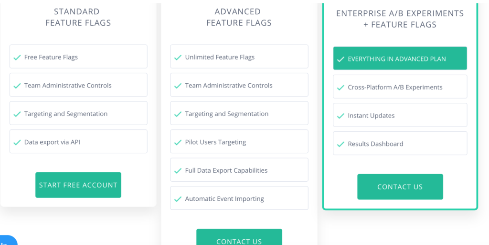
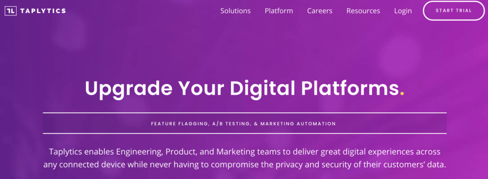

We spoke about the best practices in mobile app A/B testing in our [last post](https://tapadoo.com/best-practices-for-mobile-app-a-b-testing/). Here we cover three of the best mobile app A/B testing tools. These tools allow you to run experiments that improve the design of your app while increasing conversion rates. By running these tests you improve the overall experience of your app while making a positive impact on conversion. Using the right tool allows you to test your hypotheses within your app with accuracy and confidence.

### Optimizely

[Optimizely](https://www.optimizely.com/plans/)

Optimizely is a leading mobile app A/B testing tool or in their own words, 'the world's leading experimentation platform'. It allows businesses to deliver continuous experimentation and personalisation for their mobile app. You can experiment with onboarding, feature discovery and re-engagement strategies. By running these tests you improve the user experience while increasing engagement and retention. You can test new features and quickly remove ones that don't work. Optimizely allows you to change your app's behaviour in real-time without waiting for the App Store or Google Play review.

#### Optimizely A/B Testing Features

- Feature flags: Easily enable, disable, hide, or roll out a product feature at runtime. Choose who gets access to new features.
- Instant updates: Make updates to your experiments and variables in real-time without waiting for your next App Store release.
- Phased rollouts: Reduce the risk of launching new features by rolling them out first to a small set of users, either random or targeted.
- Audiences: Define custom attributes for fine-grained targeting and segmentation.
- Whitelists: Quickly QA experiments by forcing specific users into variations.
- Traffic splitting: Easily create randomized traffic switches anywhere in your app without affecting performance.
- Environments: Manage experiments across development, staging, and production environments.
- Event tracking: Monitor all the conversion metrics and KPIs you care about, in your app or any other service.
- Custom configuration: Easily swap out your own components for logging, error handling, event dispatching, integrations, and more.
- Multichannel experimentation: Set your own user IDs to create consistent personalized experiences across all your customer channels.
- Raw event export: Easily download the complete event data from Optimizely.
- Optimizely Stats EngineSee the impact of your experiments in real-time, with the world’s leading Experimentation Platform.
- Enterprise-ready security: Roles and permissions, 2-factor authentication, and single sign-on (SSO).
- Account-level experimentation: Ensure consistent experiences when experimenting on customer accounts; optionally split traffic based on account IDs instead of user IDs.

#### Optimizely Reviews

Optimizely is the go-to platform for A/B testing for enterprise clients. Many reviewers across a number of reviewing platforms have noted that it is easy to use and understand. Optimizely analyses the data for you, so it's simply a matter of observing the data. Other users have noted its ability to segment users based on attributes such as age, location, and platform, and evaluate interface concepts, data and headline changes, as well as the phased deployment of completed features. Also, the rich dashboard to monitor experiments and provide data snapshots during a campaign.

On the negative side, it has been noted that app integration is more challenging than the script used for the web, although there are client libraries in Swift, Java and other languages to make it easier.

#### Optimizely Pricing

You need to contact [Optimizely](https://www.optimizely.com/plans/) directly for their pricing plans. Most of the packages are custom-built, which means prices vary. Optimizely have built a powerful platform so expect pricing to be on the higher end of the bracket and aimed at enterprise clients. There is no paid version or free trial.

You can read more about Optimizely on their [feature flag information page](https://www.optimizely.com/optimization-glossary/feature-flags/).

### Apptimize

[Apptimize](https://apptimize.com)

Apptimize provides mobile A/B testing as well as feature flagging, phased rollouts, and analytics for native Android and iOS applications. Apptimize has been developed so that mobile product teams get the most out of their applications. The easy to use visual editor allows you to run a variety of tests on a number of variants in your app.

#### Apptimize A/B Testing Features

- Audience Targeting
- Split Testing
- Funnel Analysis
- Statistical Relevance Analysis
- Multivariate Testing
- Visual Editor

#### Apptimize Reviews

Apptimize has received mainly five stars across all reviewing platforms. One reviewer commented, "the fact that it's native and so easy to manage makes it a must-have tool for our business." Apptimize allows developers to designate success metrics for each test and then provides the dashboard to make it easy to compare those metrics across variants. The visual editor is easy to use along with setting up tests and multiple features. Apptimize also invests in their customers and listen to their feedback. They even offer advice on your A/B strategy.

It was difficult to find any negative comments about Apptimize. At best there were very few suggestions such as, "It would be great to have a quick overview of all my environments so I can see what is happening at a glance rather than have to go into each environment."

#### Apptimize Pricing

Apptimize offers three plans. The standard features plan is free and then you need to contact [Apptemize](https://apptimize.com) for pricing of the advanced features and enterprise A/B experiments.

[Apptimize](https://apptimize.com/plans/)

### Taplytics

[Taplytics](https://taplytics.com)

Taplytics is a mobile A/B testing service for native apps. By integrating their small SDK in your app, you can run experiments and deploy them to users without requiring an app store update. They specialise in turning first-time users into lifetime customers. The Taplytics integration is an embedded kit integration and supports the Android, iOS, tvOS, and Web platforms.

It allows you to test both your iOS and Android applications and make data-informed decisions. The company’s The A/B testing tool features easy setup, comprehensive visualization, custom segmentation and detailed reporting. It has advanced A/B testing to test any app interface element.

You can make changes to anything you can see and touch inside your app including buttons, copy, images, and colours. You can easily customise your user interface and user experience to address user needs by testing onboarding funnels, menus, search features, and more. You can make stress-free releases by controlling feature roll-outs and tracking their real-time impact with their Launch Control flagging tool.

#### Taplytics A/B Testing Features

- Target Specific Segments of Users
- Easily deploy or hide features
- Perfectly time launch sequences
- Detailed reporting
- Advanced A/B testing features on a premium plan

#### Taplytics Reviews

The main reviews for Taplytics is that it is easy to set up and has great customer support. You can also integrate with Mixpanel and Google Analytics.

#### Taplytics Pricing

Taplytics offers a free trial, premium and subscription pricing model. You need to contact the [company](https://taplytics.com) for prices.

Both Apptimize and Taplytics are primarily classified as Mobile A/B testing tools, whereas Optimizely is primarily classified as A/B Testing Analytics.
