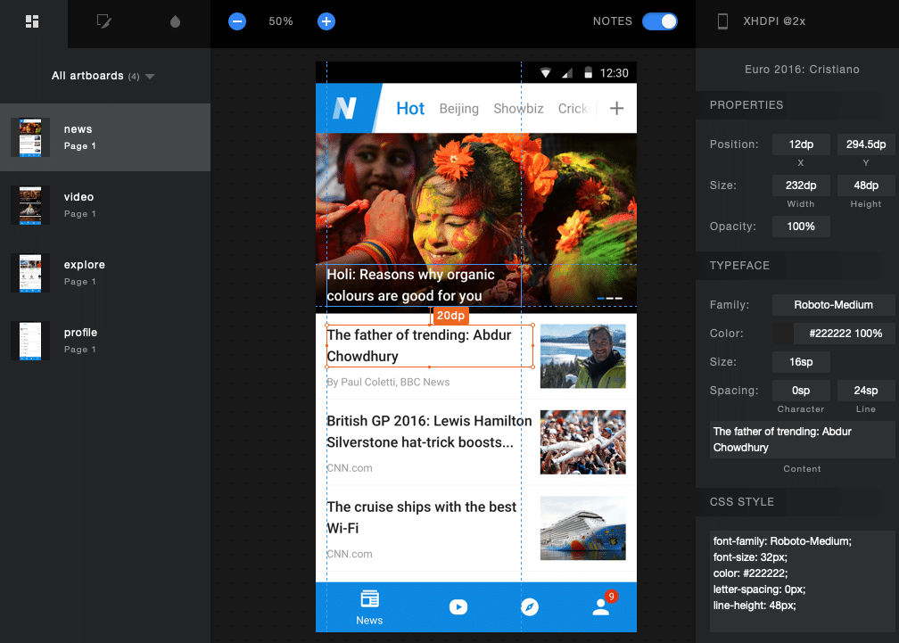
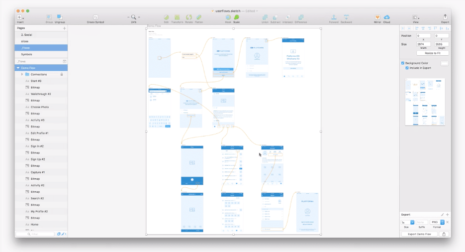
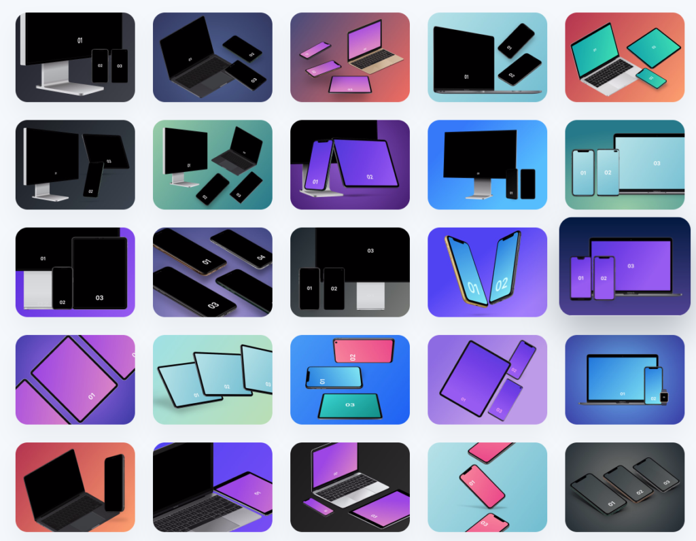
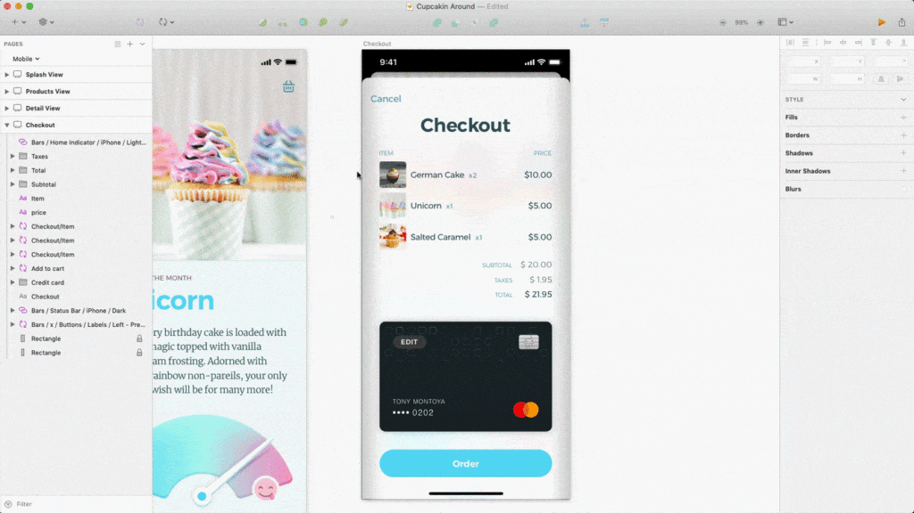

The best plugins are not only reliable but complement your workflow and enhance your designs. Here’s a quick list of some of our favourites that are useful not only for app designers, but anyone using Sketch as their main design tool. 

### Sketch Measure

HTML Output from Sketch Measure Plugin

Sketch Measure is a plugin that generates all design details from colours, heights, widths, types styles, and spaces into one handy interactive HTML page that can be passed onto developers. It will also generate assets as defined in your Sketch document and bundle them into the files for the developers. It’s available from [UTOM](https://utom.design/measure.html) and on [GitHub](https://github.com/utom/sketch-measure). There's a [preview of what the output](https://utom.design/news/) is from UTOM's site to give you a feel for what it can bring to your handover.

### User Flows by Aby Nimbalakr

This is a simple and effective way to generate flow diagrams from artboards in Sketch. [User Flows](https://abynim.github.io/UserFlows/) has simple keyboard shortcuts to define links between artboard and add conditional notes between each step. It’s simple, it’s open-source and comes in really useful especially when you need to add more features to an existing design where going back to a basic wireframe isn’t practical. 

### Spell Check Whole Page by Tallwave

It’s very easy when in “design mode” to forget about the text you’re adding. Lorum Ipsum doesn’t cut it for me, so I try to add what I think the text could look like. Because I am more focused on the design than the words, it’s really easy for spelling mistakes to be included. Even if you have text provided to you that you need to copy and paste, with all the moving parts, text can sometimes be altered unintentionally. As there’s no live spell check in Sketch, this plugin by Tallwave allows you to run a spell check on each page of your document before you send it on to the client. Again this is open-source and available on [GitHub](https://github.com/Tallwave/sketch-spellcheck-all-layers)

### Angle

If you’re going into a pitch and need sleek shots of your designs in device cases then Angle provides more than 1900 device mockups at different angles. While this one isn’t free if you regularly need to pitch app-based products and are looking for something outside of the face-on view of a device it’s worth the investment. 

### Unsplash

[Patrick Tomasso on Unsplash](https://unsplash.com/photos/KGcLJwIYiac)

If your app needs some gorgeous imagery for a gallery or news feed, [Unsplash](https://unsplash.com) has an easy to use plugin that will either randomly select an image from their curated content, or you can input a theme like “people” and it will choose one for you. 

## One I’m hearing good things about...

### Rename It

[Rename It for Sketch](https://renameit.design/sketch/)

Admittedly, I fall into the trap of unorganised layers quite often. It’s something I’m trying to improve on. With this in mind, I’ve come across [Rename It for Sketch](https://renameit.design/sketch/) which has some interesting processes for renaming layers, artboards and groups of content in batches.

## Find more Sketch plugins from:

[https://www.sketch.com/extensions/plugins/](https://www.sketch.com/extensions/plugins/)

[https://www.sketchappsources.com/plugins-for-sketch.html](https://www.sketchappsources.com/plugins-for-sketch.html)

## A cautionary tale..

A word of warning that many of you will be familiar with. Plugins need to be kept up to date with the updates to Sketch and can often break temporarily when a new version of Sketch is released. So if you rely on any particular plugin and are under time constraints, it's advisable to wait until you know the version is stable. Check on [Twitter](https://twitter.com/sketch) how people have reacted to the latest update and if it will affect any primary feature you use. As I was writing this, I thought, "Hey I'm not using Sketch right now, I'll update it". I did not check the Twitter feed... and now, none of my plugins work! Off I go to sort this out...
