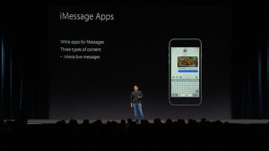
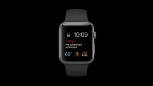
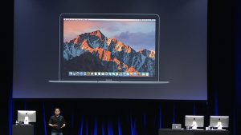
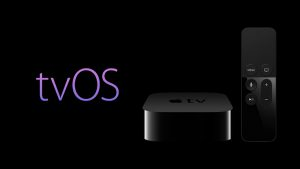

### **World Wide Developer Conference 2016**

The Apple World Wide Developer Conference (WWDC) has finally arrived. The annual event is used by Apple to announce and showcase their latest products and technologies. It's the biggest Apple event of the year, watched by millions of fans and developers around the world, and we here at Tapadoo are no exception.

This year’s conference was devoted to software. We were presented with powerful updates to iOS, tvOS, watchOS, and the newly named macOS Sierra among other technologies.

**iOS10**

iOS10 presented us with some impressive upgrades. Cool new features such as raising your wrist to “wake up” your phone are making interaction with your smart devices seamless and elegant.  The redesigned lockscreen with its rich notifications and use of 3D touch mean you can do much more without ever having to unlock your phone and dig through apps.

One of the most exciting aspects of iOS 10 is third party integration with Apple default apps and services like Siri, iMessage and Apple maps.

In the iOS10 iMessage app this will allow you to use other apps from within your conversations. You will be able to do things like order food, buy concert tickets or even send money using iMessage compatible apps.

There will be a “mini” app store built into iMessages allowing users to browse iMessage apps or “extensions” and install them from within the app.

With the new Siri SDK developers will be able to build Siri support into apps. This will allow tasks to be performed like asking Siri to send a message in WhatsApp.

Finally, prepare to be amazed. In iOS10 emojis have been revolutionised. With predictive emojis, the ability to convert words into emojis, and emojis that are three times bigger - we have truly made a leap into the future.

 :P

But really, things are looking very good for iOS 10 and I’m looking forward to its full release.

**WatchOS3**

The main focus of watchOS this year was speed. The watch has experienced some serious increases in performance and speed that allow you to access your favourite apps much quicker and navigate more efficiently.

**macOS Sierra**

OSX has received major updates and has been renamed macOS. The first release will be called macOS Sierra. Some interesting additions include bringing Siri to mac, the ability to store old files in the cloud, and auto unlock with the apple watch. macOS seems very promising and I’m looking forward to how it develops in the next few years.

**tvOS**

Siri on tvOS has been improved. You can topic search for movies, youtube search and tune in to live channels using Siri.

A new iOS remote app for tvOS has been created, replacing the outdated technology of a physical remote control, and reducing the chance for arguments over who lost the TV remote. This amalgamation of technologies brings us closer to being able to control every aspect of the home and daily life with our smart device.

**HomeKit**

This brings me on to one of my own interests, and my favourite part of the conference this year. Improvements to HomeKit.

HomeKit now has an app in iOS10 which allows you to control and interact with your HomeKit enabled accessories and sensors. With Siri integration, you can control your accessories and appliances simply by talking to them. Advances in technology like this are particularly interesting to me and I hope to see more work done with HomeKit in the near future...

This has only been a brief look into the announcements and exhibits held at this years conference. It was jam packed with progressions in Apple technologies and it has me excited to see how things have changed this time next year.

Thanks for reading and make sure to check out [Stephen's blog](https://tapadoo.wpengine.com/2016/my-thoughts-on-io-no-9/) on Google’s WWDC equivalent “ I/O” to get a comparison on the respective companies objectives and ambitions.

Until next time!

_\-Darragh_
