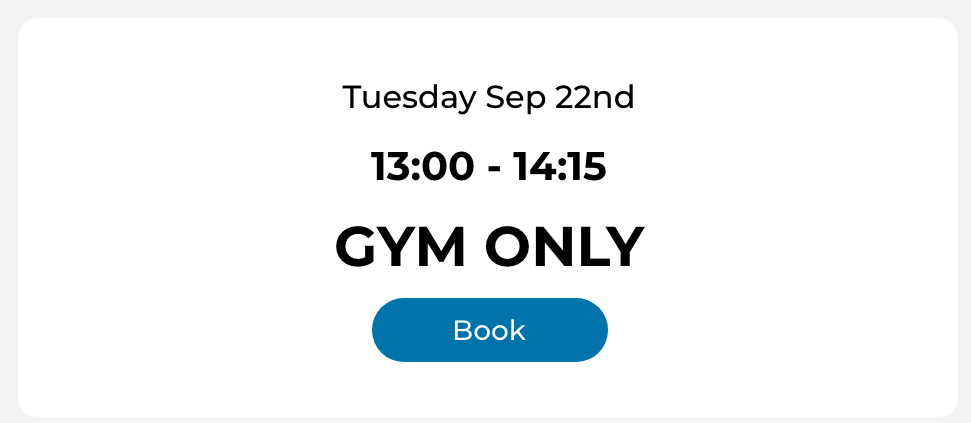
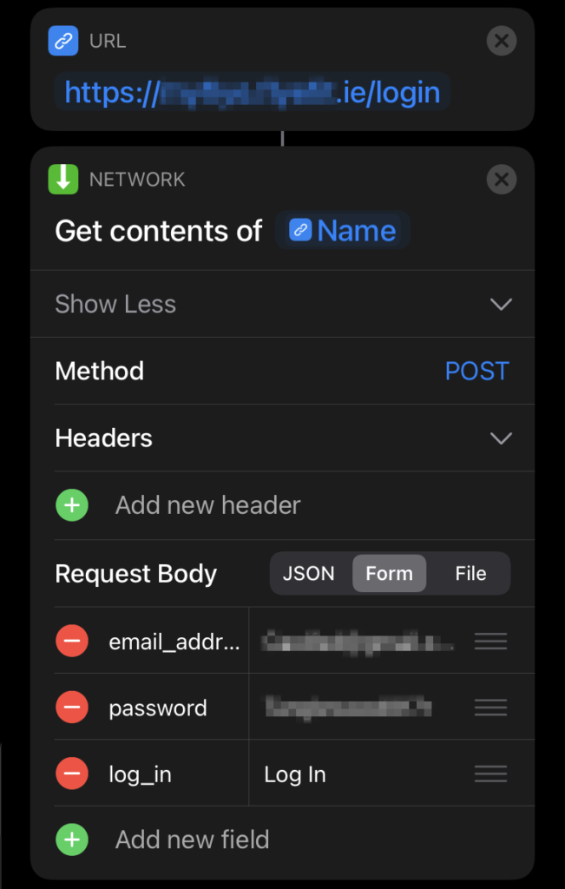
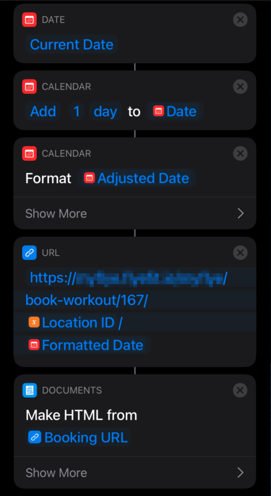
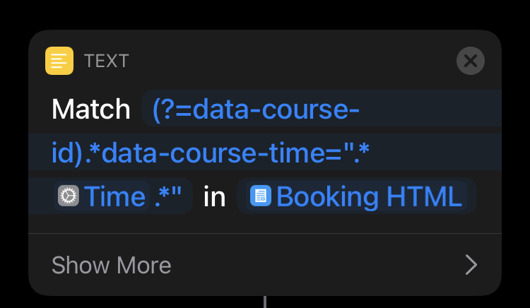
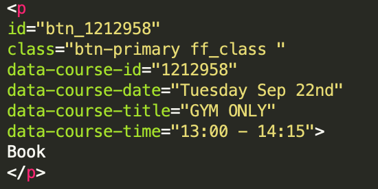
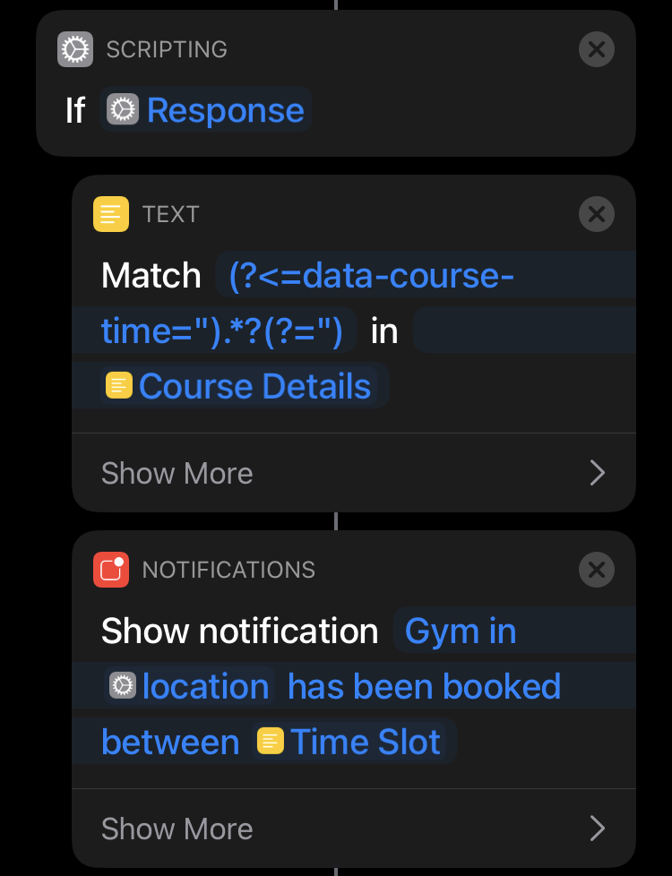
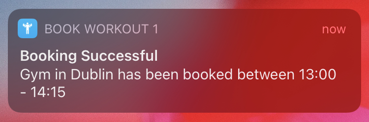

We’ve all had to make huge adjustments and sacrifices to our daily routine during the COVID-19 pandemic. Many things we do daily takes more time than it used to, queuing to buy bread in the local shop for example, or booking a time slot in the local gym in advance of attending.

Apples' native app, Shortcuts, allows you to automate specific tasks. 

It can be triggered manually by selecting the shortcut or automate it to be triggered automatically. 

An example of a task you can create is; when I arrive at my gym, start a workout on my watch and start playing music from my gym playlist. 

Once restrictions started easing, gyms started reopening. My gym in particular had, and still has, many restrictions in place to keep everyone safe. One in particular is their new booking system. 

What may be a solution for the gym, actually turned out to be a bit of a problem for me. So I thought I’d use the Shortcuts app to make things a little easier for myself.

## The Problem

The booking system is a great way to keep numbers limited and allowing a regular cleaning schedule. There are multiple slots a day, each slot being 75 minutes long with a 15-minute gap to accommodate cleaning before the next group. 

There are constraints on the booking system however. You can only book one gym slot a day and bookings for any particular gym slot are open 24 hours beforehand.  So if I wanted to book a gym session for 7:00am on a Thursday, the earliest I can book is 7:00am on the Wednesday prior (and these slots fill up quick).

Gym Website - Booking a gym slot UI

## Could I automate this?

In order to automate this I needed to first figure what actions I need to take in order to successfully book a session. I did the full process of booking a gym slot through the website and inspecting the requests made. I produced the following steps:

1. Log into the website
2. Navigate to the booking screen
3. Find the booking slot ID
4. Send a request to book the slot I wanted 

So I got to work.

## Creating my Shortcut

I went into the app on my iPhone and created a new shortcut. From here, you can select from a number of actions to run in order to start building your shortcut. Essentially, these are tasks that are in the form of a widget which can be used in sequence to create a full piece of code.

Shortcuts App - Login request actions

### 1\. Logging in

This was a relatively simple step. I added the URL action from the menu and entered the login URL I had grabbed from the website. I then added the Get Contents of URL action which allows you to send requests. Within the request you can select the method, I selected POST and created the request body which had the headers email\_address and password along with my login details (having my login details here in plain text isn’t secure but sure, gets the job done).

And I’m in. \*insert hacker gif here\*

### 2\. Navigating to the Booking Screen

Next I needed to build the URL to navigate to the correct booking screen. I got the base of the URL from the website which I hardcoded into the shortcut but needed additional path information. I needed the gym ID and the date I wanted to book. The gym IDs I got through inspecting the web page and the date was just tomorrow’s date, since this shortcut needed to run the day before the gym slot I wanted, formatted to be YYYY-mm-dd.

Shortcuts App - Creating a HTML document for the booking page

Pretty straight forward.

### 3\. Find the Booking Slot ID

Here is where I found some limitations to Shortcuts. The booking ID itself is embedded in the HTML as an attribute of the button element used to book the time slot. 

#### Attempt 1

My initial idea was to use JavaScript (JS) to get the ID. I wrote the code on my computer then went to run it in Shortcuts and I ran into an issue. In order to run JS in Shortcuts, you need to run it through a Safari web page. A new Safari web page would be created with no cached data. 

I had lost my cookie!

Therefore I was no longer logged in and no longer able to access the booking screen. I was determined to make this work with Shortcuts’ actions and not have to resort to full JS. I made many attempts. I tried logging in to a Safari web page but couldn’t run the JS after. I tried capturing the cookie but realised I would have to use JS again to retrieve it from the request header.

I gave up.

Then that week, I got up at 6am, raced to the gym only to discover I hadn’t booked my gym slot and had to do the cycle of shame home. My quest to make Shortcuts work continued.

#### Attempt 2

I scraped my first idea of using JS and started down a more “hacky” track. 

I realised I could get the page source HTML from the booking URL and convert it to a document. Within this document, I have the button element that contains all the info I need. I can’t run JS in this doc but I can use a bit of Regular Expression (RegEx). 

I took a sample of the button element and saw there is two relative pieces of information, the `data-course-id` attribute which is the booking ID I need and the `data-course-time` attribute which is the time I need to use to search for the correct button element.

After much trial and error along with a RegEx cheatsheet I was able to produce this statement that would find the button element:

(?=data-course-id).\*data-course-time=“.\*TIME\_SLOT.\*”

Shortcuts App - RegEx expression for getting the button element

`TIME_SLOT` in this statement is a variable that needs to be passed to match the button element I wish to book. If `TIME_SLOT` is set to “13:00” it would match this text :

data-course-id="1212958" 
data-course-date="Tuesday Sep 22nd" 
data-course-title="GYM ONLY" 
data-course-time="13:00 - 14:15"

HTML Element - An example of the button element used to get the booking ID

We’re getting somewhere.

Now for a final RegEx statement to match just the booking slot ID:

(?<=data-course-id=“)\\d\*

With the booking ID we can finally actually book a gym slot

### 4\. Booking my gym slot

Similar to step one, all there’s left to do is to make a POST request with the booking ID as a parameter and there we have it.

_Thank you for booking your gym slot_

Notification for a successful booking

I got my booking confirmation email and my days of forgetting to book were behind me. Additionally, I added a notification to indicate whether the booking was successful and set the shortcut to run 24hrs before the gym slots I wanted each week.

### Conclusion

Although I may have achieved my goal of automating my bookings this is far from a perfect solution. It’s tightly coupled to the web page structure so if changes are made to the website my Shortcut will stop working. 

It was fun playing around with the Shortcuts app and can see many examples of how it can be used in everyday life. Shortcuts seemed to have been developed with simple tasks in mind so complex tasks, like my workout booking shortcut, are quite challenging to achieve. Each task you want needs to be implemented as an action in the app and if it’s not, well time to get a bit creative.

Shortcuts does require a bit of basic coding understanding and there’s very limited resources on how to use it. But it's worth looking at if you like this type of thing.

Why not give it a go yourself?

If you want to see the full shortcut you can access it [here](https://www.icloud.com/shortcuts/e1857bed19aa4000badd9a530db19858).

Caoife Davis
