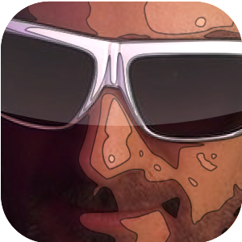

So, a few months back during the "overloaded summer of 2010", we needed more capacity, and we needed it immediately. I took a look around XCake, to see who may be in a position to help.

We knew Liam already - really liked his [red spiders](http://itunes.apple.com/ie/app/red-spiders/id347882628?mt=8) (iTunes Link) app, so we asked him to take on some contract based work.

Liam took on his new project with gusto, and we knew from an early stage he was just the man to add strength to the tapadoo team.

Cue some lunches where we spent our time attacking the concept of working for a big corporate and bestowing the benefits on working on software that...like...sees the light of day, and gets used by people by choice..and doesn't required being woken up in the middle of the night for support calls..and we had him persuaded pretty soon.

So Liam has come on board full time since early last month. Some of you will know him as [@liamdunne](http://twitter.com/liamdunne).

Apart from iPhone development, Liam occasionally produces music, [creates his own remixes](http://soundcloud.com/lmd64), and is one of the wittiest men in 140 characters.

Welcome, Liam Dunne.
