We've compiled the Apple Christmas Gift Guide 2018 to help make Apple Christmas shopping a little easier this year.

2018 has been a bittersweet year for us Apple customers. On one hand, we’ve seen tremendous price hikes across almost every product line Apple has refreshed this year. From the Watch all the way up to the Mac, some estimates have averaged this increase around 20%. All of this means it’s never been a more expensive time to be an Apple fan.

On the other hand, it’s been really quite an exciting year given the quality of the products they have released. We’ve seen the new take on the iPhone that was previewed by the iPhone X last year creep down into the main line of phones with the iPhone XR. The Mac has gotten solid improvements across the line. And the iPad and Apple Watch have extended the already vast lead they enjoy over their competition.

These price increases make it more important than ever for us as consumers to make informed decisions about our purchases so that we get the best value for our hard earned money. To this end, we’ve put together this Apple Christmas Gift Guide to help you differentiate between the various Apple offering and see what might work best for you. We hope you find it useful.

## Apple Christmas Gift Guide 2018

## iPhone

### iPhone XR

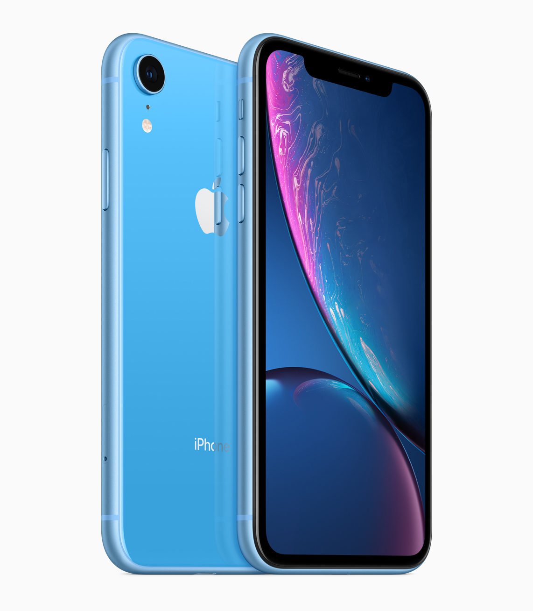

From €879  
[iPhone XR - Apple (IE)](https://www.apple.com/ie/iphone-xr/)

The iPhone line had always been quite predictable. Each year a new phone (and it’s plus sized equivalent) would be announced to the world in September. It would slot in approximately around the same price as the phone which came before it. Meanwhile, it’s predecessor would drop in price to become a more affordable option.

However, in 2017 there was an added curve-ball. Alongside the iPhone 8, Apple unveiled the iPhone X, which they said was their vision for the future. It featured a front almost entirely dominated by the screen. And it was priced accordingly, starting at an eye-watering €1179. 

This year has seen many of the ideas first shown in the iPhone X brought to the more usual (if still exasperatingly expensive) €850 approx. eye-watering point. As such, the iPhone XR is really a very exciting product. It features a gorgeous 6.1” screen complete with notch, Face ID for unlocking your phone, a magnificent camera and Apple’s latest processors. And as a bonus, the XR is available in 6 beautiful colours, giving customers a level of choice that they have rarely enjoyed when buying an iPhone. If you are buying a new iPhone and you want a great one, this is probably the phone to get.

### iPhone XS, XS Max

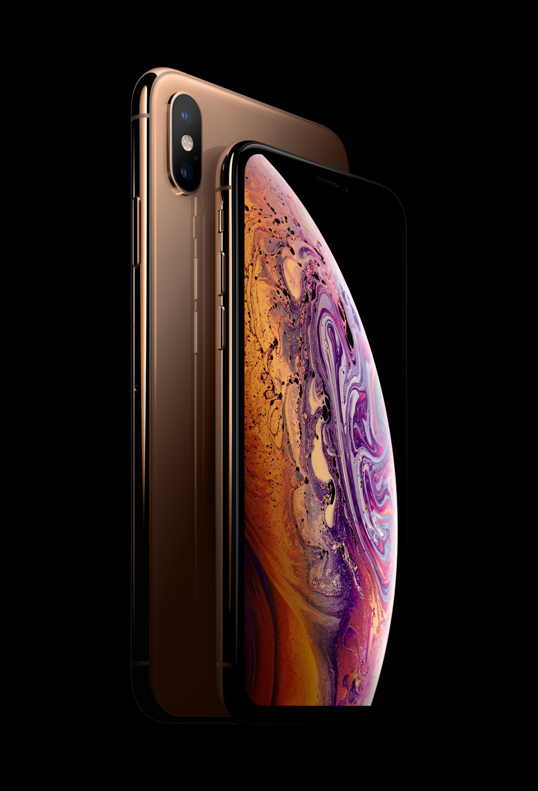

From €1179  
[iPhone XS - Apple (IE)](https://www.apple.com/ie/iphone-xs/)

Alongside the iPhone XR, Apple has kept the idea of a truly premium iPhone option alive. They have packed their latest processor and camera into the same body as last years iPhone X and called it the iPhone XS. Alongside this, they have released the iPhone XS Max which features the largest screen on an iPhone ever.

It’s worth noting that these two phones feature the same processors and same primary camera lens featured in the iPhone XR. However, there are a few places they differentiate themselves. They feature a second camera lens which allows for a 2x optical zoom and 10x digital zoom, a brilliant OLED screen that is considered the best on the market and a premium steel frame as opposed to the aluminium one of the iPhone XR. But these improvements come with a price tag.

While there is no doubt the XS represents the best iPhone available, unless you truly idolise your iPhone and demand only the best regardless of the cost, it’s hard not to recommend that most people will be perfectly delighted with the iPhone XR.

### iPhone 7 & iPhone 8

iPhone 7 from €539  
[Buy iPhone 7 and iPhone 7 Plus - Apple (IE)](https://www.apple.com/ie/shop/buy-iphone/iphone-7)  
iPhone 8 from €709  
[Buy iPhone 8 and iPhone 8 Plus - Apple (IE)](https://www.apple.com/ie/shop/buy-iphone/iphone-8)

Apple have kept the iPhones 7 & 8 available this year too as cheaper options. These will be more familiar to many staying close to the design that started with the iPhone 6 in 2014. These remain great phones at more budget friendly prices (if still expensive). The iPhone 8 is just one year old and it’s processor remains faster than most of the iPhone’s top competitors from this year. Both these phones remain solid products if you’d prefer to keep some money in your pocket.

## iPad

### iPad Pro (New)

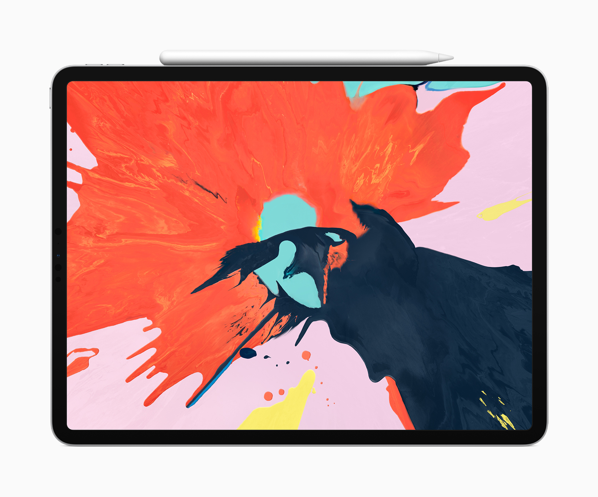

From €909  
[iPad Pro - Apple (IE)](https://www.apple.com/ie/ipad-pro/)  
The new iPad Pros may well have been the biggest “wow” from Apple in 2018. With the home button removed, the screens dominate the front of the device like never before. They are also the thinnest iOS devices Apple has made and pack an almighty performance punch, surpassing many of Apple’s own MacBook range. With Apple’s “Pencil” stylus and keyboard cases, the iPad is more capable than ever. However, all this “wow” comes at with a correspondingly “wow” price tag. Especially if you add the Pencil and/or keyboard case, which most people will want to. The “Pro” moniker seems very apt in the iPad’s case. The iPad would likely want to represent your primary computer if you were to go for a Pro.

### iPad Pro (Old)

From €749  
[Buy iPad Pro - Apple (IE)](https://www.apple.com/ie/shop/buy-ipad/ipad-pro-10-5)  
Last year’s 10.5” iPad Pro’s remains on the market as a somewhat more affordable option. It’s a wonderful iPad but it’s hard not to think of it lost a little in the middle between the more affordable 9.7” iPad, which can do most of what the 10.5” iPad can do at almost half the price, and the new iPad Pros which feel so much more lust worthy. It is still a great device tho and some may deem it the right compromise for them.

### iPad 9.7”

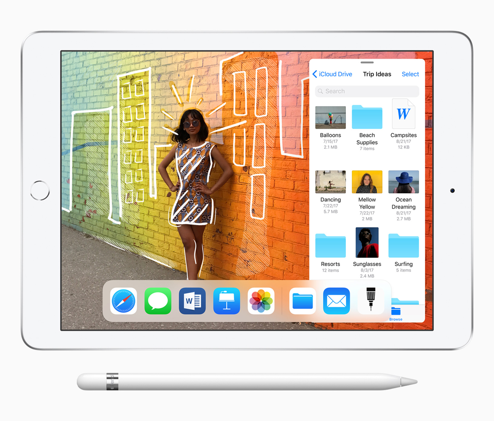

From €369  
[iPad 9.7 - Apple (IE)](https://www.apple.com/ie/ipad-9.7/)  
This is the iPad for most people. And a rare example in Apple’s line up that actually feels like a pretty fair price! For the price tag, this is a whole lot of iPad. It’s processors are fast, it’s screen is good and now it also supports the Apple Pencil. At around 40% the price of the new iPad Pros, this represents the best iPad option for most.

### iPad mini 4

From €449  
[iPad mini 4 - Apple (IE)](https://www.apple.com/ie/ipad-mini-4/)  
The iPad mini’s continued presence in the Apple line up is curious. It hasn’t been updated in over 3 years and yet remains at a higher price than it’s much more powerful and capable 9.7” sibling. It seems to be left there incase someone somewhere simply must have a smaller iPad. For everyone else, there is very little reason to recommend it’s purchase.

## Watch

### Apple Watch Series 4

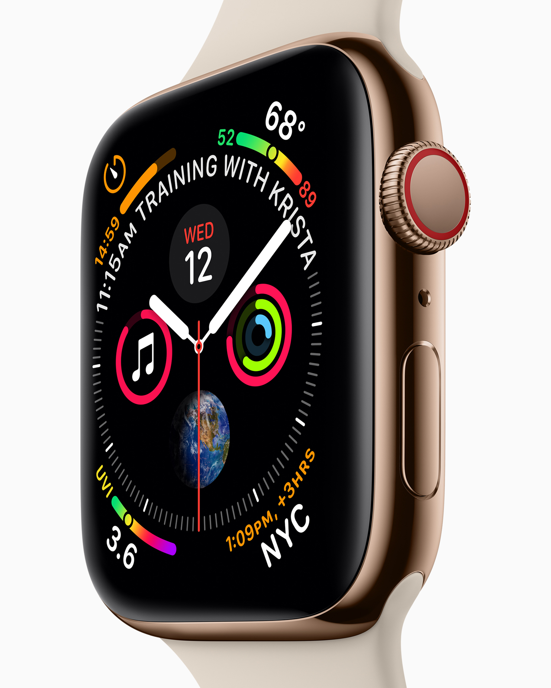

From €439  
[Apple Watch Series 4 - Apple (IE)](https://www.apple.com/ie/apple-watch-series-4/)  
This year’s Apple Watch represents the first redesign since the original. And the subtle changes have made a surprising difference. Along with the standard yearly improvements in it’s processing power and it’s watchOS software, the Apple Watch Series 4 has matured into a very nice device indeed. It’s worth noting that the network connected Apple Watch is not available in Ireland, so the Apple Watch remains very much dependant on the iPhone.

### Apple Watch Nike+

From €439  
[Apple Watch Nike+ - Apple (IE)](https://www.apple.com/ie/apple-watch-nike/)  
The Apple Watch Nike+ is the same as the Apple Watch Series 4. But for the same money, you get some extra exclusive Nike watch faces and a Nike strap instead of an Apple one. If you are buying a Series 4, it’s probably the Nike one you should get unless you don’t like the accompanying straps.

### Apple Watch Series 3

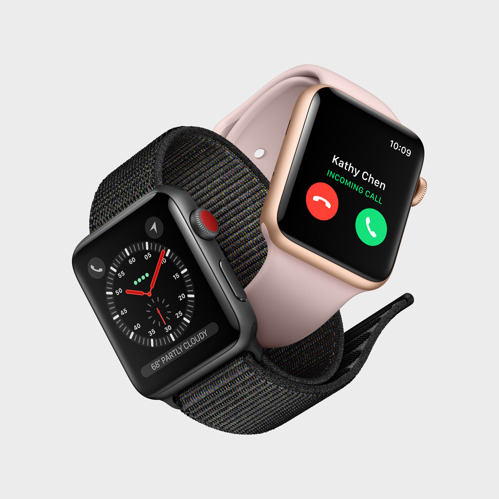

From €309  
[Apple Watch Series 3 - Apple (IE)](https://www.apple.com/ie/apple-watch-series-3/)  
Last year’s Apple Watch Series 3 remains on the market to provide a cheaper alternative to the Series 4. This is likely to be a popular option for many this Christmas, especially those who have not owned a previous Apple Watch and aren’t sure how much use they will get from one.

## Mac

### MacBook Air

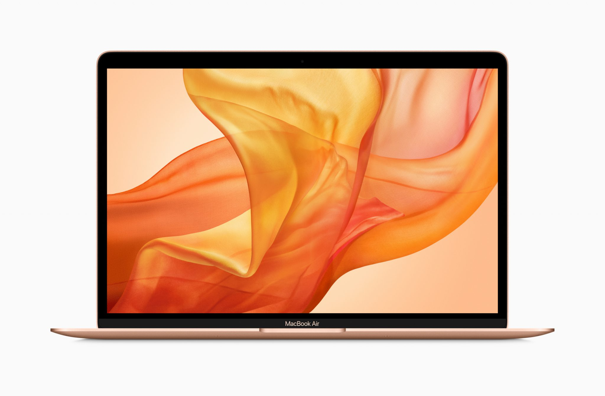

From €1379  
[MacBook Air - Apple (IE)](https://www.apple.com/ie/macbook-air/)  
The MacBook Air finally got it’s long needed refresh this year and the result is a very nice laptop. The biggest and most important change is the new Retina Display which is a vast improvement over the aged display of the previous model. However, there has been other changes too to bring the Air inline with the rest of Apple’s laptop lineup. For example Touch ID, USB-C ports and Apple’s divisive new butterfly keyboard mechanism. All things considered, this is now the go to Apple laptop for most consumers.

### MacBook

From €1549  
[MacBook - Apple (IE)](https://www.apple.com/ie/macbook/)  
The MacBook finds itself in a strange place in the post MacBook Air refresh world. It’s now less powerful and more expensive than the Air. It still has certain advantages over its sibling in it’s diminutive size, weight and the fact it has no fan (meaning it can run quieter). But, on the whole, it’s a hard sell next to the Air. The Air is plenty small and light, it’s faster and cheaper, and it offers a more roomy screen. Unless portability is your greatest necessity, the MacBook Air is probably a better shout for your cash at the moment.

### MacBook Pro

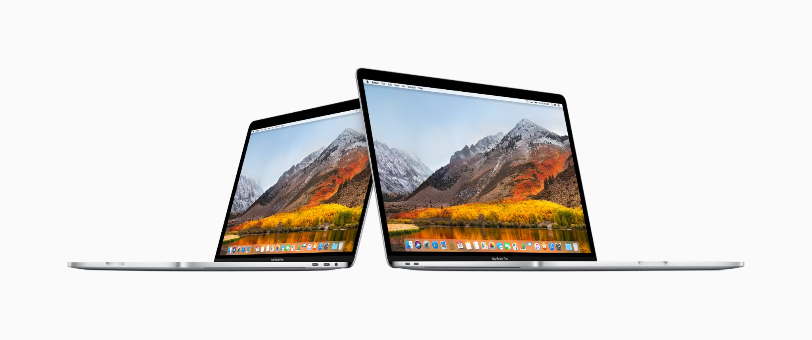

From €1,549  
[MacBook Pro - Apple (IE)](https://www.apple.com/ie/macbook-pro/)  
If you want a portable Mac and have need of some serious performance, you’ll be looking at the MacBook Pro. There isn’t so much to be said about the MacBook Pro… it remains the staple of developers, designers, and many other professionals that required a bit of oomph in their machines. The TouchBar remains a divisive addition, as does the new keyboard design. But both look like they will be with us for the foreseeable future. Indeed, we’ve seen the keyboard design continue to proliferate through Apple’s laptop lineup. The 2018 models saw a big update in their internals while the design remains the same since it’s 2016 redesign.

### iMac

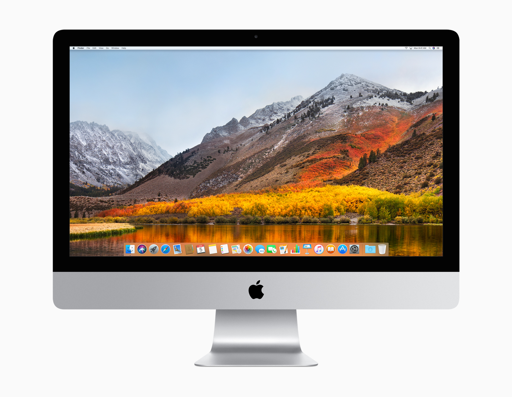

From €1,329  
[iMac - Apple (IE)](https://www.apple.com/ie/imac/)  
The go to desktop Mac is as beautiful and appealing as ever. If you want a Mac and would prefer it be a desktop, this is likely what you want to buy.

### iMac Pro

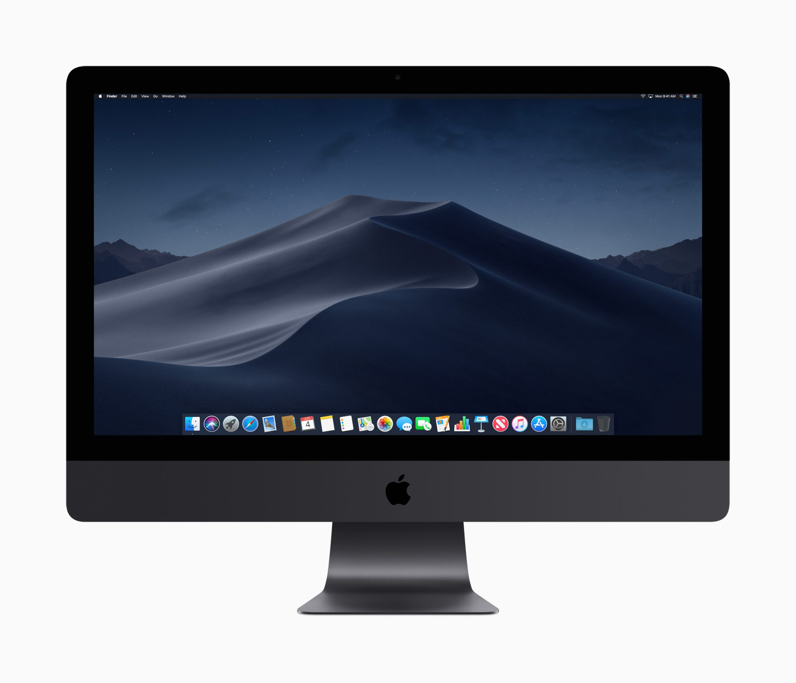

From €5,599  
[iMac Pro - Apple (IE)](https://www.apple.com/ie/imac-pro/)  
This is the iMac for those professional types who need incredible performance in their machines. The iMac Pro delivers big on performance but also on price!

### Mac Pro

From €3,499  
[Mac Pro - Apple (IE)](https://www.apple.com/ie/mac-pro/)  
Do not buy this machine! We’re almost at the 5 year mark for when this machine was last updated. It’s hard not to regard this model of Mac Pro as anything other than an abject failure and Apple have already signalled that they are working on a new, rethought out vision of the Mac Pro for 2019.

### Mac mini

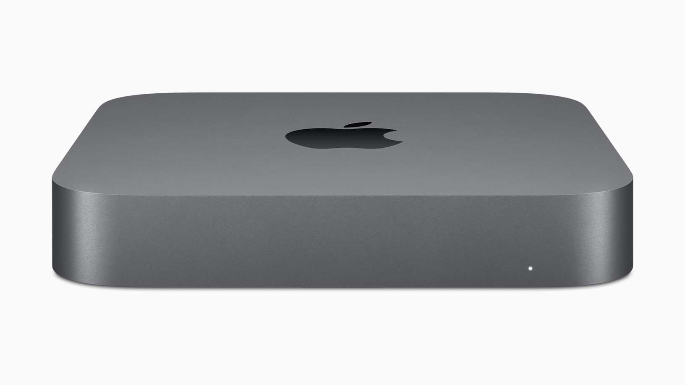

From €919  
[Mac mini - Apple (IE)](https://www.apple.com/ie/mac-mini/)  
The Mac mini, historically the budget device in the Mac lineup, got a long awaited update this autumn and the result is something a lot less budget! The new iMac mini is quite the speedy machine but has consequently seen it’s price rise by about 60%. This leaves it in an interesting position in Apple’s line up. If you have all the necessary peripherals such as keyboard, mouse and monitor already, it is a very strong option. If not, however, the iMac probably emerges as a more hassle free option.

## Apple TV

- 
    
    Apple TV
    

From €159  
[TV - Apple (IE)](https://www.apple.com/ie/tv/)  
The Apple TV tends to be popular Christmas gift. It is a nice simple way to get Netflix and the various other content services on your TV. The Apple TV features it’s own App Store but doesn’t have the same sort of support as Apple’s other products. Still, some games and apps are available that improve the experience. Another nice feature is the ability to Airplay any of your screens to your TV, which can prove useful.

## AirPods

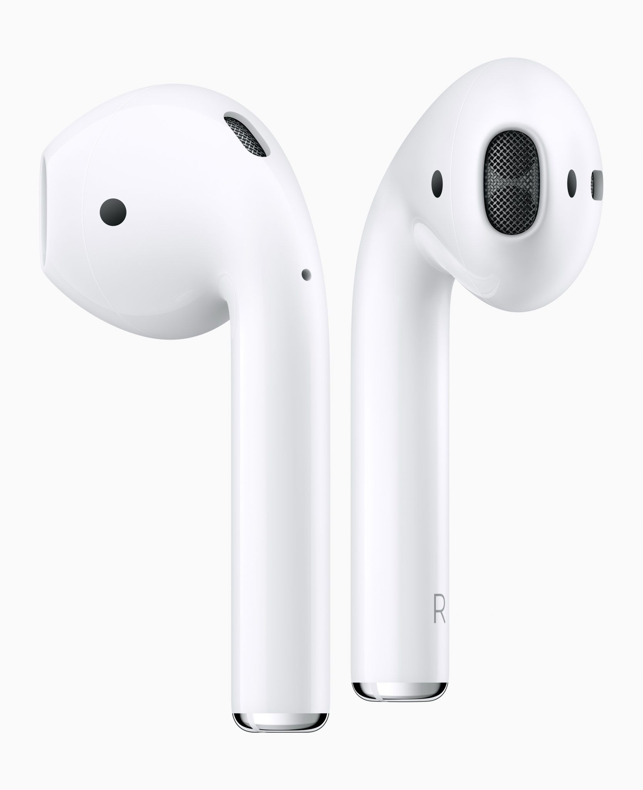

€179  
[AirPods - Apple (IE)](https://www.apple.com/ie/airpods/)  
AirPods are somewhat of a team favourite here in Tapadoo. The wireless earphones have been widely lauded across the industry as one of Apple’s best innovations in recent years. From their ease of use and decent sound to their freedom from wires and their wonderful battery life, they are a highly polished product. They are expensive, but we’ve yet to talk to someone who regretted their purchase.

We hope our Apple Christmas Gift Guide 2018 can simplfy the Apple product range and make Christmas shopping a little easier for the Apple lover.

Mike McNamara

iOS Developer
