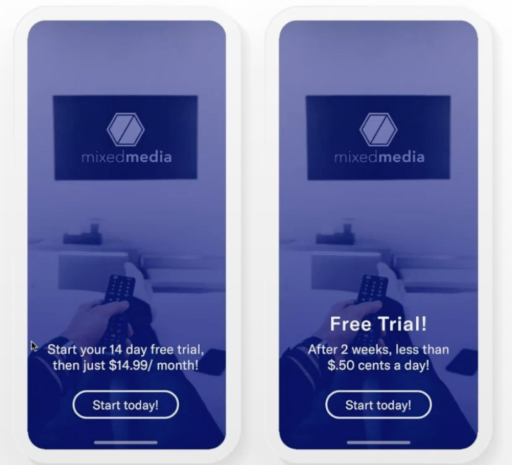

The COVID-19 pandemic has affected the whole world and customers, employers and employees are turning to digital products more than ever before. In light of this, business apps are seeing a surge of activity. 

Zoom’s videoconferencing app had a record quarter between February and April this year making $328 million in revenue. This comes well above the $122 million Zoom made in the same quarter in the previous year.  

Maersk also released a statement about their user-friendly and customer-oriented mobile app. The app allows customers to book cargo, get instant confirmations, track shipments and carry out a host of other actions from the convenience of their remote locations. The app has 4,000 users in India and over 1.8 million actions by customers were recorded on the app in the second quarter of 2020. This is more than double the actions that were recorded in the first quarter of 2020.

Mobile apps are playing an important role during this time but to maximise their potential A/B testing is an important factor to consider for any app owner.

### **Why is A/B Testing so Important?**

In a competitive market place, you need to learn how to optimise your app and marketing campaigns to give you a competitive advantage and keep users returning. By doing this you see the results that many successful apps are seeing now.

A/B testing brings many benefits including higher conversion rates, increased retention rates, insights into customer behaviour and engagement, user experience insights and helps you make better decisions based on reliable data and statistics.

Have a read of this [case study](https://www.crazyegg.com/case-studies) on how Ecommerce company WallMonkeys increased their conversion rate by 550% using Crazy Egg’s heat-maps and A/B testing tools.

The video below is a case study from Amazon where they used A/B testing to improve app retention. A/B testing helped them better identify what they should be doing. By identifying low hanging fruit that they could immediately harvest they generated more revenue and customer plays in a short amount of time.

> Real customers give you information you can't get anywhere else.
> 
> If we don't have A/B testing in our game we are making a huge mistake.
> 
> Russell Caroll, Amazon

https://www.youtube.com/watch?v=D\_vK9n5QuPg

### Best Practices for Mobile App A/B Testing

#### 1\. Get Clear

Knowing what you want to test and why is the first step. It might sound simple, but a lot of time and money is wasted when your test case isn't crystal clear. There's no point testing something that won't give you actionable insights, so only start testing when your hypothesis is clear. Get clear on your current baseline results also so that you can understand the effect A/B testing has on your app.

#### 2\. Start Small

You can test a number of variables but it's best to test one variable at a time. Small changes can make a significant difference in A/B testing. Pick one variable such as your app icon and start with small tweaks. Clearer and more confident results come from measuring the performance of what you're testing against everything else remaining the same. It's also important to consider the user experience journey. If you change too many things you'll disrupt the user experience and leave users feeling dismayed at the process.

#### 3\. Let the Test Run

It may be tempting to stop a test mid-way, particularly if the results appear to be conclusive or your hypothesis doesn't turn out the way you thought it would. You'll gain valuable information by letting it run until the end. By running your test right until the end you have that confidence in your data being reliable and the result it yields. By doing this, you'll know that the data trends will continue after the test and you can make informed marketing decisions based off of these results.

#### 4\. Don't Change Mid-way

Don't be tempted to change the testing parameters midway. If you make changes to the test case mid-way it will skew the test results. It will also make it harder to identify which variant actually made the difference to your final metrics. With A/B testing for mobile apps, you are trying to identify the variant that will improve the overall performance, including the engagement, conversion and retention. You can always run a new test case when your first test is complete.

#### 5\. Use Automation and Machine Learning

Machine learning can automate your A/B testing. It allows you to set up, run and analyse your A/B test quickly. Machine learning also gives valuable information about the impact of A/B testing. There are a number of platforms that offer machine learning for A/B testing within mobile apps. The benefit of these tests is that they can show you if a metric changes significantly as a result of a test on another metric. You may run a test that increases monetisation but has the knock-on effect of increasing uninstall rates. Machine learning and automation for A/B testing can save a lot of time and money.

### A/B Testing Success

The image on the left from Apptimize saw a 9.41% lift in conversion as a result of A/B testing.

[Source](https://apptimize.com)

Maria Colgan

Digital Marketing Manager
