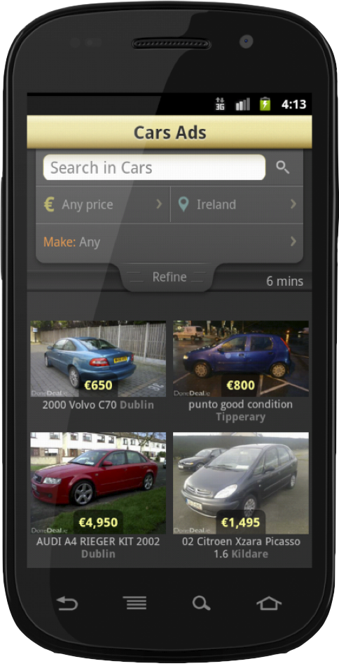

As some of you may or may not know, we released the official DoneDeal app for Android on January 24th.  

  
This surprised some people, as they thought we were solely an iOS development house.

In fact, we're a lover of all good mobile platforms, and specialise in native app development on iOS, Android and Windows Phone. Although we see less demand, we can also do Symbian and Blackberry development.

We're really proud of our DoneDeal release; It's beautifully crafted and has a few nice features. A personal favorite is the "pull down drawer" for advanced filtering.

\[caption id="attachment\_802" align="alignleft" width="484" caption="DoneDeal App for Android"\]\[/caption\]

We gave a talk at the measurement.ie conference ([slides here](http://speakerdeck.com/u/dermdaly/p/adding-analytics-to-your-mobile-apps "Slides Here")), and in it gave some insights into the Done Deal app on android. See the presentation for full details, but here's the cliff notes from around 3 weeks' worth of being "in the wild"

- It has been accessed by **35 unique firmware versions** of android
- We've seen **145 different devices** access the app
- By usage of the app, the **top 4 devices are all Samsungs**
- Number 5 is a Sony Ericsson

The interesting thing is also how the firmware versions and devices break down. At our talk we showed how 2.7% of the DoneDeal for Android base use their device in **Polish**. 2.7% is an equivalent audience to:

- 35 of the 45 Firmware versions
- 110 of the 145 devices

The last interesting statistic for DoneDeal for Android? Android version 4.x "Ice Cream Sandwich" accounts so far for 0.83% of the usage. This doesn't come as a surprise, nor do I think this is a concern. It is probably best explained by our [earlier post on that topic](https://tapadoo.wpengine.com/2012/why-you-shouldnt-expect-automatic-upgrades-to-the-latest-version-of-android/ "Why you shouldn't expect automatic upgrades to the latest version of android")

Got an Android Device? Get the app here  

