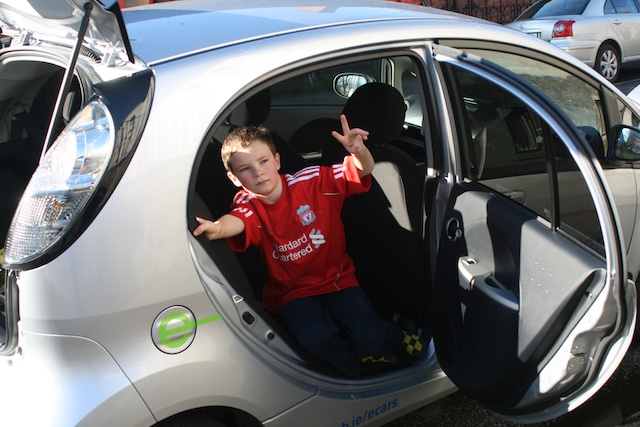

So we got to use the e-car over the weekend. Turned out to be very useful, although this would be the case for any second car.

Our kids all have training on Saturday with [St. Vincent's GAA](http://stvincentsgaa.ie/). Jack, our eldest sometimes has away games, and this normally means that the others lose out as the car is used to take him to an away game. This weekend was just like that, so I was able to head to the away game in the Electric Car, whilst my wife Aileen took the two others to Vinnies.

There was some arguing with the children, as they all wanted to be in the electric car, but we promised them we'd all meet back at the club, and they could all come home in the E-Car.

Back at the club I did snap a couple of photos of the children and the car did attract some attention. I'm fully armed with brochures supplied by ESB so I was able to give information on running costs etc. 

When we got home, I asked the children for their opinions on the car. Here's what they thought 

<iframe title="YouTube video player" width="500" height="311" src="http://www.youtube.com/embed/IpAJFV9I19g" frameborder="0" allowfullscreen></iframe>
