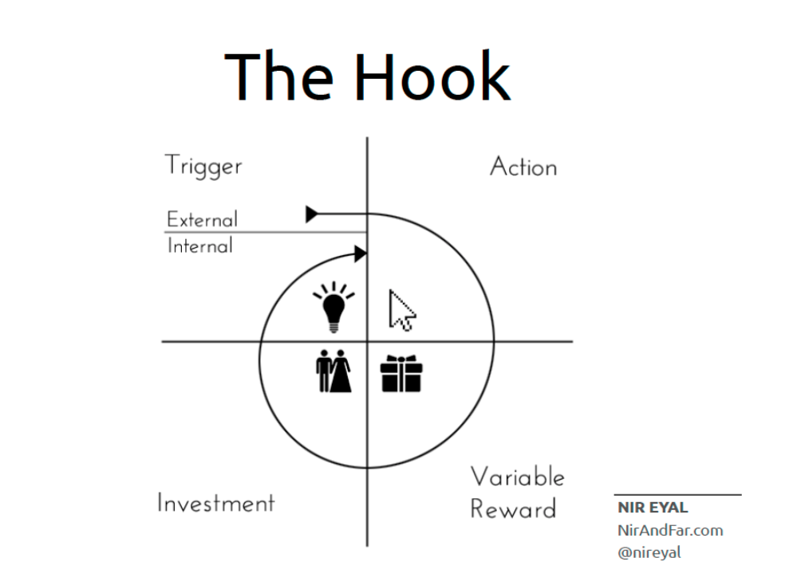
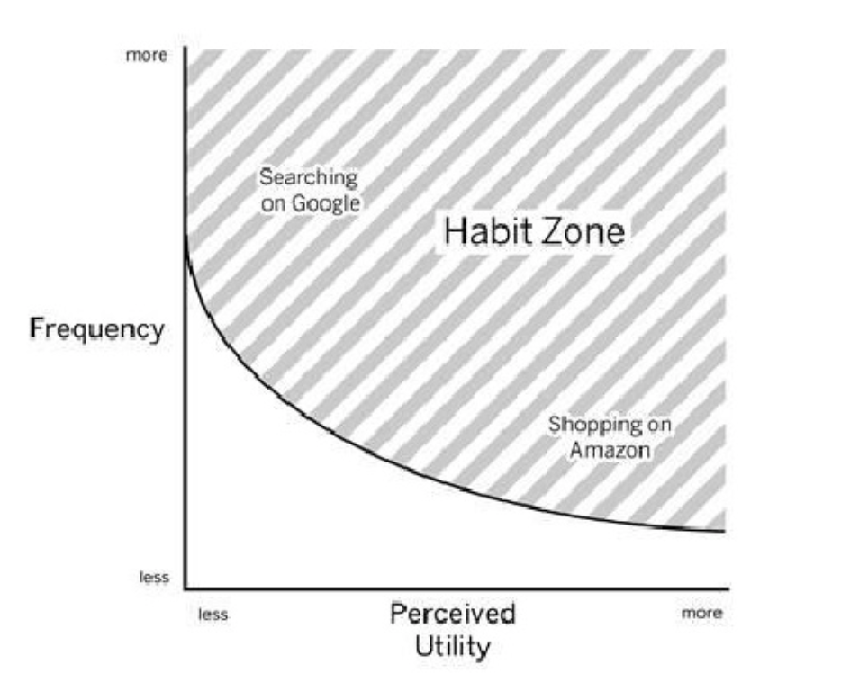
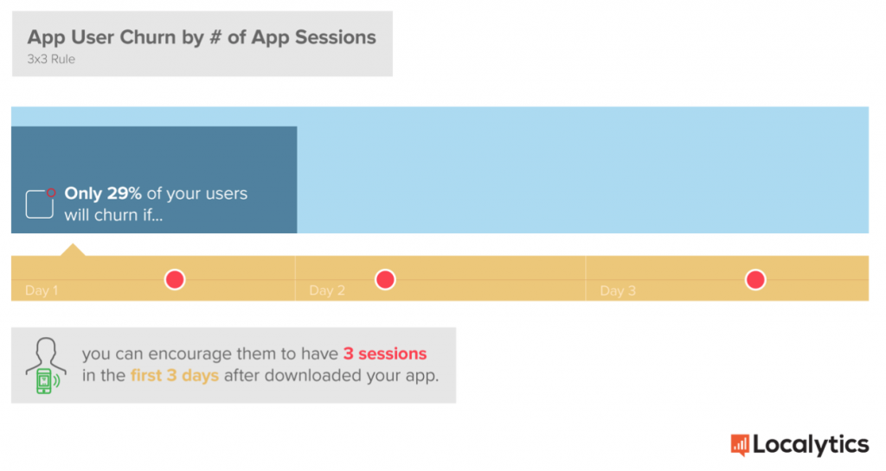

Many app developers think that the number of downloads is a sign of success for their app. While this is true to some extent, getting users to keep coming back to your app after they've downloaded it is the real success.

[App Store Optimisation](https://tapadoo.wpengine.com/app-store-optimisation%e2%80%8b-guarantee-success/) is a great way to get downloads but how do you get users to keep coming back to your app?

How do you develop a habit-forming app?

It's worth noting that [retention rates](https://tapadoo.wpengine.com/user-retention-tactics-mobile-app-marketing/) for mobile apps is [38%](https://tapadoo.wpengine.com/user-retention-tactics-mobile-app-marketing/). This means that for every 100 users that download your app, only 38 remain. So you may never get the 100 to convert to loyal users but how do you even get the 38 to convert?

The answer to this as per [Nir Eyal](https://www.nirandfar.com/) lies in creating a habit-forming app. To demonstrate this Eyal developed what is known as the [Hook Model](http://www.hookmodel.com/). The Hook Model is a model that helps you build habit-forming products. This includes habit-forming apps. This model shows you how to get users to create behavioural habits with your app.

As Eyal notes,

> “The model is intended to be a practical tool (rather than a theoretical one) made for entrepreneurs and innovators who aim to use habits for good”.

### What is the Hook Model?

The Hook Model is a four-step process of trigger, action, variable reward and investment designed to help businesses build habit forming products. It’s based on behavioural psychology and can be applied to app development. 

If the experience within your app takes users through this process repeatedly, it can turn your app into a habit-forming product. In other words, an app that users keep coming back to.

### The 4 stages of the Hook Model

#### Stage 1 - Trigger

According to Eyal, a trigger is the activator of the behaviour - the spark plug in the engine. So the trigger causes the behaviour which results in the action. You have both an external and an internal trigger. An external trigger can be anything like an email, website link, post on social media or an app icon on a phone. They act as a prompt, reminder or push to take some action. They are in effect, a call to action.

This sounds straight forward but not all triggers are met with a desire to take action. This is where the internal trigger comes in. The external trigger must hit some internal trigger that creates the desire to take action. Users then associate the external trigger with their internal emotion. Each time the user see's this trigger you are creating a hook.

#### Stage 2 - Action

Eyal goes on to explain that following the trigger comes the action: the behaviour done in anticipation of the reward. So when the user is triggered they take action. They are looking for some sort of satisfaction to fill that emotional need.

The focus of your app here should be on usability design. You are looking to drive a specific action. This action happens based on two basic drivers of human behaviour which are ease of performing an action and the psychological motivation to do so.

#### Stage 3 - Variable Reward

So how do companies, products, and apps hook users?

They give them a reward.

But in the case of the Hook Model and what's implemented by most social media companies is a variable reward. Eyal says that variable rewards are one of the most powerful tools companies use to hook users.

The reason for a reward as Eyal states is that dopamine surges when the brain is expecting a reward. Then introducing a variable reward creates a focused state which actually suppresses part of the brain associated with judgement and reason. Instead, it activates a part of the brain associated with wanting and desire.

Then to make it even better, variability also impacts [retention](https://tapadoo.wpengine.com/user-retention-tactics-mobile-app-marketing/)!

#### Stage 4 - Investment

The investment phase is the important phase because as Eyal says, it increases the odds that the user will make another pass through the hook cycle in the future. Once they do this a few times they are hooked!

This phase requires the user to do a bit of work and in doing so they invest in the product. Users can invest time, data, effort, social capital or money. The investment taken is aimed at improving the service for their next round of the Hook Model.

Inviting friends, stating preferences, building virtual assets, learning to use new features; these are the types of investments users make to improve their experience.

These actions can be used to make the next trigger more engaging, the action easier and the reward more exciting.

### Can your app become a habit-forming app?

> A company can begin to determine its product’s habit-forming potential by plotting two factors: frequency (how often the behavior occurs) and perceived utility (how useful and rewarding the behavior is in the user’s mind over alternative solutions).
> 
> Nir Yal

To create an automatic or default habit a behaviour that occurs with enough frequency and perceived utility enters what Eyal calls the Habit Zone. Once the behaviour enters the habit zone users are hooked. And you have just created a habit-forming app.

However, according to Eyal, if the frequency and perceived utility falls short and the behaviour lies below the threshold of the Habit Zone, it is less likely that the behaviour will become a habit. Some behaviours never become habits because they don't occur frequently enough. On the opposite of this is behaviours that provide minimal perceived benefit but can still become a habit because it occurs frequently.

> For an infrequent action to become a habit, the user must perceive a high degree of utility, either from gaining pleasure or avoiding pain.
> 
> Nir Eyal

### Do you have an infrequently used app but want to create a habit?

There's an alternative to the Hook Model, which has proven to create habits within apps.

[Localytics](https://www.localytics.com) have come up with a similar formula for creating habits within apps. They call it the [3X3 rule](https://tapadoo.wpengine.com/user-retention-tactics-mobile-app-marketing/). Regardless of the necessity and frequency of use of your app if you can get users to have three sessions within the first three days app churn can drop to as low as [29%](https://tapadoo.wpengine.com/user-retention-tactics-mobile-app-marketing/). This is a drop from what is normally [58%](https://tapadoo.wpengine.com/user-retention-tactics-mobile-app-marketing/) and 75% after three months.

[Source](http://info.localytics.com/blog/how-to-keep-your-app-users-with-the-3x3-rule)

As [Localytics](http://info.localytics.com/blog/how-to-keep-your-app-users-with-the-3x3-rule) have noted, the ultimate aim of apps is to keep users engaged over time. This can prove difficult for a number of apps that may not be required to be used as frequently as others. But you still want your app to be perceived as adding value and the 'go to' app when required. Localytics have identified the minimum threshold for this to happen is three sessions in three days.

They offer three ways you can encourage sessions in the first three days. These include nailing the first session i.e. the initial onboarding experience. Reminding users of your app with a remarketing campaign. Then offering a 'new friend' promotion with a targeted push notification or email message. We are weary of using push notifications unless it enhances the user experience. You can read our reviews of the best use of push [here](https://tapadoo.wpengine.com/unsure-about-app-push-notifications/).

### Conclusion

Eyal's model may be leaning more toward higher frequency and perceived utility for an app to be considered habit-forming. But not all apps are frequently used and yet they are the go-to app for that particular use. So while perceived utility is a must you can still create habits with your app if it's used less frequently. You just need to consider what Eyal says that in order for an infrequent action to become a habit, the user must perceive a high degree of utility, either from gaining pleasure or avoiding pain.

The biggest hook from Eyal’s Hook Model is the investment from users in your app. Habit-forming apps are apps that manage to get users invested in the app. And Eyal says that to get a user invested in your product or app, you need to provide a better user experience every time they use it. It’s when users become invested in your product that you have completed the hook.

You can use the Hook Model in combination with the 3x3 rule. Draw people in using the trigger, action, variable reward and investment. If your app is an infrequently used app then get users invested in it by using the 3x3 rule; three actions within the first three days. This keeps them invested and then an enhanced user experience can keep them going through the hook model each time.

Think about it another way; if users continually experience problems each time they use your app they won’t invest in it. In fact, they’ll abandon or uninstall it. But if you can continue to anticipate, match and exceed the needs of users, you can complete the hook and create habits for your users.

Maria Colgan

Digital Marketing Manager
