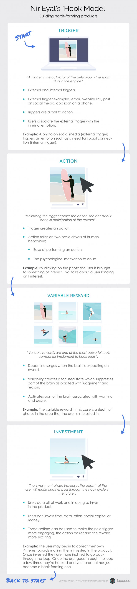

So you've more than likely heard about the [Hook Model](https://tapadoo.wpengine.com/habit-forming-app-development/) for creating habits with apps, or more importantly, turning your app into a [habit-forming product](https://tapadoo.wpengine.com/habit-forming-app-development/). That's the purpose of the Hook Model. It helps product owners identify if their app can become a habit for users and describes the process of how to get users hooked on your app.

So what is the Hook Model by Nir Eyal?

Nir Eyal's Hook Model is how you build [habit-forming products](https://tapadoo.wpengine.com/habit-forming-app-development/). It's based on behavioural psychology and applied by many businesses including app development.

Ever wonder why you are hooked on social media?

You can thank the [Hook Model](https://tapadoo.wpengine.com/habit-forming-app-development/) for that.

### The Hook Model by Nir Eyal Explained

The Hook Model by Nir Eyal is a four-step process of trigger, action, variable reward and investment. It has been designed to help businesses build habit-forming products. The focus here for product development is usability design - how product design drives specific behaviours.

It starts with an experience that causes the habit which results in the action. The experience is caused by a trigger. These triggers are both internal and external.

Then you introduce a variable reward that entice's investment. The good thing about a variable reward is that it impacts [retention rates](https://tapadoo.wpengine.com/user-retention-tactics-mobile-app-marketing/).

The investment taken is aimed at improving the service for the next round of the Hook Model. Inviting friends, stating preferences, building virtual assets, learning to use new features; these are the types of investments users make to improver their experience.

If the experience within your app takes users through this process repeatedly, it turns your app into a habit-forming product. In other words, an app that users keep coming back to.

We've written about it in more depth in another [post](https://tapadoo.wpengine.com/habit-forming-app-development/) but for the purposes of this post we've summed everything up in the infographic below.

