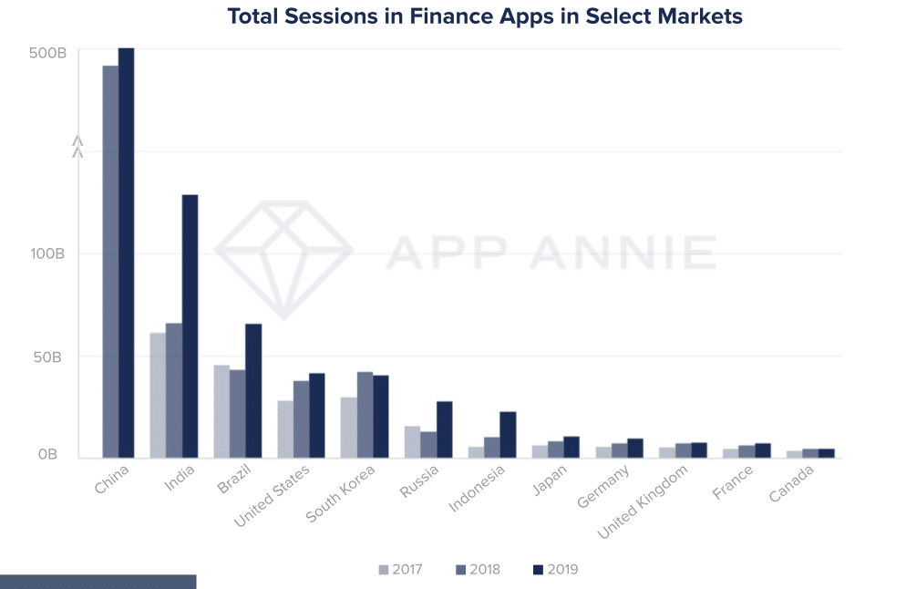
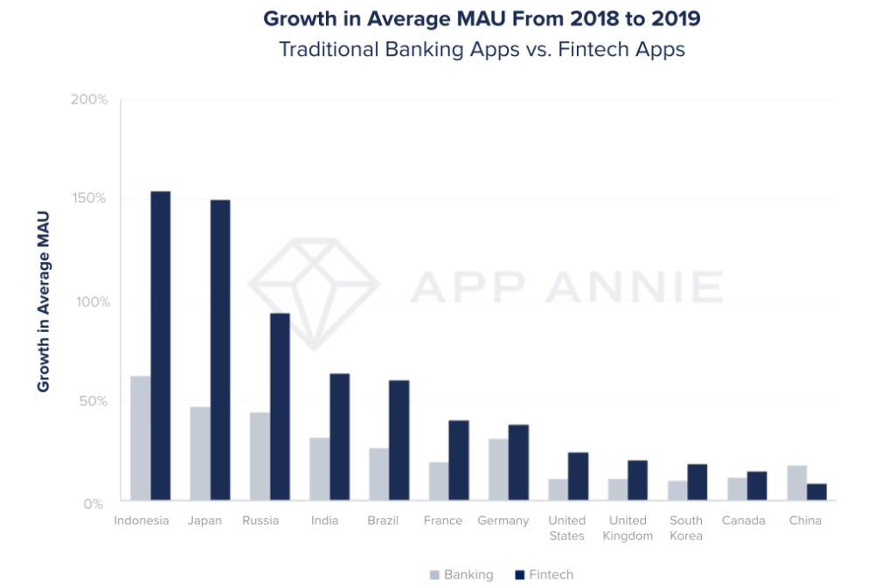
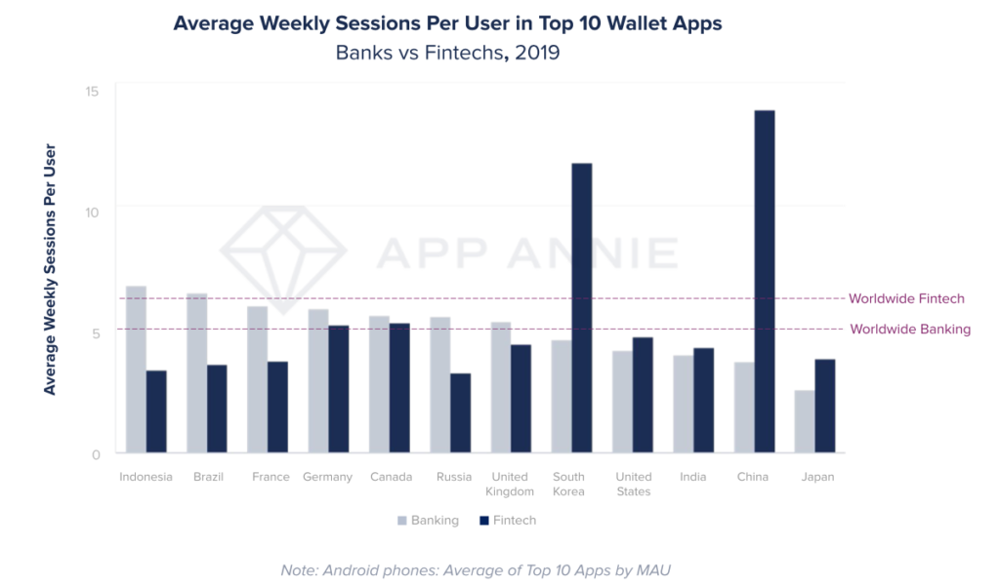
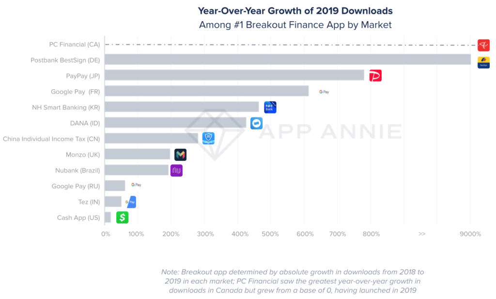
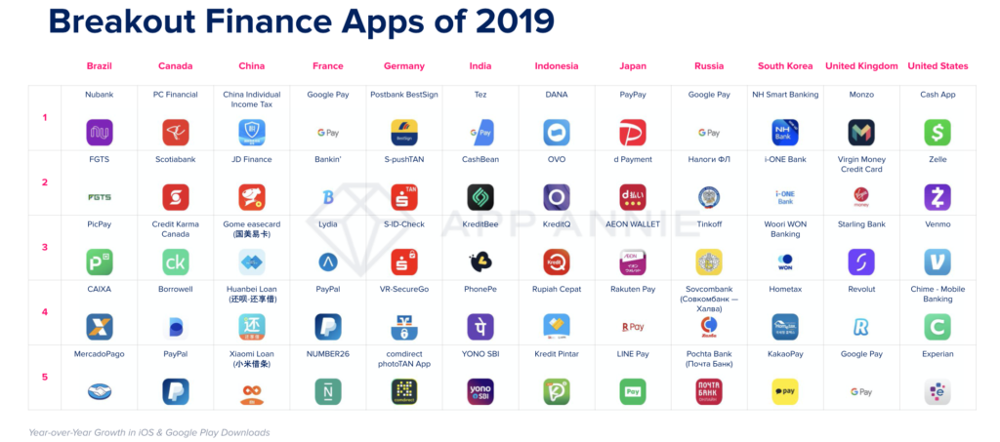

[App Annie](https://www.appannie.com/en/) released their [State of Mobile 2020](https://www.appannie.com/en/insights/market-data/state-of-mobile-2020/) report earlier this year. We’ve selected some top-line information on the effects of mobile on the finance industry. 

There’s a trend globally for consumers to migrate more of their financial activities to mobile. Both Google and Apple are taking advantage of this trend with Google offering checking accounts and Apple offering a credit card.

In 2019 consumers accessed finance apps over 1 trillion times. This is up 100% from 2017. Consumers are using their mobiles for payment apps, mobile banking apps and stock management apps. 

One way for finance apps to engage users is by offering loyalty and referral programs, with Citi reporting that [83% of consumers](https://www.forbes.com/sites/blakemorgan/2019/05/02/when-it-comes-to-customer-engagement-loyalty-matters-at-citi/%236ca973fe7fb6/) and [94% of millennials](https://www.forbes.com/sites/blakemorgan/2019/05/02/when-it-comes-to-customer-engagement-loyalty-matters-at-citi/%236ca973fe7fb6/) more likely to participate in a loyalty program if it’s on mobile. 

The chart below is the total sessions in finance apps in select markets on Android phones. The growth rate for China is year over year.

[Source](https://www.appannie.com/en/insights/market-data/state-of-mobile-2020/)

### **Growth of Monthly Active Users**

Mobile is enabling and accelerating the growth of the Fintech market with monthly active users in Fintech apps growing by 20% in 2019. Traditional banking apps saw 15% growth over the same period. Done right, mobile apps can make a great user experience for Fintech and traditional banking apps.

The graph below shows growth on both iPhone and Android phones. The numbers reflect the top 10 apps by monthly active users. 

Source

### **Banking and Fintech Wallet Apps**

Fintech wallet apps globally engaged users one more time per user each week than traditional banking wallet apps. The extra 52 sessions per year for each user represents a large volume of transactions for Fintech wallet apps. However, banking wallet apps saw far greater engagement per user in countries such as Indonesia, Brazil, France, Germany, Canada, Russia and the UK.

The chart below shows the average weekly sessions per user in top 10 Wallet Apps, showing Banks versus Fintechs in 2019. You can see that Fintech wallet apps in both China and South Korea have had large growth. This has has been fuelled by cryptocurrency exchange wallets such as [UpBit](https://upbit.com/home), [Binance](https://www.binance.com/en) and [Bithumb](https://www.bithumb.com).

[Source](https://www.appannie.com/en/insights/market-data/state-of-mobile-2020/)

### **Breakout Finance Apps Having Great Success**

Breakout Finance apps are having great success with the greatest year-over-year increase in absolute downloads. Some of these finance apps have maintained their high level of downloads from the previous year, while others have had massive growth rates year over year. You can see from the graph below that Canada’s PC Financial, which launched in Feb 2019 having massive growth in downloads. Tez, which is Google Pay in India added 36 million new downloads and have a 50% growth year over year.

Postbank BestSign, an additional security app for Postbank, grew 9,300% year over year in downloads in Germany after a December 2018 launch.

[Source](https://www.appannie.com/en/insights/market-data/state-of-mobile-2020/)

The chart below shows the Breakout Finance Apps per country for 2019.

[Source](https://www.appannie.com/en/insights/market-data/state-of-mobile-2020/)

Maria Colgan

Digital Marketing Manager
