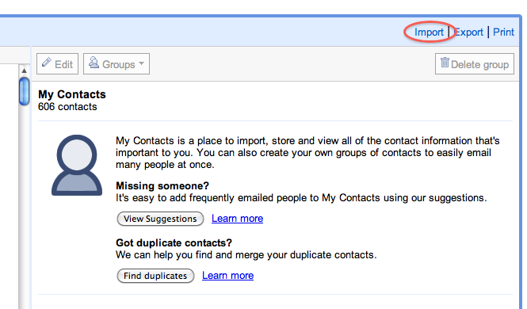

At the moment, I'm trying out an Android phone, using it as my main phone for a full week. I've a new Samsung Galaxy S, and moved over to it on Thursday last. If I make a full week, I will beat my colleagues best estimates. I'm thinking of making the prize I get is that one of them has to go through this too!

The biggest issue I've always found when changing phones is that you need to bring contacts over. I've around 600 contacts on my iPhone, and need them in the Galaxy so I can recognise who is calling or sending me texts. The Android device is very well integrated with Google accounts, so if you have a gmail, or google apps for domains account, getting your contacts is simple enough.

So, after a few false starts, I've got it working. Here's how:

1. My iPhone is already Sync'd with Mobile Me, and My iMac, and my Macbook, so I'm using the Mac Address Book application as my starting point. Even if you don't sync with mobile me, you can sync your phone contacts with address book in itunes. So, lets assume you have your contacts on your Mac.
2. Next, I purchased a €0.79 app from the Mac App Store called AB2CSV. Here's an [app store link](http://itunes.apple.com/ie/app/ab2csv/id402453326?mt=12)
3. I used AB2CSV, but used it in VCF mode. The reason I did this was I tried CSV initially. This didn't work - When imported into Google, all the useful data appeared as Notes. This problem doesn't occur with vCards.
4. So, Once you have a vcf file, with all your contacts, you can import this to a google account.
5. To do this: Click on the contacts on the left hand pane in your google mail account. This will bring up the contacts page
6. Then, choose import 
7. Choose the newly created .vcf file, and Google will import these contacts to your account.
8. Now, when you sync your Android device to your google account, all of these will show up on your device

Easy, eh?
