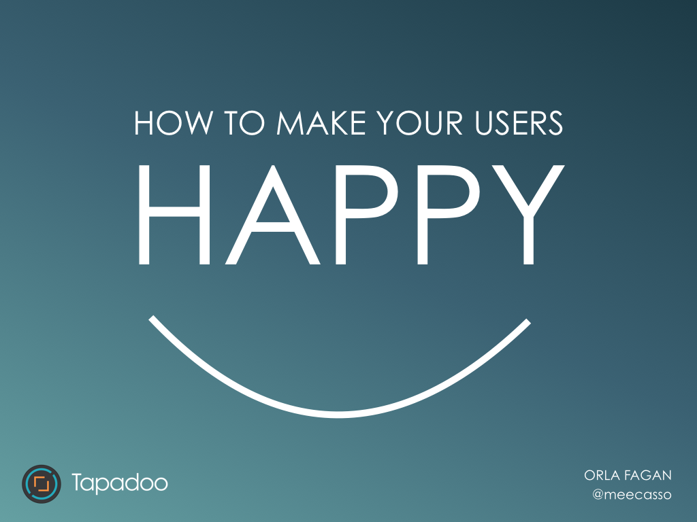
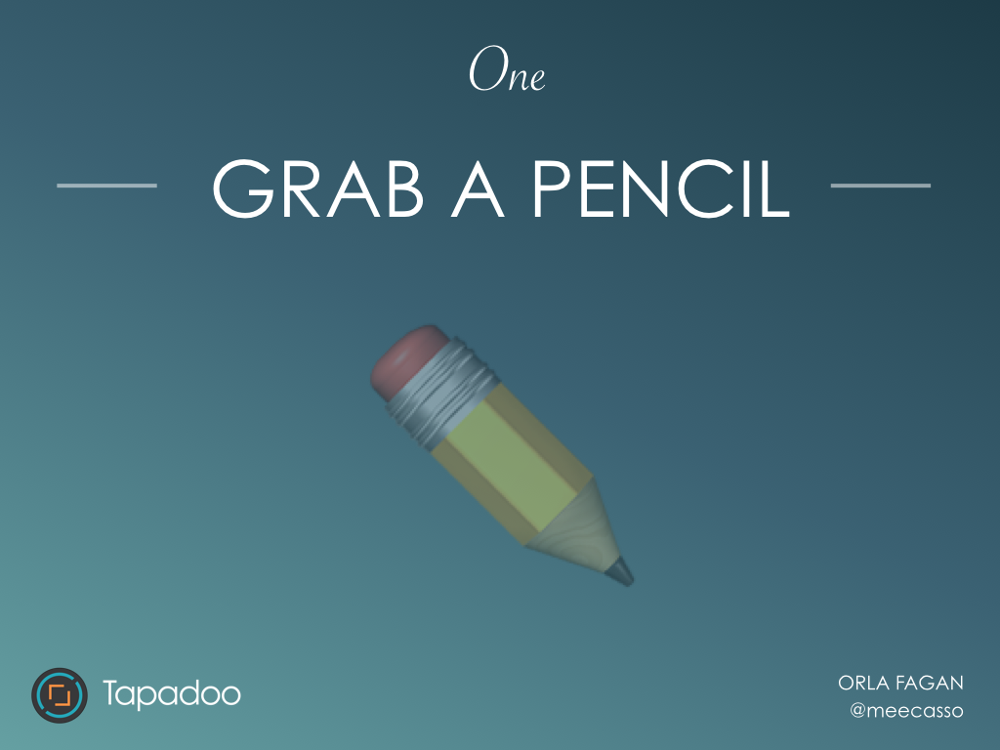
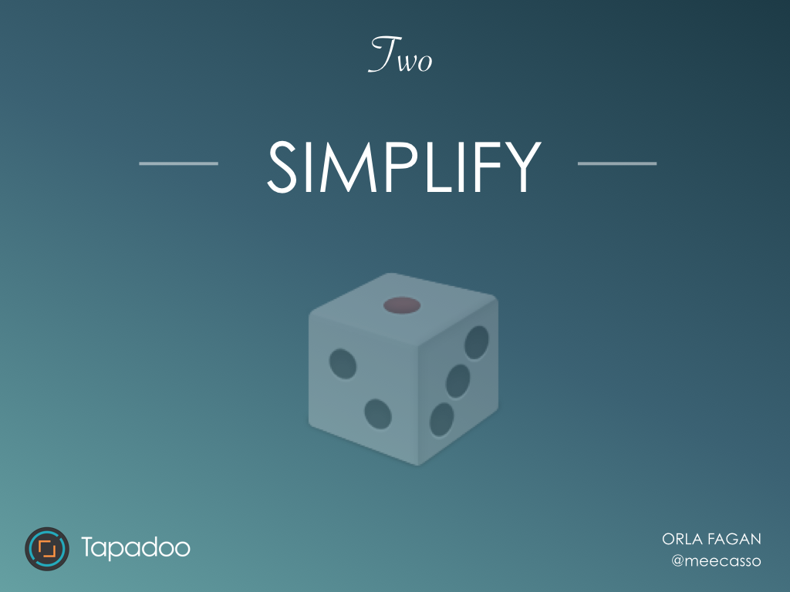
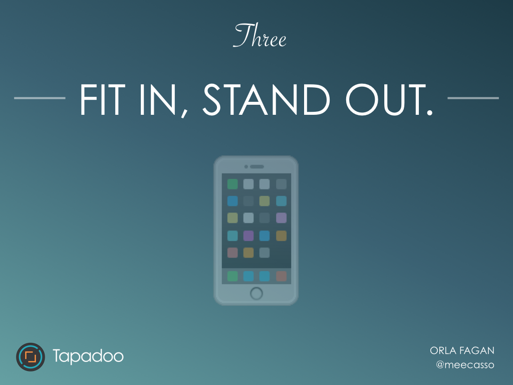
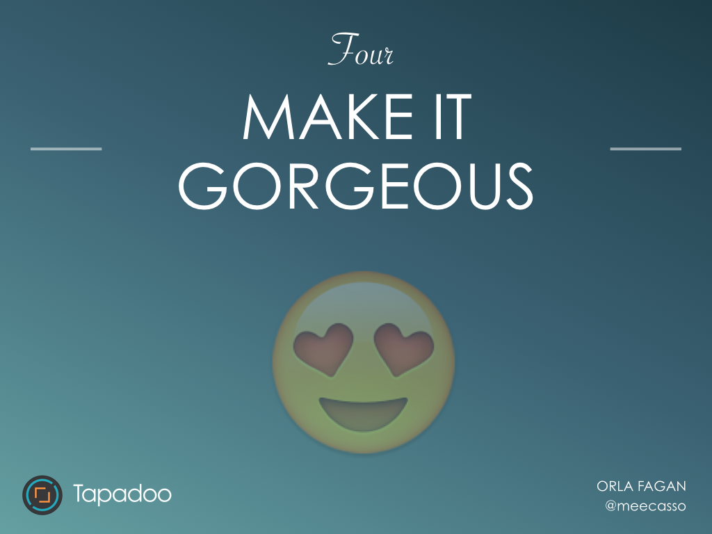
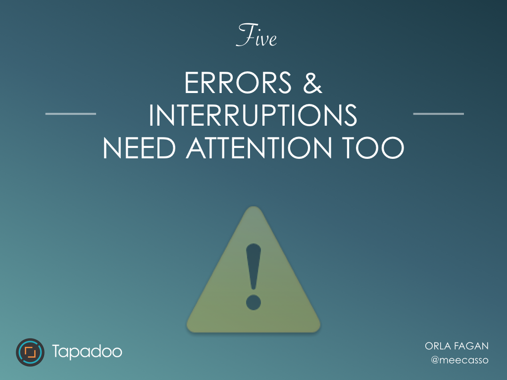
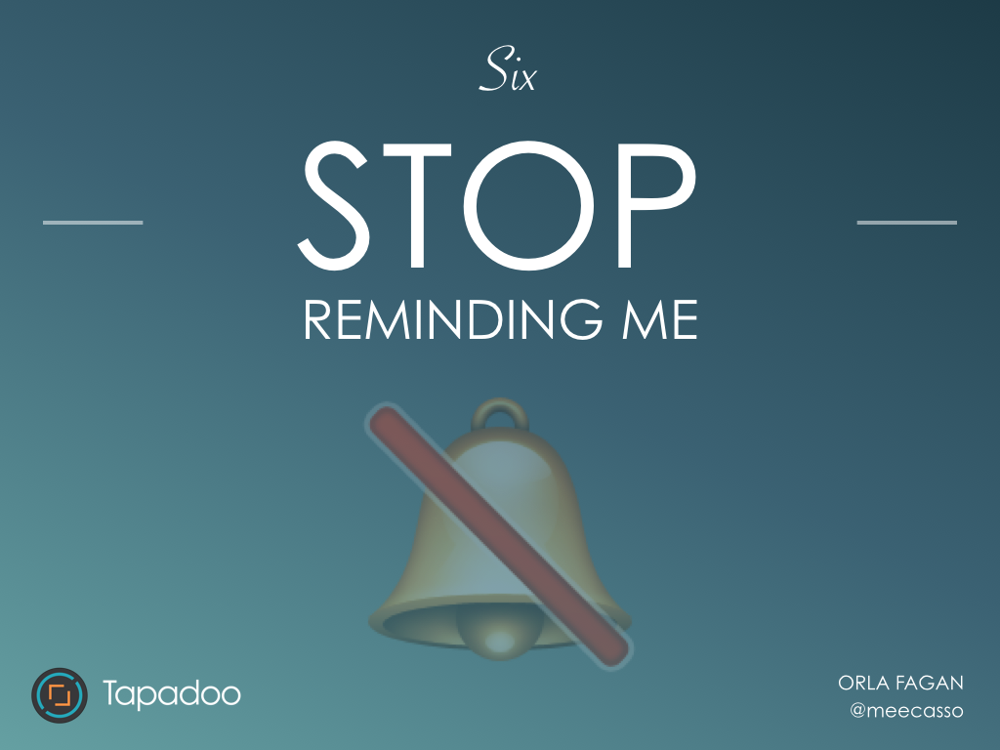
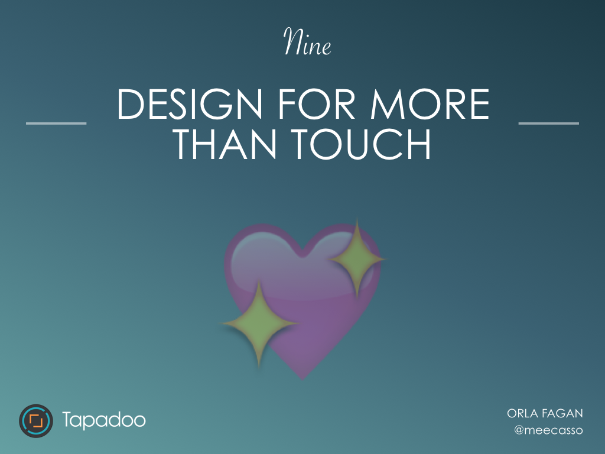
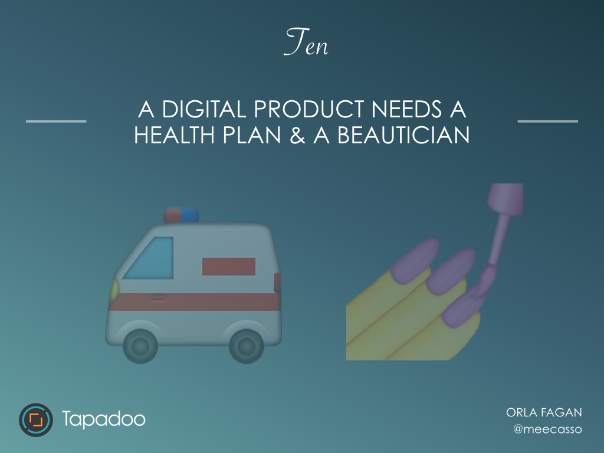

This is a short post based on my presentation at [Swipe Summit 2016](http://www.swipesummit.com) "Tips for designing outstanding mobile customer experiences", or as I would say "How to make your users happy". You can also read a more detailed version [here](http://bit.ly/20EzVID).

 

## One - Grab a pencil.

Whatever stage in the process you’re at, idea formation, a redesign, or adding a new feature etc. go back to the drawing board. What’s possible now? What if there were no limits? These are important questions. Consider what could make it better without the limitations of technology, budget, time etc

## Two - Simplify.

Aim to remove any possible friction.

**Don't door slam on first use with a log in / sign up:**  It's damaging to a brand experience to force me into physical and mental effort at the very first interaction with your app.  I’m a much more valuable lead if I have decided myself that I want to contact you or sign up to your service after I’ve been given the opportunity to use your app.

**If something is complicated break it down into small steps**. What is the preferred action? Don’t give me too many options. Mobile users want to accomplish tasks with minimal interactions with an app.  Discard everything else.

## Three - Fit in, Stand out.

Create a product that the world and its different types of users knows how to use. Different platforms, iOS/Android have different conventions and they should be respected. Use interactions that are in a users every day interactive language on their chosen platform. REMEMBER what’s familiar puts people at ease.

## Four - Make it gorgeous.

Focus on :

- Comfortable & Clean Typography - this gives your text-based content the best chance of being consumed with ease.
- Clear Content Hierarchy: Not everything on the screen is as important as the other. This should be obvious.
- Clear Call to action: What is the preferred action? What do I do next? This should be obvious without being overbearing.
- Pixel perfection: A pixellated graphic or photo, misaligned text just won’t cut it. It’s distracting and damages a users perception of quality.

## Five - Errors & interruptions need attention too.

Lets face it - errors happen. Poor quality communications damage the user experience. Display something meaningful when an error occurs.

Don’t presume a user will give permission for push just because you’ve popped an alert up.  Ask for them at the right time, explain why the app needs them & only if they add value to your user's experience.

## Six - stop reminding me.

Adding reminders is often just a lazy attempt to engage users. We need to stop trying to automise people's lives. The only thing reminders do is remind us that we are time poor.  If I as a person am not in the right frame of mind to use your app, a reminder is not going to change that.

## Seven - Engagement is a dirty word.

Advances in technology should mean we’re spending less time “engaged” in technology, not more.

Aim to make a product (if task based) that engages users for short periods of time. Engagement can be misleading. Time spent using your product doesn’t always reflect the time a user _wants_ to spend using your app. Let me complete my task and get back to my life.

 

## Eight - Surprise & Delight me.

If you provide a thoughtful experience users will thank you for it. Aim to fulfil a need, and allow the user to enjoy the experience. This is what keeps users coming back and reinforces a good brand experience.

 

## Nine - Design for more than touch.

Design for feelings and responses. Take the stress away from situations that are already stressful. Design for moments. Big & small. When a user feels a connection with a product or brand it increases adoption rates and brand loyalty.

## Ten - A digital product needs a health plan and a beautician.

We’ve all heard the phrases like “good design lasts forever”. But this doesn’t always apply to digital. The landscape changes so often, that it’s rarely a one-time thing to build/design an app or a digital product.  How to keep up? Continuously. Small updates overtime makes the transition easier for users and more cost-effective for businesses.

**Digital design is a living breathing product it just needs to be cared for.**
