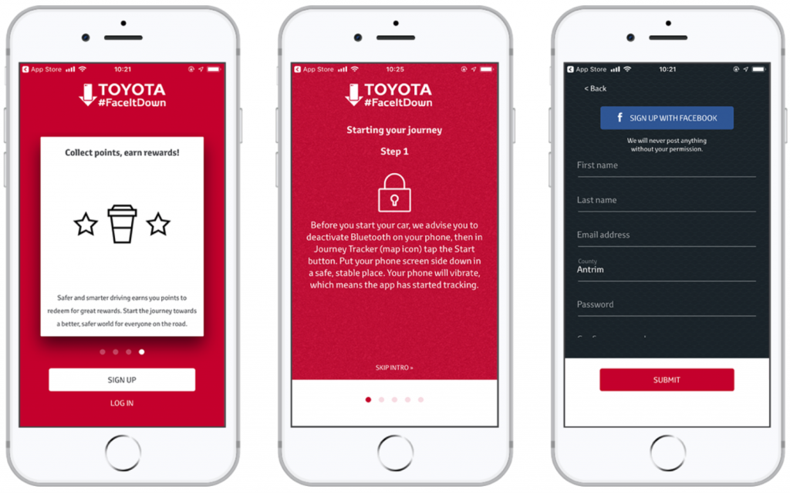
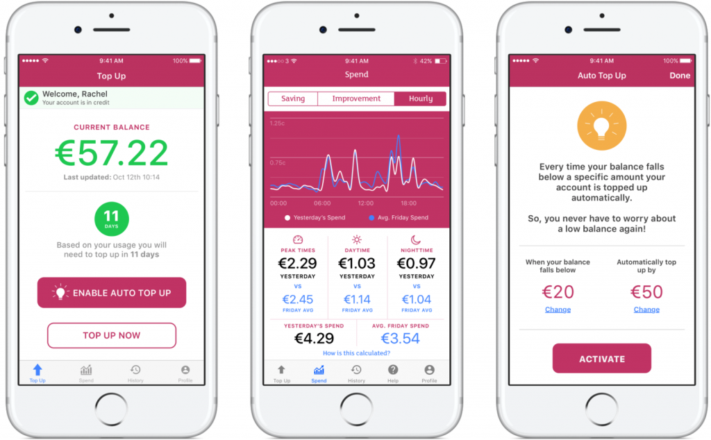

  
A lot of the time these terms UI and UX design are used interchangeably however, they stand for two separate things.

To understand the difference between user interface (UI) and user experience (UX) design let's take a step back and understand what each term stands for on its own.

#### What is user interface design?

According to [Mckay:](https://books.google.ie/books?id=wNozxtKuOKcC&pg=PA6&lpg=PA6&dq=%E2%80%9CA+user+interface,+or+UI,+is+what+connects+users+to+a+product%E2%80%99s+underlying+technology.%E2%80%9D&source=bl&ots=v85fgatir1&sig=ACfU3U1ED2qAjHeSgd0QXU8n2a7Zq0Si1w&hl=en&sa=X&ved=2ahUKEwivlIiv2oHgAhV-TxUIHY6nB9IQ6AEwAHoECAUQAQ#v=onepage&q=%E2%80%9CA%20user%20interface%2C%20or%20UI%2C%20is%20what%20connects%20users%20to%20a%20product%E2%80%99s%20underlying%20technology.%E2%80%9D&f=false)

> “A user interface, or UI, is what connects users to a product’s underlying technology.”

A user interface is essentially the combination of visual elements such as buttons, forms and screens that allow a person to interact with a product. UI designer’s focus primarily on how a product looks and feels.

#### What is user experience design?

According to [Don Norman](https://www.nngroup.com/articles/author/don-norman/) and [Jakob Nielsen:](https://www.nngroup.com/articles/author/jakob-nielsen/)

> “User experience encompasses all aspects of the accessibility of the product interaction with the company, its services, and its products.”

UX design encompasses several different disciplines. These range from computer science to information architecture to motion design. A UX designer considers the motivations of people using a product, the functionality of the product itself and the accessibility of the product.

UI design is a subset within UX design.

#### **Why UI design matters** 

#### **Guidance**

UI allows for a conversation to begin between a user and a product as it visually guides a user through a product’s interface. It does so by creating visual hierarchy, indicating to a user where prominence is placed and where they should go next.

Even the smallest adjustments in UI can have a huge impact on how people interact with and understand a product. For example, the simple shape of a button can determine whether or not a user is able to accomplish a task.

Poorly designed UI often results in users abandoning their tasks. Resulting in a loss of profits, a bad user experience, and a negative effect on a brand.

Good UI has the opposite effect, whereby it helps to increase clarity and reduces confusion. In doing so, it creates a better user experience and a better result for the brand.

#### **First impressions** 

Don’t judge a book by its cover is an age old saying but one that most people instinctively do. First impressions matter and a user interface is exactly that, a first impression.

As soon as a user sees a product they are met with UI design. From this interaction they form a split-second judgement.

> Does this product look promising?

> Does it look like it can help me?

UI design directly correlates to a user's perceived value of a product. In most cases having bad UI is a forewarning of a bad product, something a lot of users are aware of. As such, if a products perceived value is low a user can continue on their search due to the vast amount of choice in every market.

#### **Personification**

UI design brings a product to life by giving it a distinctive tone of voice. This helps to tie in a product with the rest of a company’s branding. It allows for the app to be more easily recognised, and integrates with the rest of the company’s ethos.

Giving an app a tone of voice allows it to convey emotion to a user. When used correctly, emotion can create a more accessible product and engaging experience. This helps to draw users in and keeps them there.

**Example of good UI Design**

[Source](https://tapadoo.wpengine.com/portfolio/toyota-app/)

  

#### **Why UX Matters** 

#### **Usability** 

Usability refers to the ease of access of a product. A product is said to be usable when a user has been able to both successfully and effectively accomplish their goals or tasks.

For example, imagine an app that takes 10 seconds to load every screen while you’re trying to purchase an item. Compare this to an app where every page loads instantly and the flow of ordering is much cleaner and simpler.

As [Steve Jobs](http://www.inspireux.com/2010/01/20/design-is-not-just-what-it-looks-like-and-feels-like-design-is-how-it-works/) once said

> “Design is not just what it looks like and feels like. Design is how it works.” 

UX design purposely sets out to make something as easy to use as possible. This means ensuring a product is both simple and intuitive, allowing users to find what they’re looking for. This drives both conversions and interactions as well as reducing frustration points user’s might experience.

A user should be able to accomplish their goals within as little steps as possible. This means clicking three buttons instead of six or taking two minutes to accomplish a task instead of four.

Poor usability greatly reduces productivity as users will take longer to accomplish a task.

#### **Understanding**

UX focuses on what users want. This requires understanding what a user's goals are and what their frustration points may be. This specification allows a product to be better suited to its target audience.

Understanding goals and pain points allows you to decipher where prominence should be placed, what features are needed and what are crucial versus nice to have.  

**Example of good UX Design**

[Source](https://tapadoo.wpengine.com/portfolio/prepay-power-app/)

#### **Conclusion**

In short, bad UI and UX design greatly effects a user's perceived value of a product, which in turn effects a company’s profit, business targets and goals.

According to the [Design Council](https://www.designcouncil.org.uk/sites/default/files/asset/document/DesignDelivers%20for%20Business%20briefing.pdf) “For every £1 invested in design, businesses can expect over £20 in increased revenues."

Together, UI and UX design creates a better user experience resulting in increased [retention,](https://tapadoo.wpengine.com/user-retention-tactics-mobile-app-marketing/) user satisfaction, [loyalty,](https://tapadoo.wpengine.com/brand-advocates-mobile-app-marketing/) and trust. This all results in a happy user and ultimately a profitable business.

Beth Alexander
