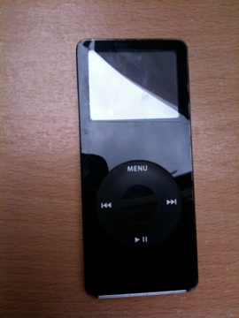
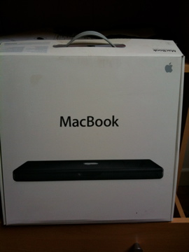
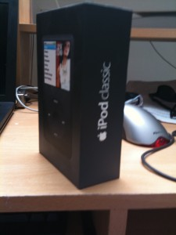
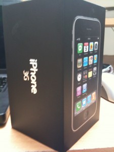
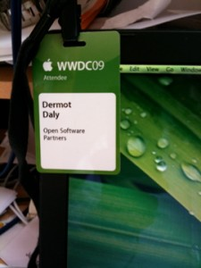
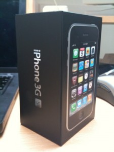

It all started out very innocent. My wife got it for me for my birthday. It was the first iPod I wanted. Up until then, I always thought that they were a little bulky. She ordered direct from the Apple store, complete with engraving, and it came a few days later. A shiny, first generation 4GB iPod Nano. A truly modern design classic.  It served me well, I still use it. I Love how portable it really is. It was so innocent, I didn't think anything of it. I was a Linux user at the time, so I used GTKPod to sync. No windows for me thank you very much. I'm a power Linux user. I endured the interface to remain GPL compliant. Some time passed, and Apple released the iPhone. The ads were very persuasive, and I needed to replace my "crappy as hell" Sony Ericsson. I was due an upgrade, so I took the plunge and got myself an iPhone. I liked it. I liked it a lot. I had moved job, and had a new computer, so I even installed iTunes. (My purism over the GPL has long waned). This was nice. Of course, the new computer ran vista. This lasted weeks at best. Too much falling off networks, and waiting for random stalls made me hate vista with a vengence. I persuaded my then boss that we should have at least one Mac for the office. So I got my macbook.  I didn't realise I was going to be hooked. Initially, I only used during office hours, but as time went on, I found myself secretly switching it on after the kids had gone to bed. Another birthday came around. My nano was long full. My wife didn't realise she was only feeding my habit. I unwrapped the present, and to my delight, it was this:  I put all my music on it, I connected it using a dock to a hifi at home. It became the defacto player for the house. And then of course, O2 came out with an offer. The new iPhone; all existing users can upgrade. Count me in. Mainline it please. Straight away. Now. please...thanks. Anyone in the company need an original iPhone ? Yep? Great; Its yours. I gotta go to the nearest O2 store...seeya.  It was then that I wrote my app, and joined XCake. I needed someone to help me. I felt that going to meetings would be good for me. As the year rolled on, someone at the meetings started talking about WWDC. No fair. How can I resist. June 09:  Then, as July wore on, I've finally realised I have a problem. Standing around an O2 store waiting for its shutter to come up, made me contemplate. Am I in too deep? who am I affecting? None of it mattered. I still went ahead: 

Watch out kids. This could happen to you. It begins with a simple iPod nano, you never know were its going to end. As I write this, I don't know what the future holds. An iMac? A cinema display? Who knows.

> Ladies and Gentlemen, I'm Dermot Daly, and I'm a Macaholic
