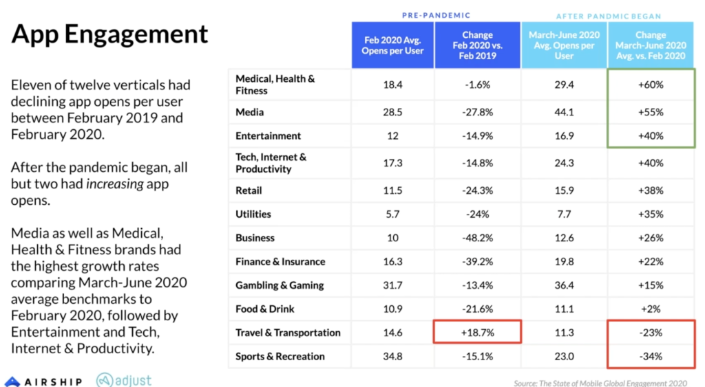
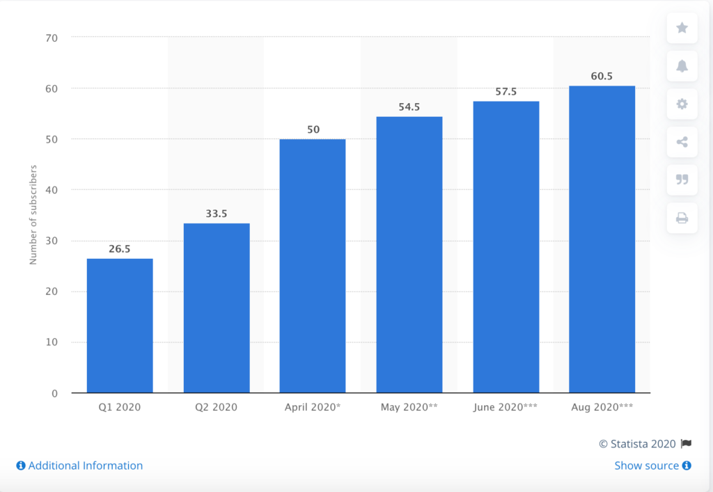
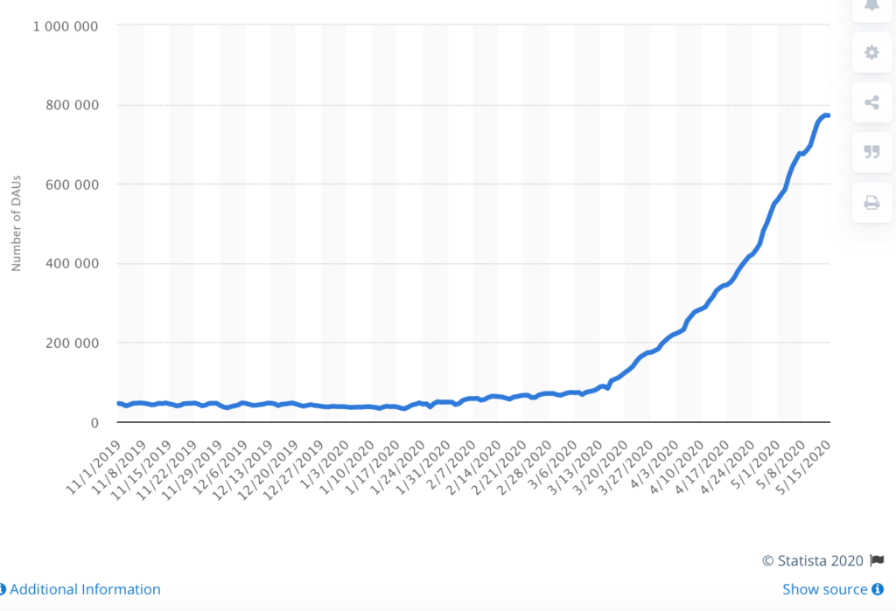

Mobile apps have been a real winner during the COVID-19 pandemic. An Airship study on the “[State of Global Mobile Engagement 2020](https://www.airship.com/resources/benchmark-report/the-state-of-global-mobile-engagement-2020/)” looks at data from millions of active app users globally, comparing usage patterns from pre-pandemic behaviour to after the pandemic began in March 2020.

Some of the key highlights from the report include:

- Mobile app audiences grew 31% year-over-year.
- After years of decline, location opt-in increased every month since March 2020, reaching 10.7% in June 2020, the highest average rate since before GDPR.
- Both average app opens per user and average notification direct open rates increased 29% since the pandemic began.
- Medical, Health & Fitness, Finance & Insurance and Travel & Transportation verticals saw more than 100% growth in average location opt-in rates after the pandemic began.
- Android users receive more notifications per month than iOS users, but users of either device have similar notification direct open rates.

The 12 app verticals covered in the report between February 2019 and June 2020 include:

- Medical, Health & Fitness
- Media
- Entertainment
- Tech, Internet & Productivity
- Retail
- Utilities
- Business
- Finance & Insurance
- Gambling & Gaming
- Food & Drink
- Travel & Transportation
- Sports & Recreation

Eleven out of the twelve app verticals measured had declining open rates per user between February 2019 and February 2020. You can see from the image below that medical, health & fitness, media, entertainment, tech, internet & productivity, retail, utilities, business, finance & insurance, gambling & gaming, food & drink, and sports & recreation all had declining open rates. The only vertical on the up side was travel & transportation, which saw an increase in open rates of 18.7%. This drop in open rates for all but one vertical happened between February 2019 and February 2020.

Something very interesting happens after the pandemic; all but two verticals had increasing open rates. While travel & transport increased over the period February 2019 to February 2020, it now saw a decrease in open rates of 23% between March and June 2020. Sports & recreation saw the most significant drop during the same period of 34%.

### **Who were the winners?**

The biggest winners are medical, health & fitness, which saw growth in open rates of 60% between the period March and June 2020. Media saw growth of 55% and entertainment saw growth of 40%, which could be closely related to the release of Disney+.

The Walt Disney Company reported that Disney+ had more than 60.5 million subscribers worldwide as of Q3 2020. This is an increase from 30 million since the end of March. It also generated average monthly revenue of $5.63 per paying subscriber.

[Disney + Subscribers](https://www.statista.com/statistics/1095372/disney-plus-number-of-subscribers-us/)

Tech, internet & productivity saw an increase in open rates of 40%. You only need to look at the success of Zoom since the pandemic hit to see why this vertical has had such a big increase. The usage stats for Zoom’s app shot up in March 2020 as Zoom saw [200 million daily meeting participants](https://blog.zoom.us/a-message-to-our-users/). In April, those figures rose to 300 million daily meeting participants. This is from 10 million daily meeting participants in December 2019. Zoom also has over 90k schools across 20 countries using their technology to educate children. 

[Daily active users (DAU) of the Zoom app on android and iOS devices in the United Kingdom (UK) from November 2019 to May 2020](https://www.statista.com/statistics/1118860/zoom-daily-active-users-uk/)

Liftoff and Adjust's [2020 report](https://www.adjust.com/blog/mobile-shopping-apps-report-2020-announcement/) shows that shopping app engagement has surged 40%. Purchase rates increased to 14.7% from 10.5% in 2019. Install costs drop to their annual low of $2.48 in March 2020.

The pandemic has shone the light on traditional financial institutions and their need to fast-track their digital innovation. Research by the [deVere Group](https://www.devere-group.com/news/Coronavirus-lockdown-Massive-surge-in-the-use-of-fintech-apps.aspx) has shown that Fintech apps are seeing a 72% surge in usage since the pandemic.

In 2019, the global online gambling market was $53.7 billion. But in the age of COVID-19, online gambling is expected by some analysts to increase at a compound annual growth rate of 11.5% from 2020 to 2027.

### Demand drives risk

With this increase in demand for technology, there is also a need for increased risk assessment. Take the gambling app Clubillion which is a free online casino game available on iOS and Android. The apps are now ranked number 1 'social slots' casino app on Google Play and the App Store, with a 4.8 star on both platforms.

They suffered a massive security breach in March of this year where on a single day, 10k of individual Clubillion players were exposed.

Studies have shown that free gambling and gaming apps are especially prone to attacks and hacking from cybercriminals. They are routinely targeted for theft of private data and embedding malicious software on users’ devices.

While apps have done really well during the Covid-19 pandemic risk assessment should also be high on the agenda.

Maria Colgan

Digital Marketing Manager
