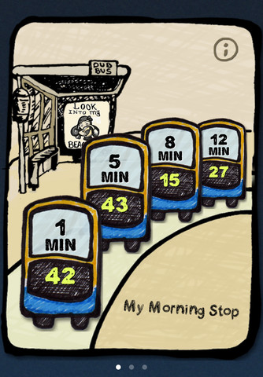
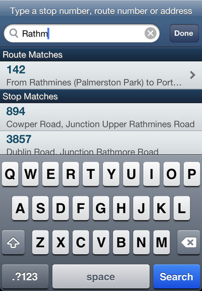

We recently launched a real-time bus app for Dublin called "My Dublin Bus" ([Facebook page](https://www.facebook.com/mydublinbus "Facebook Page"), [iTunes Link](http://itunes.apple.com/ie/app/my-dublin-bus/id499001954?mt=8 "iTunes Link")), and so far the majority of the reviews have been 5 Star. We're happy about that.

The app is super-simple to use; In fact, simplicity is a feature. We put a lot of thought into this, and wanted to share the process behind this.

There are a number of bus apps out there; Some, like the official one is probably mandated to support many different kinds of commuter - the casual commuter, the everyday commuter, and the visitor. Others focus on the various bus routes, and take a map-centric approach to commuting; All of these are important useful features.

But, as an everyday commuter, I find myself needing 10% of those apps, with the other 90% "in the way". I wanted something "for me".

So, we challenged ourselves - how do we make it simple to use for the everyday user. I was the straw man. I use the bus every day. If I didn't need a feature, it was out. This was a cold approach, and we believe the app is better for it. There were a number of things I set out at the start:

1. I check times pretty much every time I go to use a bus. This needs to be the primary focus of the app
2. I know where I am going - I don't need maps
3. None of the bus stops I use regularly are termini, so the timetables are irrelevant guesswork
4. I rarely change the stops I use, but it may happen from time to time - obviously I need a way to edit them

The app that sprang to mind was the Weather App bundled with the iPhone. No need to tap anything - Tell it once what cities are of interest, and all I ever need to do is open it. There is no reason why checking my bus times should be different.

So, we came up with "My Dublin Bus". When opened, it automatically grabs the real time information for your stops and displays it. No tapping, no finding of favourites - Just give me the information already.

\[caption id="attachment\_836" align="alignleft" width="334" caption="Main Screen"\]\[/caption\]

Adding stops is a snap. Other apps ask you to search by stop number, route number, address and so forth. Why? Just find as you type with My Dublin Bus:

\[caption id="attachment\_837" align="alignleft" width="334" caption="Find as you type"\]\[/caption\]

And, as we mentioned - The feedback has been overwhelmingly positive, we have had some feedback from people suggesting adding feature x or feature y. We consider every request; we really do. But if we feel that a feature may jeopardise the simplicity, we've elected to leave it out.

Sometimes, less is more.
