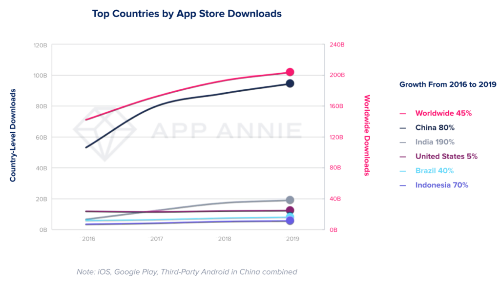
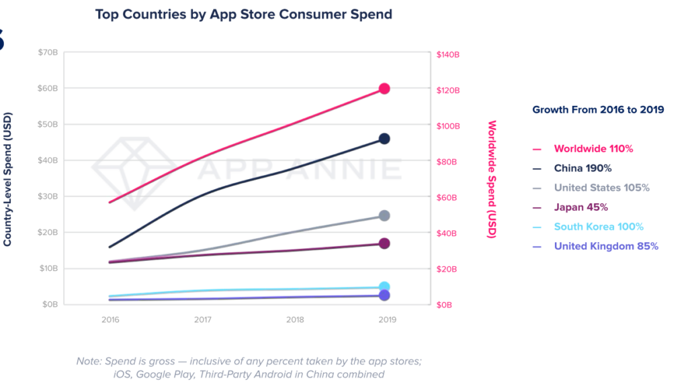
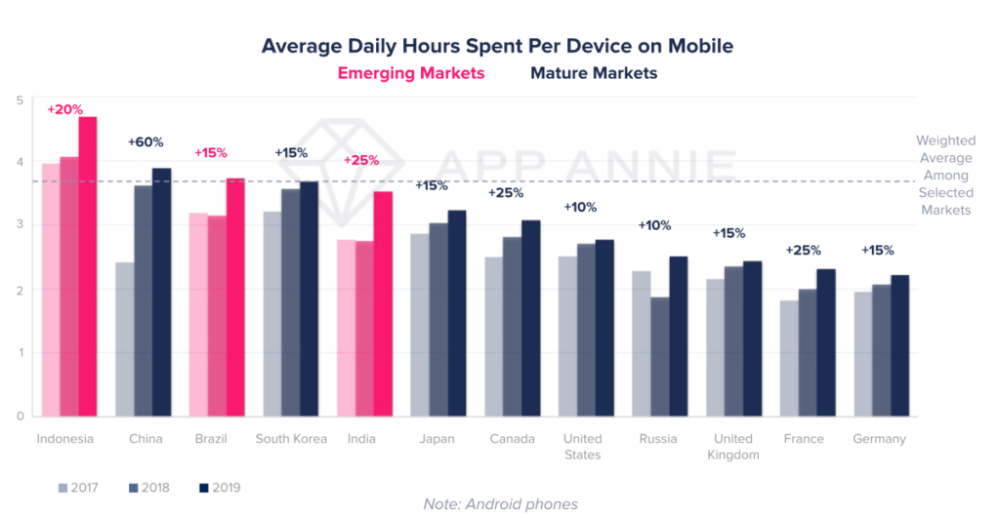
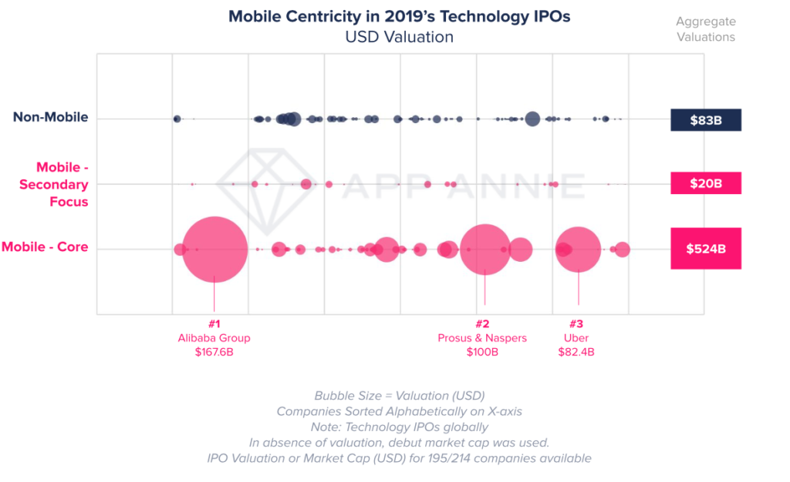
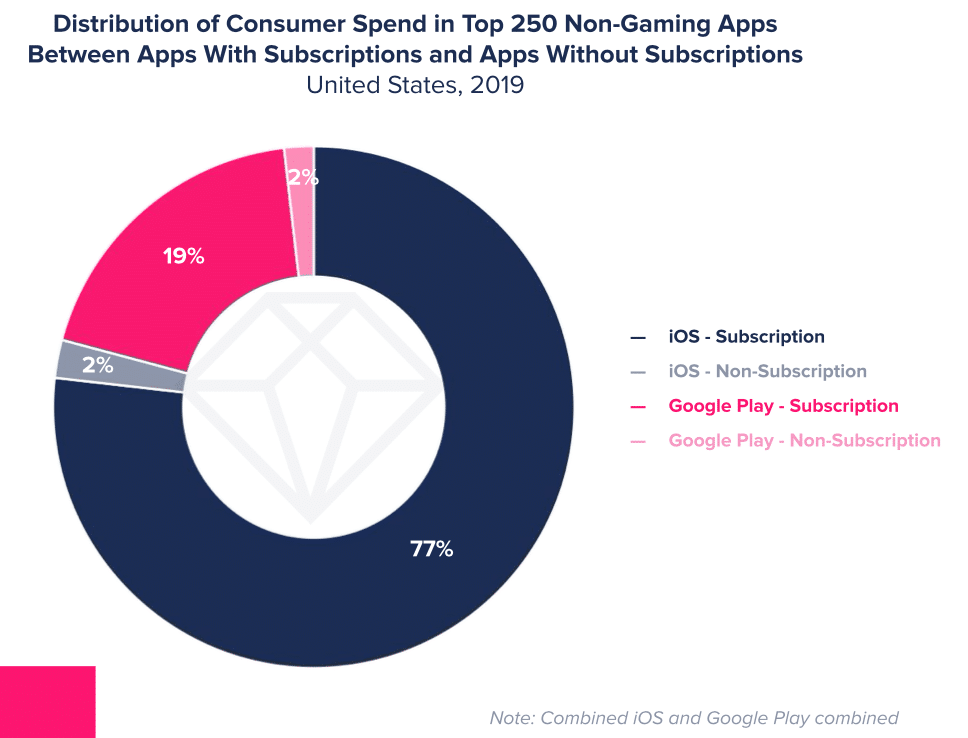
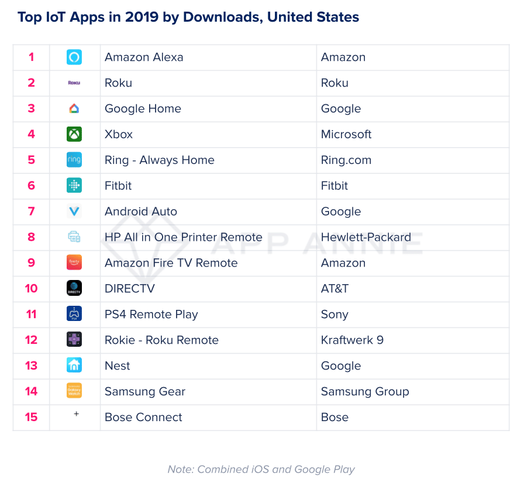
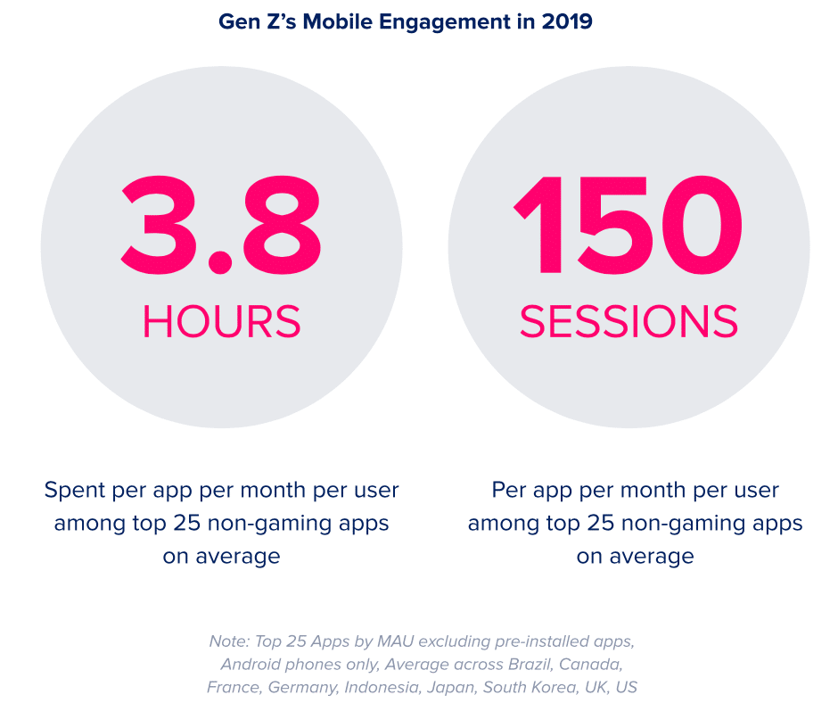
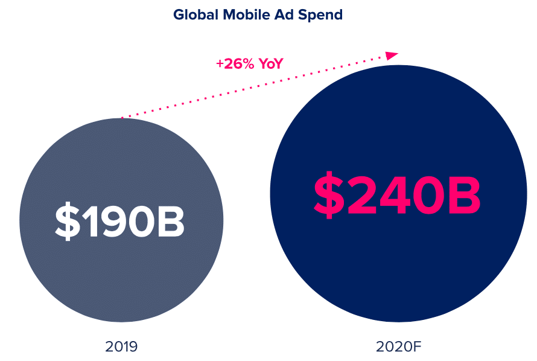

[App Annie](https://www.appannie.com/en/) is an industry leader in mobile data and analytics. It’s trusted by more than one million users worldwide with 1,100 enterprise clients signed up to its service. It has data on over eight million apps and thousands of websites, giving a complete picture of the mobile landscape to help its customers acquire and retain customers, prioritise their mobile roadmap, enter new markets and optimise ROI. Their mission is to help customers create winning mobile experiences and achieve excellence. 

Each year [App Annie](https://www.appannie.com/en/) produces a report on the state of mobile. If you’d like to see the full report on the State of Mobile in 2020 you can download it [here](http://On%20our%20morning%20virtual%20office%20meeting%20this%20morning%20we%20got%20into%20a%20bit%20of%20a%20debate%20about%20which%20of%20these%20biscuits%20is%20better%20to%20dunk%20in%20a%20cup%20of%20tea;%20bourbon%20creams,%20custard%20creams%20or%20jersey%20creams.%20Which%20would%20you%20go%20for?%20%20Well....to%20satisfy%20our%20curiosity%20we%20discovered%20that%20the%20top-selling%20biscuits%20in%20Ireland%20include%20bourbon%20creams%20and%20custard%20creams,%20but%20no%20jersey%20creams!%20Bourbon%20creams%20came%20in%20at%20no.6%20on%20the%20list%20while%20custard%20creams%20came%20in%20at%20no.%2010.%20%20Can%20you%20guess%20the%20number%201?%20%20Not%20surprisingly,%20it%20is%20chocolate%20digestive%20%20We%20love%20biscuits%20so%20much%20that%20in%202014%20the%20Central%20Bank%20spent%20%E2%82%AC55k%20on%20biscuits!). In this post, we'll take some top-line details on the mobile market including apps.

### **App Downloads**

According to [App Annie](https://www.appannie.com/en/), there were 204 billion app downloads globally in 2019. They say that annual worldwide downloads have grown 45% in the three years since 2016 and 6% year over year.  These figures exclude re-installs and updates. You can see from the chart below that downloads mainly happened in emerging markets with India seeing growth of 190%, Indonesia 70% and Brazil 40%. The US remains stagnant at 5% while China saw an 80% increase in Growth. Mature markets might be levelling off but the numbers are still significant with the US seeing 12.3 billion downloads in 2019, Japan seeing 2.5 billion and South Korea seeing 2 billion. These growth rates are from 2016 to 2019.

[Source](https://www.appannie.com/en/insights/market-data/state-of-mobile-2020/)

### **Consumer Spend on the App Stores**

Consumer spend on the app stores hit $120 billion in 2019, up 2.1x from 2016. Gaming takes the biggest share of this with them making up 72% of all app store spend. There has also been an increase in subscriptions in non-gaming apps driving growth from 15% share of the market in 2016 to 28% in 2019. As you can see from the chart below China is the largest market with a 40% market share and seeing growth of 80% from 2016 to 2019. The growth in mature markets of the US, UK, Japan and South Korea has been fuelled by subscriptions in both gaming and non-gaming apps, although they don’t provide the percentage breakdown of this.

[Source](https://www.appannie.com/en/insights/market-data/state-of-mobile-2020/)

### **Mobile Dominates Digital Minutes**

On average we are spending 3 hours and 40 minutes per day on our mobile, this equates to spending 35% more time in mobile in 2019 than two years prior. As you can see from the graph below emerging markets of Indonesia, Brazil and India are spending most time on mobile. France, India and Canada spent 25% more time on their mobile in 2019 than in 2017. China has seen a significant growth in time spent on mobile of 60% from 2016 to 2019.

[Source](https://www.appannie.com/en/insights/market-data/state-of-mobile-2020/)

### **Higher Average IPO Valuation**

Mobile-first companies saw 825% higher average IPO valuation. These mobile-focused companies had a combined $544 billion valuation, which was 6.5x higher than those companies without a mobile focus. You can see from the chart that the three largest IPOs in 2019 were for companies who were heavily focused on mobile. These IPOs amounted to $350 billion; $167 billion for the Alibaba Group, $100 billion for Prosus & Naspers and $82.4 billion for Uber.

[Source](https://www.appannie.com/en/insights/market-data/state-of-mobile-2020/)

### **In-App Subscriptions Vs Apps without Subscriptions**

Subscription apps seem to be driving the way in the US with in-app subscriptions contributing to 96% of spend in top non-gaming apps. 97% of the spend on the App Store and 91% on the Play Store was in the top 250 apps. Tinder, Netflix and Tencent Videos topped consumer spend for 2019 in non-gaming apps. The chart below shows the distribution of consumer spend in the top 250 non-gaming apps between apps with subscriptions and those without. You can see iOS apps clearly dominating the subscription market.

[Source](https://www.appannie.com/en/insights/market-data/state-of-mobile-2020/)

### Top IoT Apps Downloaded in the United States in 2019

There were over 106 million downloads of the top 20 IoT apps in the US in 2019. Many players in the industry are working together to create IoT standardisation that will see [25.2 billion connected devices](https://www.gsma.com/mobileeconomy/) by 2025.

[Source](https://www.appannie.com/en/insights/market-data/state-of-mobile-2020/)

### Gen Z's Mobile Engagement in 2019

Generation Z has 60% more sessions per user in top apps than older demographics. In the top 25 non-gaming apps, Generation Z spent 3.8 hours per app per month and 150 sessions. Generation Z will [surpass Millennials](https://www.inc.com/anne-gherini/gen-z-is-about-to-outnumber-millennials-heres-how-that-will-affect-business-world.html) as the largest generation by the end of 2019, comprising roughly 32% of the population.

> “Millennials and Gen Z have over $1 trillion in direct spending power and will continue gaining influence in 2020 and beyond. In order to reach them, marketers need to take advantage of immersive mobile platforms like Snapchat, where we build engaging mobile experiences and drive powerful incremental reach among younger audiences.”
> 
> Kathleen Gambarelli, Group Product Marketing Manager, Snapchat

[Source](https://www.appannie.com/en/insights/market-data/state-of-mobile-2020/)

### 2020 Set to be a Big Year for Mobile Ad Spend

2020 is set to be a big year for mobile ad spend with a 26% year on year increase, bringing the spend from $190 billion to $240 billion. Consumer and ad spend in mobile is to top $380 billion globally in 2020.

[Source](https://www.appannie.com/en/insights/market-data/state-of-mobile-2020/)

Maria Colgan

Digital Marketing Manager
