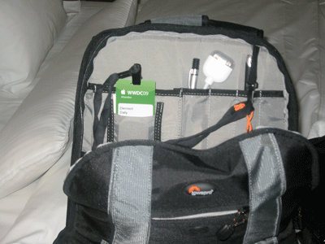
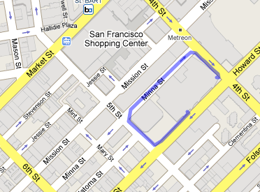
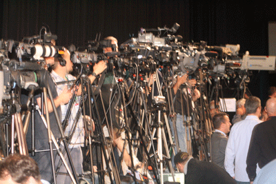

I was lucky enough to visit Apple's Worldwide Developer Conference (WWDC) this year. This post consists of my initial thoughts having come back.

\[caption id="attachment\_179" align="alignleft" width="400"\] Getting ready to head to Moscone\[/caption\]

**The Keynote**

The keynote was interesting from a number of points of view. We were advised to get there early to ensure a place in the main auditorium, which must hold 4000 people. I went along with this, and got there for 7:30 am (the Keynote was due to begin at 10am). hockingly, at this time, the queue (line for those of you in the US) went 3 quarters of the way around Moscone West:  Ok. So it's fair to say that the keynote generates serious buzz. Each year it consists of nuggets of information regarding new Macs and new iPhones. Both had some enhancements, and both had price drops but I didn't feel that they were as exciting as other years.

\[caption id="attachment\_180" align="alignnone" width="400"\] The press gallery at the keynote\[/caption\]

What stood out for me however, was the buzz in the room around the start, and indeed the whoops and cheers as they announced how the growth in active mac users has jumped in the last couple of years. I would liken the response to people who are delighted to have so many new members to their church.

**The Sessions** The sessions where by and large excellent. Every speaker was polished, and the delivery was first rate. And..its like drinking from the firehose. The information comes thick and fast, is detailed and useful. Each session leaves aside about 10 minutes for Q&A and sticking around for these is worthwhile. Its also good to see the Apple folk having to answer technical questions on the fly. One part of the Q&A became a little tedious. Apple do not answer any question if it is posed in the future tense. I'm a relative newbie to this world, but I noticed this very early. It surprised me that people continued to do it. Any question beginning with "Are you planning on...", "Will there be..", etc. etc. gets stonewalled, brushed aside, or given a stock answer like

> "That's great feedback. Doooley noted. I'd encourage you to file a radar on that"

(I didn't notice anyone noting anything by the way). I would go as far as to say I felt that some of the evangelists (this is what the public facing guys who give out their e-mails, etc. are known as) seemed to take some pleasure in trumping out these mantras. Often, the "that's great feedback" line was delivered through a smug grin. The point is this. **Apple don't talk about the future. Don't ask. There's no point**.

**Lunchtime sessions** The lunchtime sessions put on by Apple were superb. The ones I attended were worthy of a TED talk, with the most entertaining one being Denis Wingos "Adventures in Technoarcheology, Restoring Lunar Images for a New Generation of Exploration". It was technical, interesting, entertaining and even emotional in parts. During the Q&A, a guy who worked on the original NASA project complimented the speaker, and got emotional. It was touching. Software development is much older in the US than here in Ireland, so there were plenty of more mature people at the conference.

**Extra events** There's lots of things going on during the week of WWDC. You could quite easily eat and drink free for the week should you want to. We attended events put on by Symbian (Free lunch, nokia 5800 out of that!), Palm (free tapas and drink!), The iphone launch party (Rubbing shoulders with Steve Wozniak!, free champagne!), Parallells (free food and drink!), Cocoaheads (free entertaining talk by Wil Shipley), etc. All of these were a great place to meet people, network, and have some fun too. This brings me on to another point.

**Geeks are people, too. Interesting people, even** Like all first timers, I had preconceived notions of the "kind" of people who attend events like this. I took some flak about my week away going to a "nerdfest" and other such terms, but the experience has totally changed that. As software engineers/programmers/scientists people make assumptions about our inability to communicate beyond speaking about technology. What I met were lots of people who were interesting, engaging and fun to be around. Some of these people use the term 'nerd' or 'geek' with pride. None of them were like the stereotypes we've come to know from movies, etc. Some spoke about technology, some spoke about the books they've written, but plenty were happy to speak about sports, or where they are from, or their family, whatever. At WWDC, I was with people I enjoy spending time with. We had overlaps in our interests, sure, but by and large I met people that self confessed 'non-nerds' could enjoy being with. I think its time that those stereotypes were busted.
