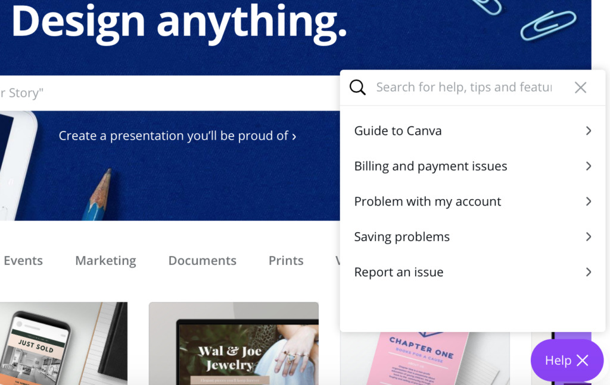
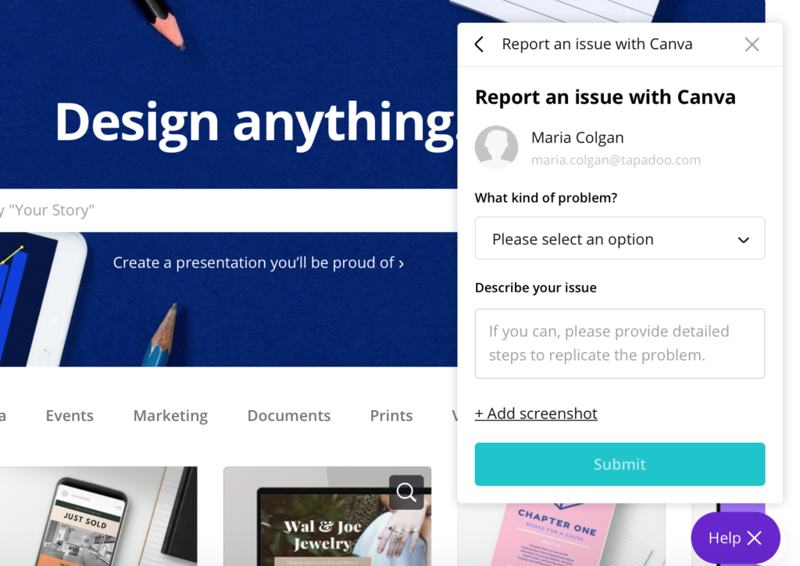
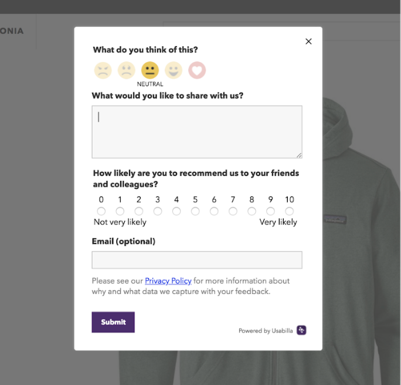

Developing an app is never a finished product. There are always tweaks that can be made to improve the user experience and make it a better and more desirable product. But whatever changes you make to your app you want to make sure that they are in line with what users want. Users want to enjoy their experience within your app, and as users of your product, they'll have more insight into what improvements need to take place to make it a better experience.

Give users a voice. Allow them to complete feedback on your app. And the best and most efficient way to solicit and collect this feedback is in-app. Users will be more inclined to leave feedback in-app than having to leave the app and go elsewhere to provide it. Being able to provide feedback in-app when the user has just used it increases the chances of them sharing their experience, ideas and highlighting some issues they may be having with your app.

Whether you choose to have a permanent in-app feedback mechanism or a one-off survey, in-app feedback mechanisms allow you to collect feedback with little to no maintenance.

Here are some top tips for gathering feedback in-app

### **Top Tips for Gathering Feedback In-App**

#### **One-off survey or permanent feature**

Consider if you are going to use a one-off survey or have a permanent feedback widget. One-off surveys are useful for gathering specific feedback on a feature within your app, or a particular part of the user experience you are looking to improve. These surveys usually appear after a user completes a series of tasks within your app or when they get to a specific screen. A permanent feedback widget is in your app permanently for when users want to submit ad-hoc feedback. This type of feedback doesn’t openly solicit feedback. 

#### **Make the feedback widget discoverable**

If you are choosing a permanent feedback solution within your app make sure the feedback widget is discoverable. The widget can be placed in the header or footer, as a menu item or as an always visible app icon. Wherever the widget is placed it should be kept there for consistency and to ensure good results. In the examples below Canva does this well.

#### **Keep the survey short**

When choosing a one-off survey it can be tempting to ask a number of questions to get the maximum results, but too many questions are off-putting. Keep the survey short and sweet and don’t ask unnecessary questions. If you have user data already don’t ask for it again. Save your questions for what you really need to know. In the examples below Patagonia is a good example of this.

#### **Consider the user experience**

The user experience of your in-app survey is just as important as your apps overall user experience. Consider the overall design of the survey carefully, making sure it represents your app's brand. Don’t make too many questions compulsory and allow for open-ended feedback. Inform users that feedback will be taken on board and actioned where possible. The survey can be used to entice loyal users into more open conversations about improving the user experience within your app.

#### **Ask the right users at the right time**

While it may be tempting to give a one-off survey to every user within your app, you really only want to ask loyal users. Loyal users are invested in the success of your app. They'll want you to make improvements to your app for a more enjoyable user experience. Also, there’s nothing worse than downloading an app and using it for the first time to be hit with a survey. Most users will just go ahead and delete that app. So ask loyal users, users who have been using the app for some time and who know it in detail. These users will be much more willing to invest time completing an in-app survey.

#### **Tell people how long the survey will take**

When a survey pops up in-app users will want to know who long it’s going to take to complete it. Nobody wants to invest 20 minutes completing an in-app survey, even loyal users. Pick four or five key questions to ask users. Also, include a progress indicator so they know exactly where they are in the survey and how long is left to go before it is completed.

And finally, don't forget to thank users and keep them updated on the progress of their feedback.

### Examples of In-App Feedback

#### Slack

Slack allows users to send them a message with feedback directly within their platform. The command “/feedback” allows users to immediately submit feedback to the Slack team. The feedback can be given anywhere in the app and users don't need to move to a feedback widget or chat window.

#### Canva

[Canva](https://www.canva.com/) provides an unobtrusive but constantly present in-app feedback mechanism. They place the prompt in the bottom right-hand corner so as not to interrupt the user experience yet obvious enough for users to report a problem if needed. Users are encouraged to provide screenshots and be as detailed as possible.

- 
    
- 
    

[Canva](https://www.canva.com/)

#### Patagonia

Patagonia provides sleek in-app feedback mechanism. It captures all feedback on one screen making it more inviting for users to provide the feedback. It also offers a mixture of smiley face emojis, open-form feedback boxes, and NPS score. This is covering all in-app feedback in one setting.

Maria Colgan

Digital Marketing Manager
