## **Developer turned Designer**

Stepping out of your comfort zone is always a scary thought, but also an opportunity to grow as a person and to expand your repertoire of skills. It’s a challenge to your current way of thinking and to gain a new sense of perspective for your newly acquired craft.

At Tapadoo, my collaboration with the design team has involved contributing to [UI/UX](https://en.wikipedia.org/wiki/User_experience_design) decisions that come in from clients and how best to tackle them but not to the extent where I am designing something from scratch.

I challenged myself to design a project of my choice. I decided to go for something simple and chose to design a Weather App. Also how hard could it be? Show the temperature and time of day. Easy, right? Not so much.

## **Requirements**

The goal was to design something _simplistic_ but also _functional_. These were the two keywords I kept referencing when making decisions. The user should be able to extract the information they are looking for without much effort.

I first listed the content that I felt was important when opening up a Weather app:

- Temperature
- Location
- Day
- Type of Weather

## **Research**

Once I had chosen what I wanted to show, it was now time to go and get some ideas of how I was going to display my content. I drew inspiration from sites such as Dribbble and Youtube as well as Instagram. I was made aware quite early on that although much of the stuff on Dribbble does look nice, it is very much concept based and isn’t very functional. Also having looked at weather apps on the App Store made me realise that a lot of the information displayed on screen requires the user to take their time when filtering the information they require.

## **Process**

**Sketches**

Now onto the hard part, where do I begin? Do I pick the colours I’m going to use first? What font should I go with? What assets will I need?

Thankfully I received some guidance from our designers [Orla](https://tapadoo.wpengine.com/author/orla/) and [Sona](https://www.instagram.com/sonadoodle/). The simplest place to start was good old pen and paper. An easy way to get ideas out of your head and get them in front of you quickly.

[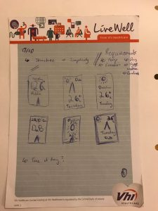](https://tapadoo.wpengine.com/wp-content/uploads/2017/12/IMG_PG1-e1510311365992.jpg) [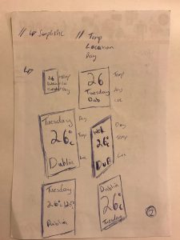](https://tapadoo.wpengine.com/wp-content/uploads/2017/12/IMG_PG2-e1510311399305.jpg) [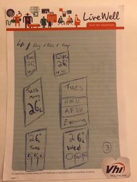](https://tapadoo.wpengine.com/wp-content/uploads/2017/12/IMG_PG3-e1510311462462.jpg) [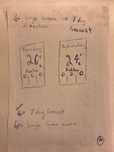](https://tapadoo.wpengine.com/wp-content/uploads/2017/12/IMG_PG4-e1510311287441.jpg)

[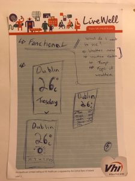](https://tapadoo.wpengine.com/wp-content/uploads/2017/12/IMG_PG5-e1510311231692.jpg) [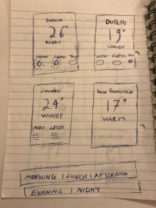](https://tapadoo.wpengine.com/wp-content/uploads/2017/12/IMG_PG12.jpg) [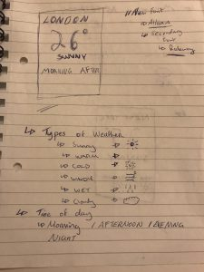](https://tapadoo.wpengine.com/wp-content/uploads/2017/12/IMG_PG13.jpg) [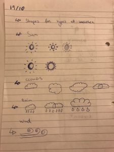](https://tapadoo.wpengine.com/wp-content/uploads/2017/12/IMG_PG16-e1510311198293.jpg)

From my sketches, I really wanted to emphasise the importance of the temperature and make it the main focus of my design.

After doing a few drawings of what I’d like my design to look like I felt it was time to bring it to life and get the basic layout done in Sketch.

[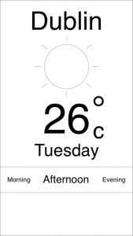](https://tapadoo.wpengine.com/wp-content/uploads/2017/12/Initial-Layout-1.png)

**Font Selection**

Once I had my initial layout up and running on Sketch, I went back to Orla and Sona to seek more advice over font selection.

I had looked at different articles with regards font pairing and the theory behind it. Having a wide variety of fonts to choose from can be quite daunting, so I decided to select from a subset of fonts that I particularly liked the look of. Of course there are articles which detail how a font complements content such as images and what emotions they might evoke. Without getting too technical and delving into the meaning behind it the criteria I used was:  as long as the fonts chosen complemented each other the choice was fine. Otherwise, I could be there for days/weeks selecting what font to go with.

The primary font I went with was Allura and the secondary font was Raleway. After taking some days away from the design, I felt that the Allura font wasn't really in-keeping with what I wanted to achieve with in my design. Instead of going in search for another primary font, I tried having the Raleway font as the only font for my design but changing the different font weights to emphasise certain content over others. To me the design looks a lot cleaner with the single font family.

[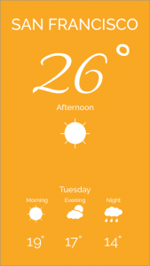](https://tapadoo.wpengine.com/wp-content/uploads/2017/12/Original-Design-2.png) [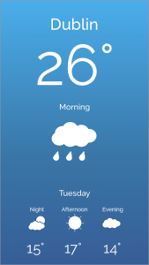](https://tapadoo.wpengine.com/wp-content/uploads/2017/12/Morning.png)

**Colour Selection**

A component that has a huge impact on how a design/layout looks and feels. Colour can set the tone of the design from the outset. Going back to my two keywords _simplistic_ and _functional_, I didn’t want to have too many colours on screen at any one time as it may distract the user. My goal was to select colours to help complement the temperature but to not detract from the information.

Having looked a other weather apps on Dribbble I liked how some designs used colour gradients well to represent the tone of the weather, which is what I tried to do in my own design.

**Iterations**

Once I had a decent basis to work from, I began to iterate over my designs. When it came to colours, I changed from having the colours represent temperature to represent the time of day.

- Morning - Light Orange
- Afternoon - Light Blue
- Evening - Aqua
- Night - Light Red

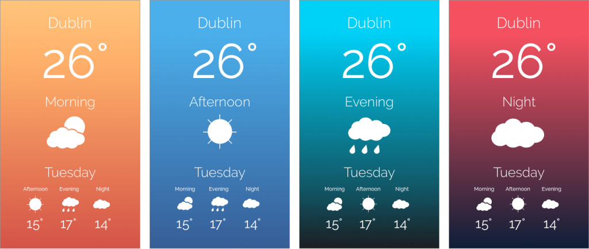

Going onto my new version of designs, I decided to play around with the having the location text in a lighter font size then the main temperature number. I also swapped around how the time of day and day reads. Instead of having the text read, "Morning Monday", the text will now read "Monday Morning", which reads much better from top to bottom.

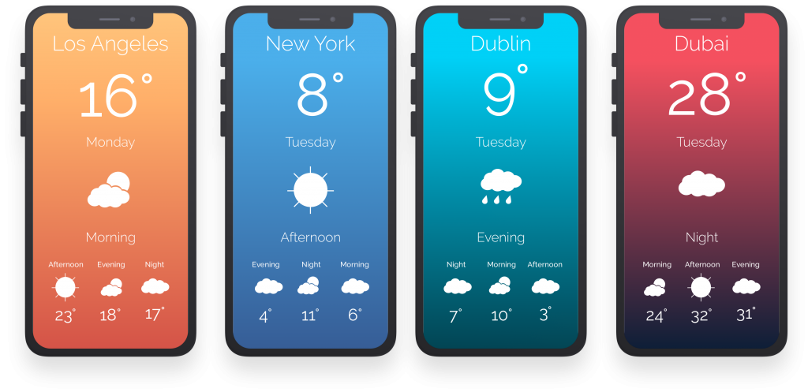

**Consultation**

I was very fortunate to have Orla and Sona available to me as a point of reference which may not always be the case when starting something new. A point of reference doesn't always have to be a person, it can be any resource from the Internet or a book, just something that you can refer back to when seeking guidance as to what is the next step.

Even though you have your own ideas of where you want to go with your design or whatever you may be working towards, it's always good to have another pair of eyes to take into account different perspectives you may not have considered.

Orla was able to give me advice regarding the consistency of the colour gradients I was using. She advised on a lighter finishing colour for the red gradient as it was very dark compared to it’s counterparts. She also recommended reducing the font size of the location title as it could be seen as competing with the main temperature text.

Sona was able to advise going for a more location based weather app from the outset as opposed to having each screen be a separate day. The reasoning for this is the weather can be very unreliable at times, especially in Ireland, so showing the weather a few days down the line didn’t seem too reliable from a user's point of view. She also sent on articles referencing font pairing and colours to get me started.

## **End Product**

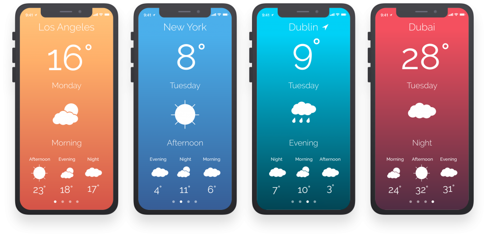

Even though this can be seen as an individual project, it is very much a team effort. Getting guidance from Orla and Sona on designs, feedback from other developers on the blog post and where improvements can be made all adds up to the finished article.

## What Next?

Go and try that thing you always wanted to do. You just might surprise yourself at what you can accomplish when you put your mind to it.

## **Resources**

[https://designschool.canva.com/blog/the-ultimate-guide-to-font-pairing/](https://designschool.canva.com/blog/the-ultimate-guide-to-font-pairing/)

[https://designschool.canva.com/blog/100-color-combinations/](https://designschool.canva.com/blog/100-color-combinations/)
