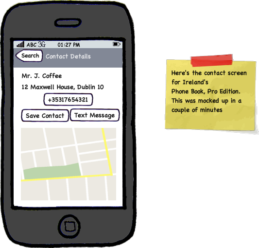
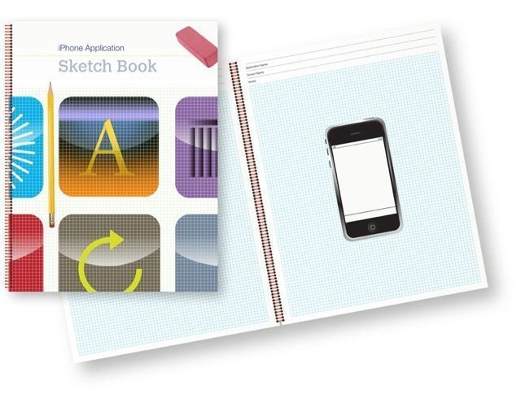

I'm gonna speak about two tools that I recommend if you are planning on developing apps, particularly for clients. These are just as important for any sort of iPhone app development, but they are very useful for interacting and collaborating with customers.

## Balsamiq

[Balsamiq mockups](http://www.balsamiq.com/products/mockups) from Balsamiq Studios plain and simple rocks. What is it? It is a very rapid prototyping tools for UI and User Experiences. They've added specific iPhone stencils into the product so you can create mockups really, really quickly. Why do I like it? Lots of reasons:

1. Its runs everywhere. Its an Adobe Air application, which though is not native to Mac, it runs nicely on the desktop. But, they've also got an edition that runs in a web page, so you can deploy it on your wiki, or any other collaborative web server you may use. They've even got a hosted edition which you can play with for free (go [here](http://www.balsamiq.com/demos/mockups/Mockups.html), have a play)
2. Doing up stuff is _fast_. It is genuinely as quick as using a pen and paper. Just last week I was working on a proposal; the client had given me his ideas, and I already formed my opinion on how it would look. I mailed him back my response as a bulleted point list (It was a small project!). He wasn't convinced. So...I spent a bit longer, and did up a couple of pages of a proposal. I used mockups to illustrate my ideas. Without spending too much time, I had gone from a boring e-mail response, to a professional, well thought out one, which immediately struck a chord with the client.
3. It is focused on function rather than detail. I really like this. It produces mockups that look like they are hand drawn. It avoids details like colour, animation etc. This means when working with the client we can focus on what the app does ( not "Shouldn't that button be bluer?"). We get across high level ideas, get them across well, and by being low on a lot of details, it means we can get more feedback with the client. I love the phrase Balsamiq use themselves:
    
    > A low fidelity look which encourages hones feedback. We call it "_a look no-one is afraid to criticize_"
    
4. They have an agile approach to their product; They update their application on a regular basis, based on feedback taken through GetSatisfaction

Enough of my rambling; Here's a mockup.

## iPhone Application Sketch Book

Next is...an actual sketch book. Its available on amazon, but you can find details about it on [www.mobilesketchbook.com](http://www.mobilesketchbook.com). I think this is a great one for grabbing ideas, or scribbling down initial design thoughts. I like this because it is a low-tech answer; Each page is lined graph paper, with a full-size image of on iPhone on it. The screen area is blank, so you can draw on it to capture your app ideas.  You can have this in your laptop bag, and use it when an idea comes to you. (when travelling, for example).

Having this along at a client meeting is great. It shows the client that you are doing this often, and you are serious about capturing the ideas

I know there's others out there, based around Powerpoint or Keynote, but frankly, these two are my favourites right now.

If you've other tips, please leave a comment with your favourite tools for iPhone design and development.

* * *

You're reading the tapadoo blog. Did you know that as well as publishing our own applications, we offer iPhone development services and consultancy? If you have an idea, project or something you think we can help you with, please get in touch through [our contact page](https://tapadoo.wpengine.com/contact/).
