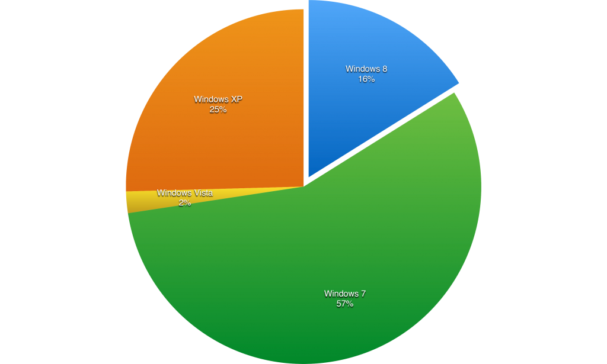
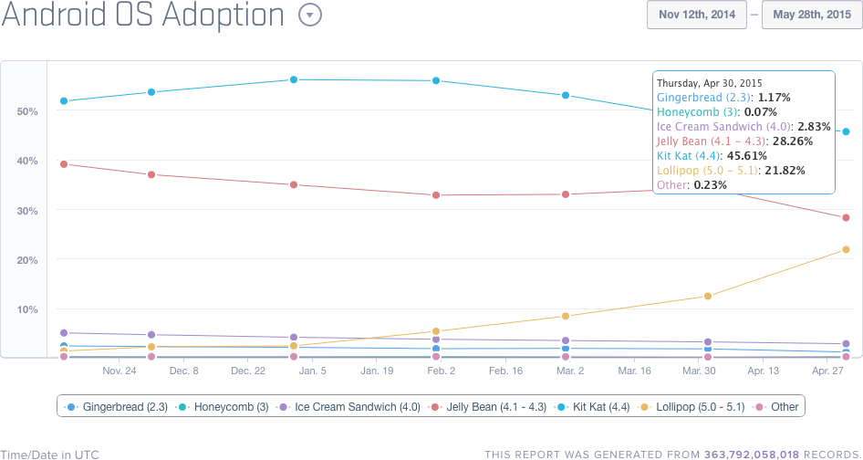

Later today Apple will release their new mobile operating system, iOS 9. While we're excited to see some of the new features and improvements (including [Multitasking](https://tapadoo.wpengine.com/2015/imultitask-therefore-ipad/), better battery life and Apple's first News app) it will serve as another reminder of the challenges facing anyone who has an app.

When building a new app, many people put a lot of time, money and effort into making it great. However, like any asset, your app needs to be maintained. App maintenance is the only way to ensure that your asset will continue working with newly released technologies. The idea (and budget line) of enterprise software maintenance is well established. However, planned maintenance for mobile apps is a relatively new field - try searching Google to see which app developers mention this or have a specific service offering.

The necessity to update your mobile business app is critical given how frequently mobile operating systems update. The first version of what is now known as iOS (iPhone OS 1.x) was released in June 2007 with the first Android OS (Android 1.0) being introduced in September 2008. Since their debut, there have been 8 major releases of iOS and 11 versions of Android.

With the two prominent mobile OS providers a pattern has started to emerge - they both introduce a new mobile OS every year. At [WWDC 2015](http://www.apple.com/live/2015-june-event/) (June 8, 2015) Apple previewed iOS 9 and at [I/O 2015](https://www.youtube.com/watch?v=7V-fIGMDsmE) (May 28, 2015) Google showed developers Android M (for Marshmallow) which is expected to be released later this month. As well as major updates there are regular minor updates and revisions.

Unlike the traditional software update models on desktop computers, the adoption rate for mobile operating systems is extremely fast. The below graph from [Mixpanel](https://mixpanel.com/) shows the iOS adoption rate from the day iOS 8 (September 17, 2014) was launched to the day iOS 9 (June 8, 2015) was announced.

##### _Mixpanel Graph Showing iOS Adoption Rate_

In just eight months, almost 87% of all Apple mobile devices (the company sold its [billionth iOS device](https://twitter.com/pschiller/status/560197288048340992) in November 2014) run the most recent OS. As of today (iOS 9 release day) almost 91% of iPhone and iPad devices are using iOS 8. For operating system adoption this is unprecedented and a stark contrast to desktop OS adoption rates. The below chart shows the current market share for desktops running Windows (which account for 91% of the desktop landscape) operating systems. This clearly illustrates that desktop users are comparatively slow to update their operating systems. For example, Windows 8 (this category includes Windows 8.1) was released two years ago yet today only accounts for 16% (Data by [NetMarketShare](https://www.netmarketshare.com/operating-system-market-share.aspx?qprid=10&qpcustomd=0)) of all Windows machines. This is quite stark when you consider Windows 8 is eclipsed by Windows XP, a 2001 operating system that Microsoft stopped supporting last year. This would be unthinkable in the mobile space.

##### _Chart Showing Windows Adoption Rate_

The below graph from Mixpanel shows the Android adoption rate from the day Lollipop (November 12, 2014) was launched to the day Android M (May 28, 2015) was announced.

##### _Mixpanel Graph Showing Android Adoption Rate_

While Android adoption is more fragmented than iOS, the two most recent OSs (KitKat and Lollipop) which where both released in the last two years (covering approximately the same time period as Windows 8), account for around 67% of the market share.

The data is clear: compared to their desktop counterparts, mobile operating systems are released more frequently and end-users are quick to update to the latest release. So how much should a business expect to pay to maintain their app? After analysing the data for the client base at Tapadoo I’d suggested setting aside 15% - 25% (variation is down to the project size) of the original app development costs as a good guide price. This will allow business apps to have planned developer time to support operating system updates and allow enhancement of existing features. Regardless of what level of support works for your business budget, the above illustrates it is important you have some plan in place. Don’t waste your asset.
