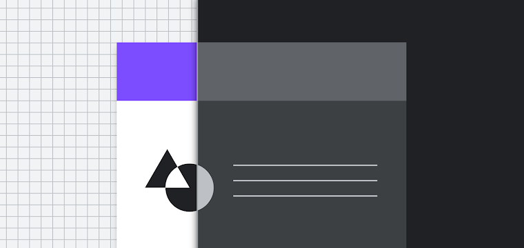
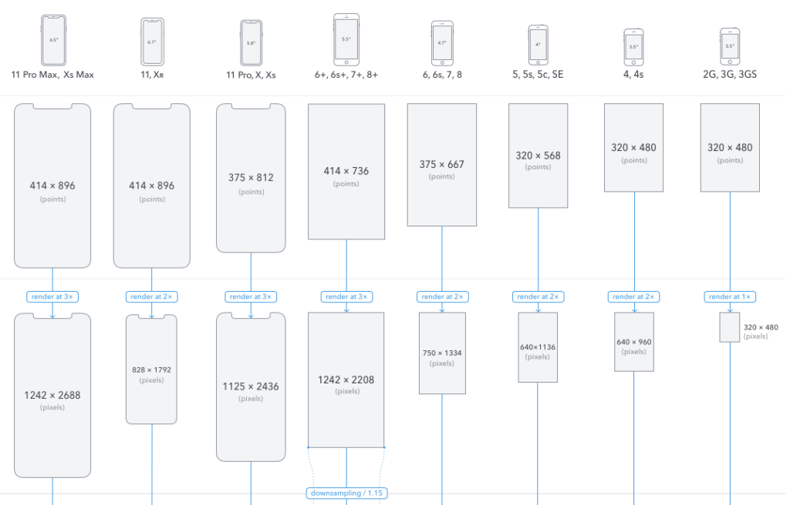
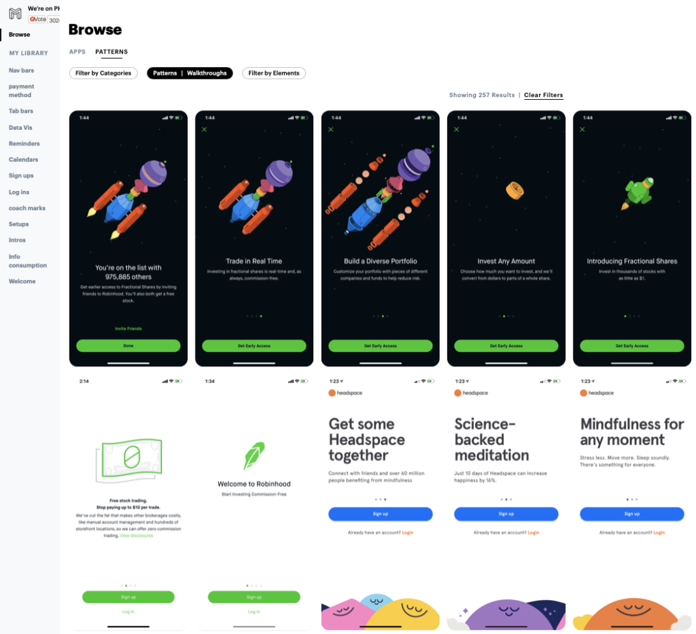
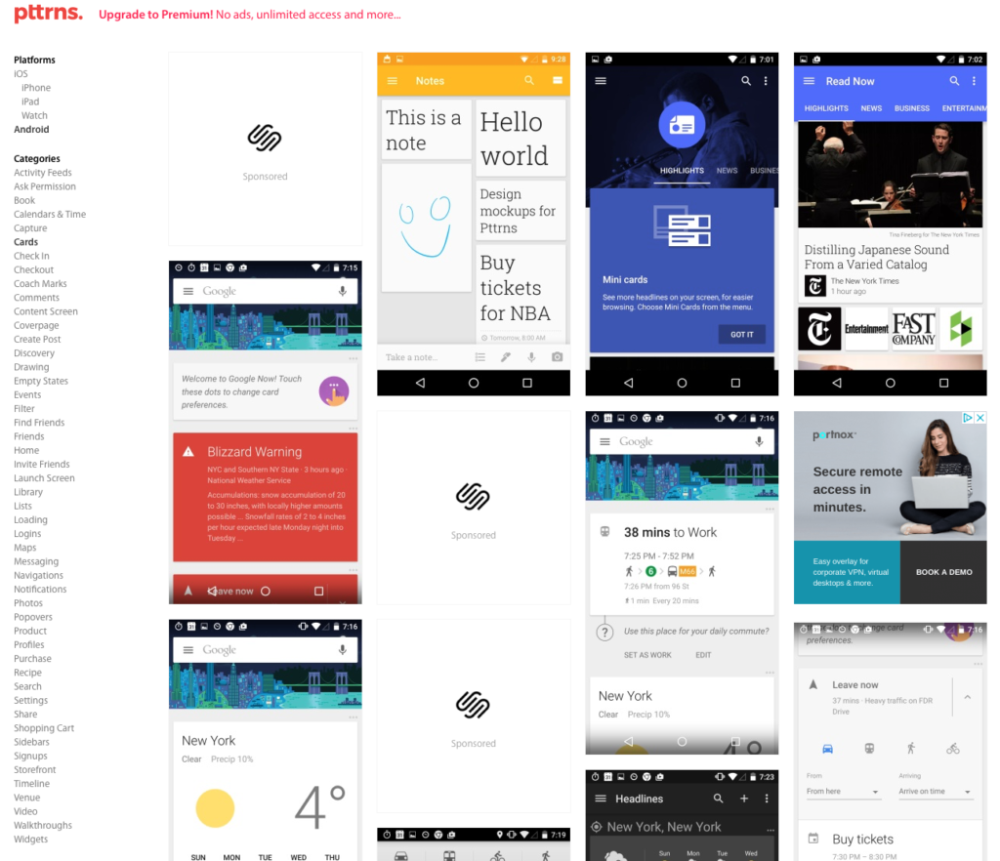
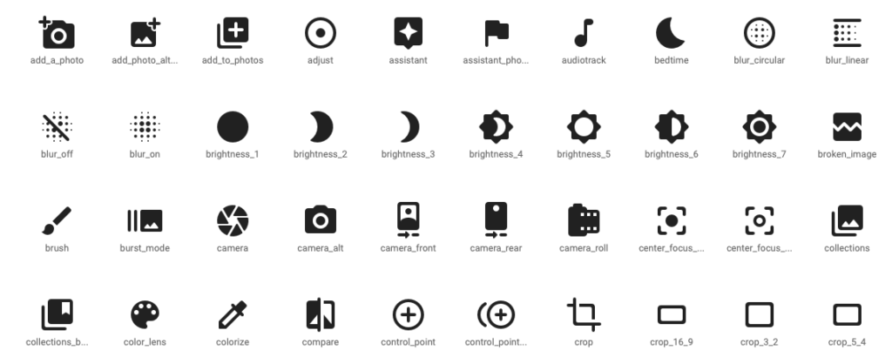
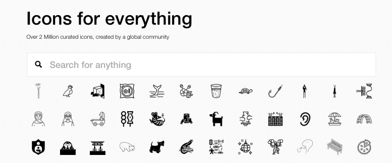
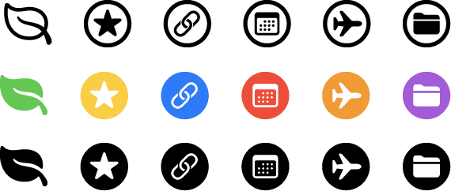
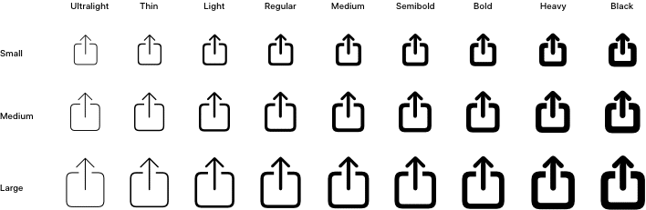
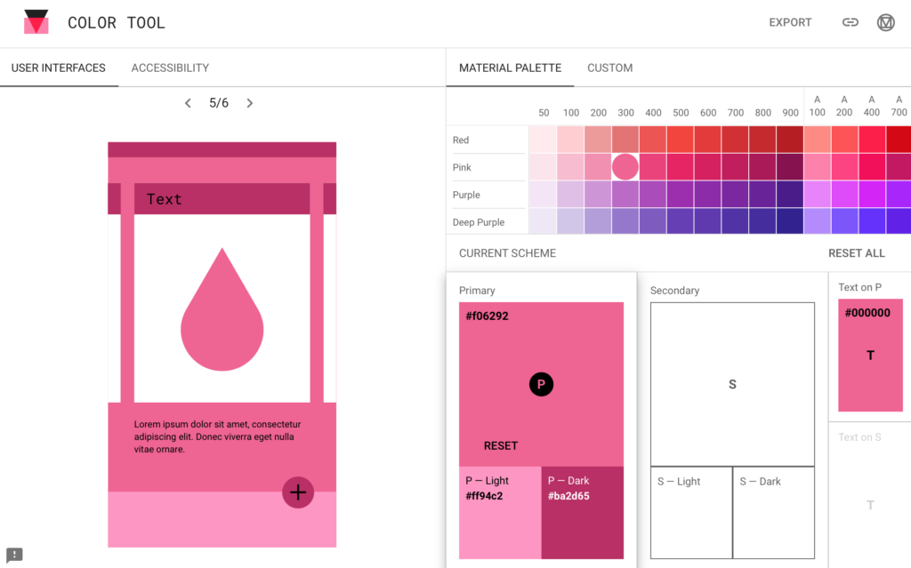
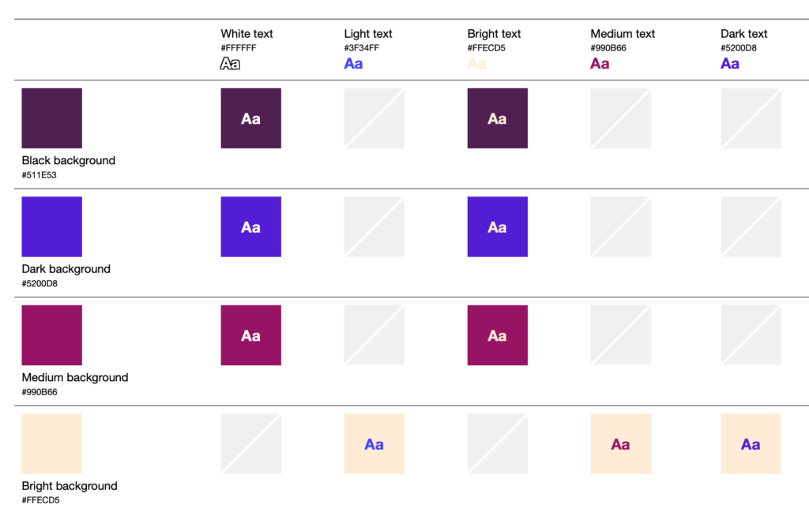

Over time designers build up a collection of resources that they visit or use regularly. Resources we use to remind ourselves of best practice, to check our knowledge is still up to date, or what exactly the size of an iPhone 6s is again! Below we've listed some resources that we use regularly, or visit when we need them for a specific purpose. If you're just starting out in mobile app design these may come in handy. If you're a seasoned pro we'd love to hear what your most-used resources are.  

## The Basics

If this is your first look into mobile app design, now is a good time to familiarise yourself with [Apple and Google's interface guidelines](https://tapadoo.com/ios-and-android-design-differences-and-why-they-matter/) and the concept of screen sizes and screen resolutions. 

#### Apple's Human Interface Guidelines

[Human Interface Guidelines - Apple  
](https://developer.apple.com/design/human-interface-guidelines/ios/overview/themes/)

Apple’s Human Interface Guidelines (HIG) provide an in-depth view of UI patterns that are native to iOS. From design themes, principals, interface and interaction guidelines, elements of the visual design such as colour, typography, to animations. It's important to stay on top of new design developments and revisit the HIG to ensure your knowledge or assumptions are up to date. The HIG also becomes a useful communication tool between designers and developers.

[https://developer.apple.com/design/human-interface-guidelines/ios/overview/themes/](https://developer.apple.com/design/human-interface-guidelines/ios/overview/themes/)

#### Google's Material Design Guidelines

[Material Design for Android](https://material.io/design)

Similarly, Google’s Material Design (MD) guidelines promote a  “visual language that synthesizes the classic principles of good design with the innovation of technology and science”. Their aim is to create a unified design language across all their platforms and devices. MD also provide examples of how to correctly use each component of their UI and how it should not be used. 

[https://material.io/design](https://material.io/design)

### Screen sizes and resolutions 

When starting out in mobile app design, it’s a good idea to familiarise yourself with points, dps, rendered pixels and physical pixels. While both iOS and Android are moving towards scalable vectors for their graphical assets, there are times when you’ll need to understand the multipliers for different devices. Online you’ll find a lot of tables, lists and formulas detailing screen sizes and resolutions. However, PaintCode’s visual explanations are one of the easiest ways to comprehend the different resolutions. While it only details iPhone sizes, it's still useful to see the concept in a visual form.  

[https://www.paintcodeapp.com/news/ultimate-guide-to-iphone-resolutions](https://www.paintcodeapp.com/news/ultimate-guide-to-iphone-resolution)

[Paintcode's The Ultimate Guide To iPhone Resolutions](https://www.paintcodeapp.com/news/ultimate-guide-to-iphone-resolutions)

If you would like to learn more about dots and pixels. Sebastien Gabriel has created this guide for designers [https://sebastien-gabriel.com/designers-guide-to-dpi/](https://sebastien-gabriel.com/designers-guide-to-dpi/)

For a comprehensive device list for both iOS and Android, with screen dimension, aspect ratios, and densities, Google Material Design device metric list details over 60 smart devices from Android and iOS mobile devices, including tablets, iPads, smartwatches, laptops and desktop screens. Unfortunately, Google has decided to stop updating this list, but it’s still useful for referencing older devices. 

[https://material.io/resources/devices/](https://material.io/resources/devices/)

## Real world inspiration

Quite often when designers are looking for ideas and inspiration they’ll head over to Dribbble. It's a great place to soak up different styles and to help generate ideas. However, quite often these designs are done without restrictions imposed either by a client brief or the platform it’s been designed for. Looking at real-life examples and patterns that are actually in users hands can help decide how to solve your design problem.

#### Mobbin

[Mobbin](https://mobbin.design/)

For real-world examples, Mobbin is a great tool to find, filter and save mobile UI patterns. It’s regularly updated and curated with high-quality examples. It can be filtered by industry category, UI pattern or element, which is really handy when you’re looking for an example of something specific. 

[https://mobbin.design/](https://mobbin.design/)

#### Pttrns

While Mobbin only covers iPhone apps, Pttrns.com covers a wider range of examples from iOS (iPhone, iPad, Watch) and also has a wide range of Android examples to browse. This is another useful resource for real-world examples. 

[https://pttrns.com/](https://pttrns.com/)

[pttrns web tool](https://pttrns.com/)

If you find an example you’re interested in on any UI design site, I’d recommend downloading the app from the respective store to get a good feel for the experience as a whole. 

## Iconography

#### Material Icons

[Google's Material Icon Library](https://material.io/resources/icons)

Icons are a consistent element of mobile UI design. They’re heavily used for navigation and actions. While many designers love to create their own custom icons sometimes it’s more efficient and effective to use icons from pre-made sets. For a long time, Google has provided universally recognised symbols that can be downloaded for free in both PNG and SVG for iOS and Android, it also offers a number of basic styles (rounded, filled, outlined etc). 

[https://material.io/resources/icons](https://material.io/resources/icons)

#### The Noun Project

[The Noun Project](https://thenounproject.com/)

If you can’t find what you’re looking for from the Google resources, the Noun Project offers a huge range of community-contributed icons and icon sets. It has everything from industry-specific, nature, weather, sports and hobbies etc. There are over 2 million royalty-free icons available and it’s easy to search for what you’re looking for. 

[https://thenounproject.com/](https://thenounproject.com/)

#### Apple's SF Symbols

During [last years](https://developer.apple.com/videos/play/wwdc2019/206/) WWDC event, Apple announced the introduction of SF Symbols, a library of vector-based symbols that supports multiple weights and sizes. [This year](https://developer.apple.com/videos/play/wwdc2020/10207) they updated the symbols to include more than 2,400 symbols, alignment improvements, and colour enhancements. The symbols cleanly integrate with Apple's system font San Francisco (SF). 

[https://developer.apple.com/design/human-interface-guidelines/sf-symbols/overview/](https://developer.apple.com/design/human-interface-guidelines/sf-symbols/overview/)

#### Drawkit

[Drawkit](https://www.drawkit.io/)

DrawKit is relatively new to me but it offers “A constantly updated library of high quality, **beautiful vector icons**, in four styles. **Free to use on personal and commercial projects, royalty-free**.” But the real bonus here is that it also offers a large range of illustrations AND animations that are After Effects and Lottie-ready that can be used in your projects. 

[https://www.drawkit.io/](https://www.drawkit.io/)

## Stock Images

#### Unsplash

[Simon Berger on Unsplash](https://unsplash.com/@8moments)

The use of photography rather than an image placeholder really brings a mockup to life. Using good photography that portrays the story you're trying to tell is even more important. Unsplash provides a wide range of high-quality stock photographs under lots of different themes that can be used for personal or commercial use without payment or attribution (although if you can, you should!). They even have an [app](https://apps.apple.com/us/app/unsplash/id1290631746)!

[https://unsplash.com](https://unsplash.com)

## User faces

To give the impression of a fully-fledged product, it's important to use avatars of real people instead of the dreaded repeated "user icon" in a grey circle! There a number of tools to help you bring your mockups to life with real faces.

#### UI Faces

UI Faces offers a wide range of faces to use for your mockups. The avatars are donated by the community and can be filtered using a number of categories such as age, race, gender, and expression. It also offers plugins for Sketch, XD, and Figma. As a bonus, it also offers a range of diverse names too.

[https://uifaces.co](https://uifaces.co)

#### Diverse UI

Again offers a wide range of free to use avatars. The website allows you to change the scale of the avatar and filter by sex. Divers UI also has a Sketch plugin available.

[https://diverseui.com](https://diverseui.com)

## Colour

The colours used in any interface have an impact on the experience. An app's colour palette can be driven by the brand's colour guidelines or by the theme or feeling the app wants to portray. It's important to use colour in a way that not only communicates the feeling or brand theme but ensures it doesn't detract from the usability or comfort of the app.

#### Theming with Colour Tool

If you're wondering how your brand colour would look being applied to an app, Material Design offers a "Color Tool" that allows you to preview what a colour theme would look like applied to Android apps various UI components. It also offers accessibility warnings if it believes the contrast of background colour and text is poor.

[https://material.io/resources/color/](https://material.io/resources/color)

## Accessible color palette builder

[Accessible Colour Palette Builder](https://toolness.github.io/accessible-color-matrix/)

There are lots of good colour accessibility tools online. The accessible colour matrix is particularly useful when a designer is working with a wide colour palette. The matrix maps out every colour combination with the colours you've chosen and shows each background and text colour combination.

[https://toolness.github.io/accessible-color-matrix/](https://toolness.github.io/accessible-color-matrix/)

[Colour Contrast Checker](https://colourcontrast.cc) is another tool that allows you to enter your chosen colours and tweak them until the contrast is comfortable.

Other colour palette tools

#### Coolors

Maybe you've only got one colour and need to build a palette to compliment it? [Coolors](https://coolors.co) generates multiple combinations and allows you to lock in the shades that you prefer. It's one of those tools you could spend hours on just generating new palettes.

[https://coolors.co](https://coolors.co)

#### Abobe Color

[Adobe's](https://color.adobe.com/create/color-wheel) colour tools offer a range of ways to adjust and generate a colour palette. Its colour wheel feature adjusts the palette based on the user moving one colour at a time. It also gives the options to generate different types of palettes within colour theory i.e analogue, monochromatic, triad, complementary and more. It has recently added colour accessibility tools too.

[https://color.adobe.com/create/color-wheel](https://color.adobe.com/create/color-wheel)

There are many resources that aren't listed here. Some of the most valuable resources are the ones you only visit every so often when you need to for a specific need. I'm thankful to the people who make these available to designers. If you use a free resource, please consider sharing or donating to the tool if there is a facility to do so and you have the means to.

We'd love to hear what your go-to list of resources is.
