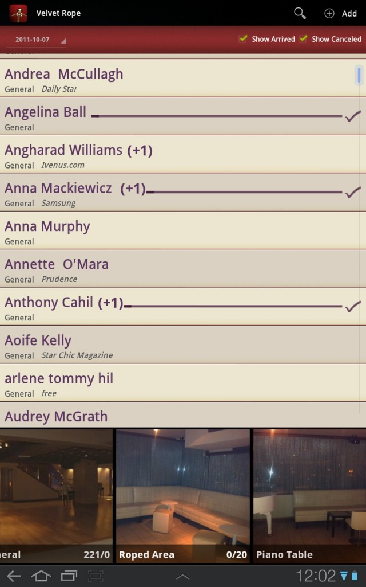
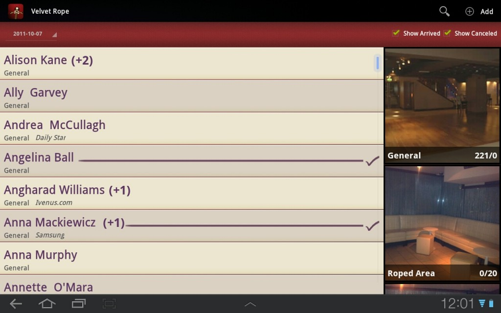

I love new interesting projects. This is a case in point. We already knew the guys in [Samsung Ireland](https://www.facebook.com/SamsungMobileIreland "Samsung Mobile Ireland"); After all they preloaded 2 of our Apps on the Galaxy S-II; We've been regular attendees at their developer events, and also at the odd product launch.

This time, they came to us with a challenge - They had a launch a couple of weeks down the road, and wanted something nice on the night to manage the guest list; Could we do it?

After our initial chat with Samsung, we had a quick brain storm. The brief was well...brief. Here's what we knew:

- The launch was going to be a high profile affair, with irish celebrities, models, etc. present (ok that ruled us out from attending!)
- They location was [Krystle Night Club](http://www.krystlenightclub.com/ "Krystle Night Club"). A well known, high end night club in Dublin.
- They wanted to replace the usual on the door clipboard with a tablet device
- They needed to pre-populate the guest list.

So, we brainstormed and came up with a concept we felt worked well; We called the night club management and spoke to them about how they typically made reservations, what happened when people cancelled, turned up with more people, etc. We visited the night club, and got photos of the various seated areas of the club, we took notes on their occupancy, etc. (Yes this was the boring part).

We wireframed and set to work, and the day prior to launch we had "Velvet Rope"

Velvet Rope allows the Night club owner to take reservations and choose where people will sit. It shows at all points occupancy of each section, and overall occupancy. It allows the host on the door to check people against the guest list; It all syncs to a central server, so multiple devices can run throughout the club (multiple entrances? no problem!)

Velvet Rope runs on Android Honeycomb. It is beautifully designed; It simplifies the job of guest list management. and it does it well.   Oh, and on the night, there were some great publicity shots.

