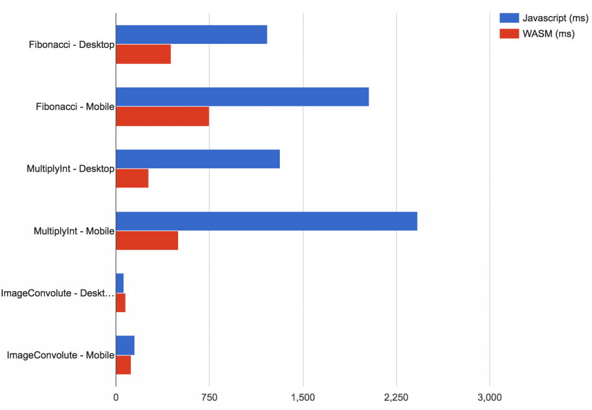

## **What is WASM?**

WASM is a new standard in web development. It is an assembly-like text format that aims to be byte-code for the web. It does this by allowing other high-level languages to be compiled into a portable executable for your browser. Currently, it is envisioned to complement Javascript and HTML.

Here is an example of the execution flow of a C/C++ application in your browser.

_[Image source](https://tutorialzine.com/2017/06/getting-started-with-web-assembly)_

## **Why do we need WASM?**

Web development has long been known for its never-ending cycle of

> What is the best new tool to use?

That is about to get a whole lot more complicated with the introduction of WASM and the influx of new languages and tools accessible to web developers. Potentially, this influx could take a different approach in the direction that the web is going.

WASM is based on an open standard, meaning all browsers will have to comply with the same rules. So waiting for browser vendors to upgrade their standards at different paces could be a thing of the past. 

The biggest benefit of WASM is performance and how this will affect mobile browsers.

For example, games that are currently on your phone and desktop can now be run in your browser without platform-specific limitations thanks to the WebGL shaders.

This is not a new feature, but with the performance of WASM behind WebGL as well as the myriad of languages that can be compiled into WASM, we could see more games being developed solely for the web. Not to mention, the benefits of it being cross-platform.

_Below, is a quick example of the performance benefits of WASM vs JS on a OnePlus 3 & MacBook Pro 2015 model_

[Source](https://github.com/takahirox/WebAssembly-benchmark)

This suggests benefits in performance, but image processing on desktop is still lacking.

## **Will this be the demise of Javascript?**

In summary, probably not for the moment. Eventually, we could see Javascript being a thing of the past; but with its widespread adoption, this won’t happen any time soon.  

WASM also does not have any modules for supporting the platform-specific APIs that Browsers have been slowly giving Javascript access to. Things like Bluetooth and other peripheral access will still need to be accessed through Javascript, which pushes the idea that Javascript is intended as a companion for WASM.  

Web apps will certainly be less dependant on Javascript though, and it will mainly be used as the glue for browser APIs and less about the core logic of your application.

## **What are the advantages for developers?**

For seasoned developers new to the web this is great, as there might already be tools in languages they know for building web applications. For web developers, this is a great opportunity to try out new languages and frameworks.

[Blazor](https://github.com/aspnet/blazor) is an example of how .NET developers can already start taking advantage of WASM and build applications for the web.

[Blazor](https://github.com/aspnet/blazor) is an experimental web framework developed by Microsoft. At first glance it seems great, it has all the features of a frontend framework with the ability to use Visual Studio as an IDE.

WASM also allows code-sharing between more languages, so if you already have a .NET backend, using Blazor for the frontend would be quite beneficial.  

These tools are all in early phases though, so using them in production is probably not a good idea just yet.

## **Will this affect the mobile app market?**

For a limited amount of use cases, WASM could definitely interrupt the app market. With the performance benefits behind it, we could see web versions of mobile apps run at very similar speeds.

But with the need for an internet connection, there is certainly a limited amount of cases that WASM would be more beneficial in using.

Applications like news feeds and multiplayer games that always require an internet connection could easily be built as good as their app counterpart, but you lose all the nice features like push notifications and other platform specific APIs. These features could be implemented through Javascript APIs, but it is unlikely to happen any time soon.

## **Compatibility**

One of the first questions asked when choosing a new tool for the web is browser compatibility, and how this affects the audience you are targeting. WASM is currently supported by 78% of global users as shown below

[Source](https://caniuse.com/)

Which in reality, is not that good. Fallbacks can be implemented for older versions of Chrome using [asm.js](http://asmjs.org/), but there is still the constant issue of Internet Explorer. So if your audience is likely to use IE, then WASM might not be for you.

## **Conclusion**

WASM is great, although it might not be the time to jump into it straight away. With the limited support for the global browser market share and the fact that most frameworks built for WASM are in early days, we still have a bit to go before WASM becomes the norm.

When that day comes though, the web will be a different place, and the community behind it too. Developers from all areas will have greater accessibility in contributing to web applications and the use cases for the web will expand even more.

If you'd like to read further on this there are some great resources out there. Check out these links:

[https://github.com/aspnet/blazor](https://github.com/aspnet/blazor) - .NET web framework using C#/Razor and HTML

[https://github.com/mbasso/asm-dom](https://github.com/mbasso/asm-dom) - WASM virtual DOM to build C++ SPA

[https://webassembly.org/demo/Tanks/](https://webassembly.org/demo/Tanks/) - Unreal Engine 4 to WASM Demo

[https://takahirox.github.io/WebAssembly-benchmark/](https://takahirox.github.io/WebAssembly-benchmark/) - Performance Benchmarks

Leon Harvey

Front End Developer
