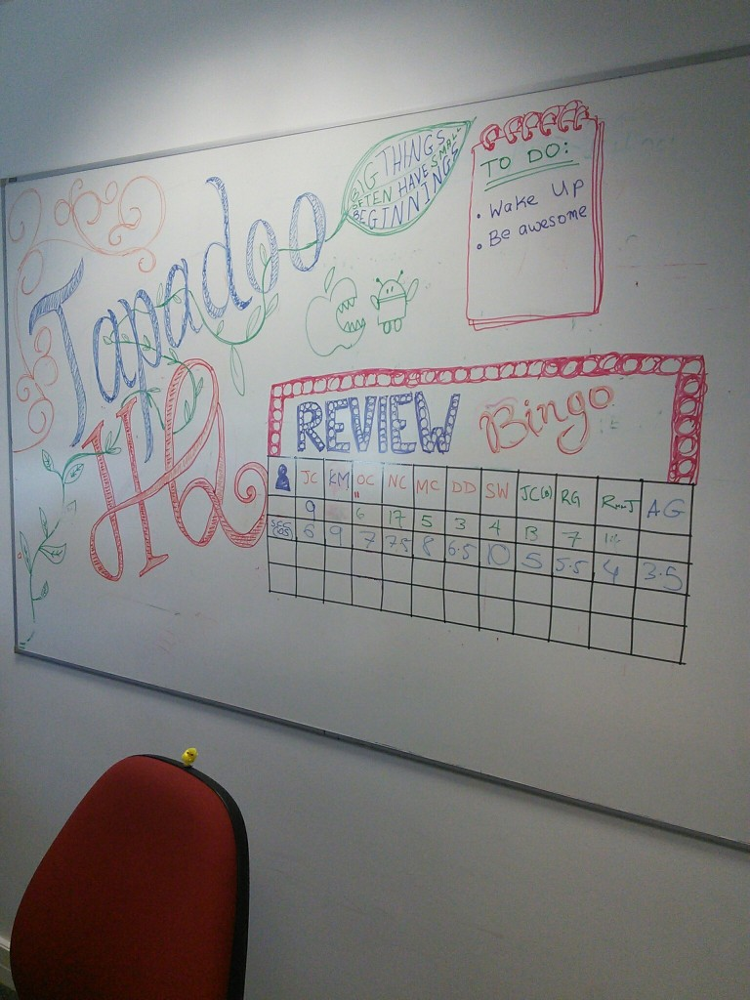
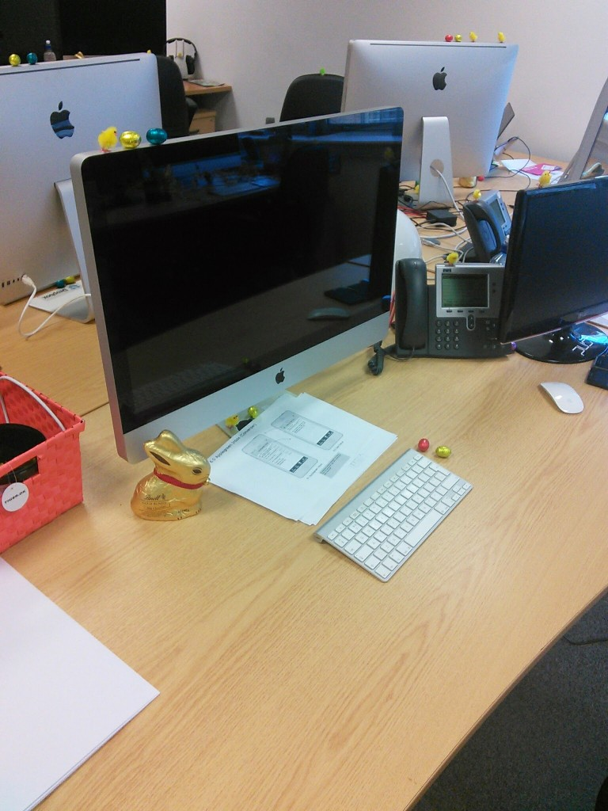

Time is moving very quickly here at Tapadoo!  We've really settled in now and have been given a lot more responsibility in the projects we're working on. Everyday I encounter something new, sometimes it's a small piece of functionality, or a new way of accomplishing a programming task, or even a newly released feature of an API. It requires constant effort and willingness to adopt and adapt, but that's what really keeps me engaged. It's an immensely rewarding experience, applying what I've just learnt, and seeing it function within the current project.

We got to experience our first game of review bingo this week! When an app is submitted for review, it will go through various standard checks,  and on passing will be published on the app store. Everyone in the office takes a guess at the number of days this process will take. Bragging rights for the person who comes closest!

I got to be present at a client meeting this week, which was an excellent way to show, and get some feedback on what we'd been working on. Having someone from outside of the team look at the project was slightly worrying, and I was concerned that the work I had done was not quite up to the standard required. But it went much better than I expected. The feedback given was positive and really helped me see what aspects needed work.

It was Aidan's turn to make a cake this week, and everyone thoroughly enjoyed it. I'm next up to the plate, and have already started planning, hopefully I don't disappoint!

The Easter Bunny also paid the office a visit, leaving eggs in cracks and crevices throughout. We'll be finding them for weeks to come!

Some really exciting things are happening in the coming weeks, and some really interesting projects to work on too! [Úll](http://2014.ull.ie/) is taking place in less than two weeks, which will definitely be a big highlight of our time here at Tapadoo. It's a meet-up/conference for developers and designers, held over 3 days in Kilkenny. Everyone in the offices is really looking forward to it! More to come on that in future posts!

That's it for now! Kevin.
