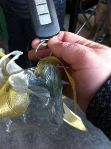

We like to think we know what we're doing. And every once in a while, its good to apply our skills in a fun way. A few weeks ago, we heard of a [competition being run by the Science Gallery](http://www.sciencegallery.com/electricdreams), as part of its "Green Machines" exhibition. The competition was to come up with an innovative app idea. And I thought

> **Hey. Isn't that what we do?**

So, we put aside a day a couple of weeks back, and invited a highly recommended talented graphic designer [Feargal Halligan](http://www.fragilehooligan.com/) to join us in coming up with a concept and entry. The morning was spent brainstorming, while the afternoon was spent wireframing and doing graphic treatments. The evening was spent writing ...and we put our entry in.

And earlier this week, we got a call...

> to say we'd won!

We've just come from the announcement. I've an electric car for a month, beginning in January, and ESB love our ideas.

I'll post on some pics later.

See ? This is what happens when you have the [right](http://twitter.com/adamkmccarthy) [people](http://twitter.com/liamdunne) on your team.
