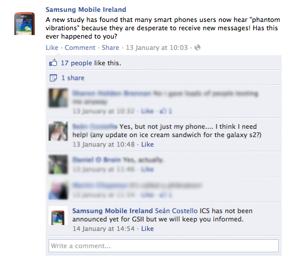

It must be tough working for an Android handset manufacturer if you're the guy who manages their social media presence.

Every time you have something to say, no matter what that is, you have to deal with an Android power user who wants the latest version of Android on their 6 month old device.

I didn't have to look far on the Samsung Ireland Facebook page for this: 

So let me make this simple:

> If you run and Android device, chances are you are not running the latest version. You can scream and scream at your operator or device manufacturer, but it is unlikely to happen

Here's why:

Imagine you run the Operating System section of an Android handset manufacturer. You are tasked with building the operating system for your next device.

Now, in order to get this to market, you need a target that isn't moving. So you grab the current stable version of Android from Google, and you get to work to make this work on your hardware. You do a ton of tests (and this is a LOT of testing); resulting in tweaks, patches and fixes, enhancements to take advantage of your cool chip, and so forth.

Then, you go to sell it; Your clients are mobile operators, who want very specific things added to their build. Simple stuff like reskinning, up to specific apps added as they need. So for each of your customers, you need to add some code, and so carry out per-customer testing.

During this time, Google have added enhancements to the operating system. Your choice now is to try to re-merge this, or release the stable, tested version you're happy with. This is a no brainer choice. Even if you were to re-merge, the target could have moved again, so you simply aren't going to do it.

Now imagine your device is out in the market. It has sold 1 million units, in multiple countries and on multiple operators. Google release "Neopolitan Truffle With Flake Topping" (or whatever they call the next Android O/S). Do you a) Pull the new version, merge back in your changes, test, and then on a per-client basis merge their changes and test again, risking the possibility of releasing a bug which affects your 1 million clients ? or b) Leave well enough alone, and keep the new version in your back pocket for the next device that you are already working on?

**Exactly**
