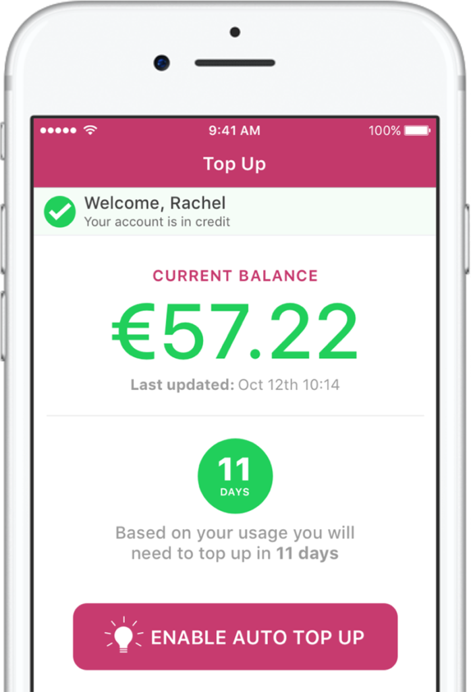
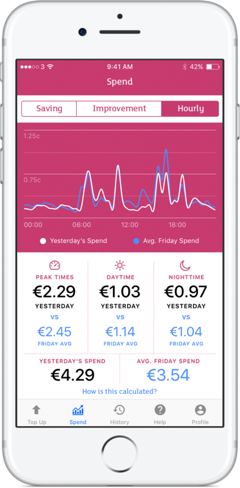
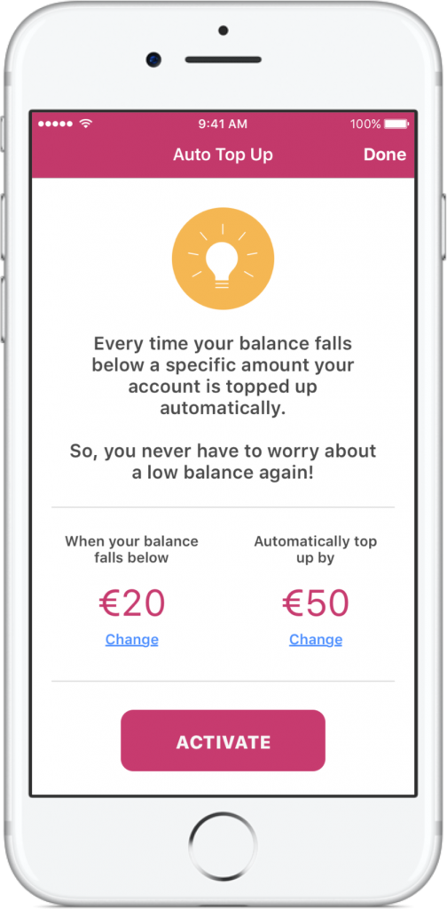

The public utility space is a competitive market; having a mobile utility app not only provides customers with convenience, but it also gives utility companies a competitive edge. Companies with a mobile utility app are transforming their business processes, efficiency and bottom line, all whilst offering a seamless process for their customers.

[65%](https://www.chartwellinc.com/engaging-utility-customers-in-the-digital-age/) of utilities say that mobile technology will be the most influential customer experience trend over the next 10 years.

There are many benefits a utility app can provide over traditional methods of engaging with customers. Below are 5 reasons why utility companies should consider a mobile utility app for their business.

#### Meeting the needs of customers

Our fast-paced and digital lifestyles have led consumers to no longer want to deal with physical paper statements or engage in phone calls.

Mobile utility apps offer utility companies the perfect channel to meet the ever-evolving needs of their customers. Whether it’s a gas, electric or a water company, mobile utility apps offer a way of directly communicating and engaging with customers in a way that is convenient for the customer.

A mobile utility app provides real-time access to up to date customer and utility service information that helps meet the demands of customers.

#### Personalised User Experience

The user experience journey within apps is highly personalised. The entire journey can be tailored to users requirements. By gathering important insights from customer data utility companies can create a user experience that is designed to their specific needs and satisfaction.

Personalisation improves the customer experience by as much as 55%, and mobile apps are a perfect way to offer personalisation. Users have the option of receiving tailored information on their account, as well as receiving personalised push notifications. 

Consumers welcome this highly personalised user experience on apps that includes information on their billing and usage details, balances, and the ability to contact their service provider from within the app.

#### Convenience

More than 60% of consumers prefer an automated self-service offering in a mobile app, and self-service offerings increase customer satisfaction by 11%. 

Customers using their utility provider’s mobile utility app had a [15%](https://www.chartwellinc.com/engaging-utility-customers-in-the-digital-age/) increase in loyalty. Loyal customers are also likely to recommend their utility company, spend more, cost less to support and have a higher lifetime value.

Convenience goes a long way in generating customer loyalty and adding to the bottom line.

#### Speed and Access

Mobile apps are fast and reliable and are usually 1.5 times faster than mobile websites. They store data locally on the mobile device, which means they perform actions faster due to data retrieval happening instantly. 

Users are also able to access basic information and functionality offline. This is a fundamental difference between a mobile app and website. Customers still need an internet connection to perform critical tasks such as a payment process.

#### Revenue

An improved customer experience within a mobile app can increase revenue for utility companies by [5-10%](https://www.mckinsey.com/~/media/mckinsey/industries/public%20and%20social%20sector/our%20insights/cx%20compendium%202017/customer-experience-compendium-july-2017.pdf) within two to three years.

[86%](https://www.the-future-of-commerce.com/2020/09/02/what-do-customers-want-from-their-electric-utility/) of utility customers are willing to spend more for a better customer experience and when customers are satisfied they are twice as likely to stay with their existing service provider. 

A [5%](https://www.bain.com) increase in customer retention produces more than a 25% increase in profit.

Transaction completion rates are higher on mobile apps and having billing information registered means bills can be paid instantly. Mobile apps also allow for auto payments within the app. 

Investing in the user experience of an app can really add to the bottom line for utility companies 

The entire mobile app experience helps boost the customer experience and retention rates of customers.

### Utility App Example - PrePay Power

- 
    
- 
    
- 
    

[PrePay Power Case Study](https://tapadoo.com/case-studies/prepay-power-app/)

The PrePay Power app is a pay as you go electricity utility app we developed for our client [PrePay Power](https://tapadoo.com/case-studies/prepay-power-app/). The app is native to iOS and Android and allows users to top up their electricity quickly and easily. 

Before the app, users had to go to a local shop to buy a PrePay Power meter code and input that code into the meter in their home. Since the implementation of the app users no longer have to leave their home or go online to top up their electricity. Now all they have to do is log in to the app and input their top-up details and it happens instantly.

Prepay Powers main objective with the utility app is convenience for the customer and to give customers full control over their electricity bills.

The company is going from strength to strength with a 29% increase in revenue in 2018 and the customer base expanding by 9% to 140,000.

Maria Colgan

Digital Marketing Manager
