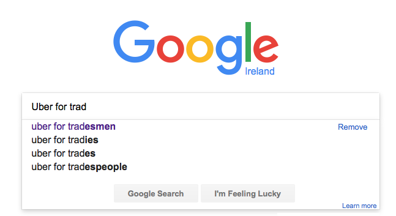

The majority of the work we carry out are for corporate clients. But we still get approaches from potential startups to get quotes on a project idea. The single most common request to quote for is "Uber for Tradespeople". Seriously. Every 2 months or so someone asks us to develop this.

The pitch goes like this: "Imagine you're at home and you need a new wardrobe made. You simply open the app fill out the details of your job, and offer it to all the carpenters in your area. A few responses come back, and you choose the one you want. You pay through the app, and we take a cut of the job".

Sounds great, doesn't it? But let's look at the concept in detail:

**Has it been done before?** It has. Many many times. Do a quick google search for "Uber for Trades", and you'll see this: 

Pick the first one, there's 122,000 results; The highest profile "Uber for Tradespeople" startup was Handy.com. A quick look at their website shows that they still offer trades services, but the site is very much focused on hiring cleaners. To date, handy.com have raised over $110m in venture funding, but it certainly looks like they've pivoted to focus on cleaning. There must be a good reason for that, right?

A quick click through of the search results will show you there's an "Uber for Tradespeople" story coming out of San Francisco, Ireland, Australia, The UK to name but a few. Some of the articles go back to the days of the launch of the app store and many of these are about funding rounds for companies that now...don't exist.

When considering "Uber for Tradespeople", many assume that the Uber/Hailo/MyTaxi model will just work for trades people, but I think this is just folly. Here's why:

1. Tradespeople aren't like Taxi Drivers. They aren't in an industry that is mobile, where a portion of the day already requires waiting in a geographic region for a job nearby.
2. Two sided business models are notoriously difficult to build. Say you launch your app; how is it on day 1 ? If there are no trades people on the system, no customers will show up. If there's no customers on the system, no trades people will show up.
3. A piece of work carried out by a tradesperson isn't like a regulated, metered taxi journey. In a regulated industry like Taxis, getting one over another will result in largely the same cost. With tradespeople, on the other hand, If you fill out a form saying you need a new wardrobe fitted, the tradesperson doesn't know if it's an IKEA wardrobe to be assembled, an existing wardrobe being moved from one room to another, or a full supply and fit of a new wardrobe. Put simply: Trades jobs always need quoting prior to the job being done.
4. Cash is king; particularly in odd jobs. A tradesperson may or may not want to put a small job through a system to get paid.
5. The need for tradespeople is rare. You may need a carpenter once every 4 or 5 years, unlike a taxi which you'd tend to get much more regularly. So the transactions through your system may be of higher value, but there's way less of them.
6. There's no good reason to be loyal to your platform. Once you use a tradesperson for any job, if you like their work, you'll store their number and call them direct next time. Every time. That tradesperson may even be your link to others, as by trusting them, you'll trust their recommendations. Essentially, your need to use the platform diminishes after your first use.
7. Even first time around, there's no good reason to be loyal to your platform. If you agree with 3 above; let's say you meet 3 tradespeople who quote to fit your wardrobe. You'll exchange numbers. Each will call you. And to save you both some money, you can agree to tell the platform that the job was never fulfilled, and manage payments outside of the system. Your commission is gone.
8. The concept ignores the context. If I need a tradesperson it's unlikely to be timely; it's more likely to be considered. There's no benefit to it being an app as such. Finding a tradesperson online is served pretty well on the web. I'll simply use Google, or pop a message on my Facebook feed looking for suggestions.

Uber/Hailo/MyTaxi are sticky services because they provide value to you _every time_; They help you find someone nearby, and soon. It belongs in an app, because it's very likely the only device you have access to when you need a taxi. The _service_ is more valuable than the individual taxi driver who picks you up; you don't take his number because why would you ? - they could be anywhere, far away next time you need a taxi. In the case of "Uber for Tradespeople", the _individual tradesperson_ provides the value, rendering the service less valuable to you.

Not every app idea is a good one. What works in one industry, doesn't always translate to others. We like to pride ourselves on being honest with potential clients. If we think the chances of success are low, we point this out. Sometimes, it feels like we're bursting the potential client's bubble, but in the long term we feel we're doing the right thing by everyone.

Hero image credit: Photo by [Igor Ovsyannykov](http://unsplash.com/photos/iXV0i4Wo4yc?utm_source=unsplash&utm_medium=referral&utm_content=creditCopyText) on [Unsplash](https://unsplash.com/?utm_source=unsplash&utm_medium=referral&utm_content=creditCopyText)
