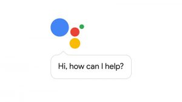
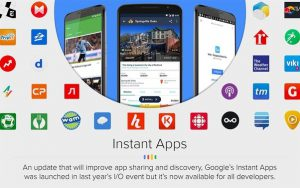
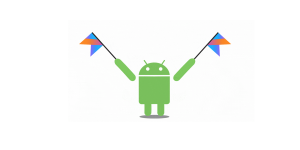

May 17th, 2017 marked Google's 10th I/O, the company’s developer conference which has been held every year since 2008. Developers from all over the world gather in San Francisco, California, for an early look at Google’s latest technologies and visions for the future.  Of course, not everyone at Tapadoo HQ could attend the event in person, but the Android (and even some iOS) developers gathered in the office after work to watch a livestream of the conference.

Google I/O is now no longer just for developers.  It’s for enthusiasts all around the world, and this was showcased with excellence this year.  With 2 billion devices running Android, I/O is one of the most anticipated annual tech events around.

CEO Sundar Pichai took to the stage, and made it clear that this year’s conference would again focus on artificial intelligence and the rapid advancements the field has made in the past year.

He made us believe that _“computing is evolving again”_ and that we are currently experiencing an _“important shift in computing, from a mobile first approach to an AI first approach”_.

When we think of AI, robots are often the first things that come to mind. Robots to carry out everyday tasks like cooking and cleaning - tasks that we humans find so cumbersome.  Some even fear that robots may become so smart they will one day demand their own rights!  But that’s not quite what Sundar was trying to say. Sundar instead described a future where Google's products would appear more natural and conversational. He demands a future in which humans can interact with their computers and devices very much like they would with other humans.

**Google Home and Assistant**

_“A conversation with Google to get things done in your world.”_  

No better way to describe the new features that have been added to the Google Assistant.  

Google’s main aim is to make your day easier, to interface with users in a more conversational way and for its AI to now understand the context in which you were speaking to it.  

They want you to be able to express what you want throughout the day and for the right thing to happen.  And if you don’t want to speak out loud, you can now even type and keep everything you do private.  What’s even better is that now it’s available on iPhone!  Sorry in advance, Siri, but you cannot compare to Google Assistant when it comes to answering complicated queries and integrating 3rd party applications.  Google’s entire philosophy of AI is based around making their machines smarter by using the data that they collect from their various products.  By introducing Google Assistant on iPhone not only are they showing off their tech but also broadening their data input. Well played, Google!

Google showcased their advancements on Google Home, the company’s smart speaker and flagship AI product.  Some of the new features that have been added are ‘Proactive Assistance’, ‘Hands free calling’, ‘Enhanced Entertainment’ and ‘Visual Responses’.  Voice recognition allows Google to distinguish between who is talking to it - saying _“Call mom”_ won’t lead to Google Home accidentally calling your wife or husband’s mother by accident. Google Home doesn’t just end in your home.  Ask for directions to the beach in your kitchen and receive results on your phone on the go.

The most interesting part in all of this is the Google Assistant SDK.  As developers, we can now start building our own hardware prototypes with ease.  It’s only about time your fridge speaks out to you to tell you that it hasn’t been opened in a while right?

**Instant Apps**

Everyone can now develop Instant Apps!  They give you the ability to _“click and dive right into the native app experience”_, without having to download the app and save it to your phone.  Google reckon that it takes only 4-5 weeks to adapt your current existing app to support this new feature.

Why Instant Apps you may ask? - Well, from a developer’s point of view, you will be developing in an environment that you are already familiar with.  And for the the end user, you no longer have to discover and install the app.  Ever have to install an app for ordering food just once that you will never use again? No need to do that anymore!

With Instant Apps we can now optimise the end users experience and increase the amount of users that interact with our apps.

**Adaptive Icons and Notifications**

Last year Google made it apparent that they were leaning towards using round icons for apps.  Now they have released a new feature, Adaptive Icons, unfortunately for now it is limited to Pixel (Google Manufactured smartphone) users.  The shapes range from circles, cylinders and squircles!  Staying on the topic of icons, a change has also been introduced to notifications.  When you receive a notification a badge will appear on your app.  The user no longer needs to pull down on the status bar.  Simply hold down on the app and the notification will be revealed to you.

**Kotlin**

_“Languages are the tools we use to express our thoughts”_

With 82 billion apps downloaded in the last year, Android is growing faster than ever before. Hoping to continue it's momentum, Google announced first-class support for Kotlin, a statically typed programming language released in 2011.  Built by the same team that brought us IntelliJ, Google are partnering up with JetBrains to expand further support for Kotlin in the coming months.

Why Kotlin, you may ask?

1. It’s completely interoperable with Java as Kotlin compiles to Java compatible bytecode.
2. It’s concise - no more boilerplate code!
3. And finally, if written correctly it can avoid some common errors such as Null-Pointer Exceptions.

Kotlin has often been compared to Apple’s Swift programming language in terms of its syntax.  Could Kotlin be the bridge required to get more iOS developers to start writing Android apps?

 

Thanks for reading.

Stay tuned for future blog posts, where I hope to expand on the features mentioned above.

Image Credits: [Wikimedia](https://commons.wikimedia.org/wiki/File:Sundar_Pichai,_on_stage_at_Google%27s_2014_Google_I-O_Conference_(15031323426).jpg), [NDTV](http://gadgets.ndtv.com/mobiles/features/google-io-2017-keynote-preview-android-o-vr-assistant-1694712), [Quora](https://www.quora.com/What-are-the-announcements-made-in-Google-IO-2017), [Android Estate](http://www.androidestate.com/android-o-features-io-keynote/), [JetBrains](https://blog.jetbrains.com/kotlin/2017/05/kotlin-on-android-now-official/), [XDA](https://www1-lw.xda-cdn.com/files/2017/02/Google_IO_2017_Hashtag-Teal.jpg)
