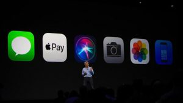

 

Recently the Apple Worldwide Developer’s Conference took place announcing many new and interesting features. At the conference, Apple presented updates and new releases for some of their products and technologies. Some of which are particularly interesting to us iOS app developers.

 

# HomePod

 

WWDC showed some new products being released. One that stood out the most to me was the HomePod. It is a new smart speaker developed by Apple which showcases some interesting features. HomePod has the smart assistant, Siri, built in which allows you to use Siri like you would on many of Apple’s devices. However the main feature of the HomePod is it’s use of spatial awareness allowing it to adjust audio based on the room it’s in.

 

# iOS 11

## 

 

With the introduction of iOS 11 came some interesting upgrades. Apple Pay now allows person-to-person payments through iMessages. Money can now be sent easily and securely with Touch ID which will be highly beneficial to everyday users and not just retailers and restaurants.

Another upgrade of the new iOS was the new “Do Not Disturb While Driving” feature. Even though it has a ridiculously long name, this new feature is a solution to a worldwide problem. Instead of taking a risk by send a quick text to tell your mate you’re on the way, with do not disturb while driving a user can setup auto texts to send to them.

 

# Core ML

## 

 

Apple revealed a new machine learning API for developers called Core ML. This new framework will allow developers to easily add machine learning models to apps and to make greater use of AI within their apps. Core ML has the potential to make apps smarter, more efficient and easier to use if implemented correctly. This can be used to greatly enhance a user experience by bringing intelligent features such as face tracking, text detection, barcode detection and much more.

 

A great feature of Core ML is the fact that it does on device processing meaning that the data used to improve user experience never has to leave the device. Users of apps that take advantage of Core ML won’t require internet access to make use of the feature and won’t have to wait for information to be processed over a network. In addition, since the data doesn’t have to lead the device, it’s more secure.

# ARKit

## 

 

Apple have decided to venture into augmented reality with their announcement of ARKit. This new augmented reality framework will allow developers to create a more engaging experience for their users, expanding outside the screen. A key feature of ARKit is it’s excellent scaling of virtual objects. These objects can be placed into the space around use with it scaled to it’s actual size.This can be used to create a more immersive experiences for users, bringing real life experiences straight to their devices.

# Wrapping Up

This year there were many new updates that caught my attention and could be integrated into current and future apps created here at Tapadoo to create better and more powerful apps. Apple showcased updates for their new iOS 11 platform, Apple Pay, Siri, and their release of APIs for machine learning and augmented reality just to name a few.

 

 

Thanks for reading, and hoped you gained some insight into the features and products that will impact the future of apps and technologies.

 

Image Credits: [MacRumors](https://www.macrumors.com/roundup/homepod/), [cnet](https://www.cnet.com/news/homepod-ios-11-and-imac-pro-ipad-pro-high-sierra-all-the-news-from-apple-wwdc-2017/), [Apple](https://developer.apple.com/videos/play/wwdc2017/602/), [arstechina](https://arstechnica.com/apple/2017/06/what-to-expect-from-apples-wwdc-2017-keynote-on-monday/)
