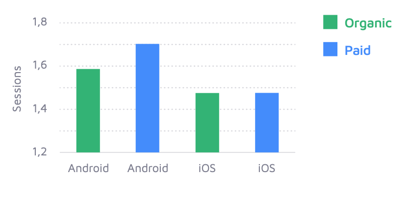
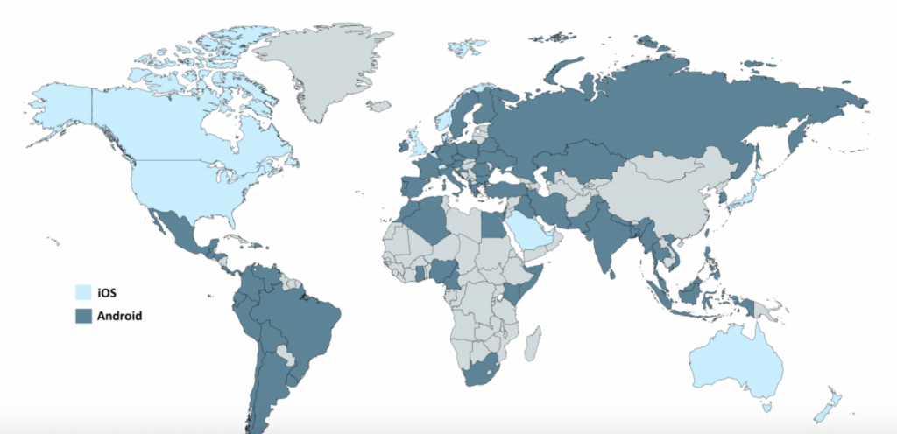
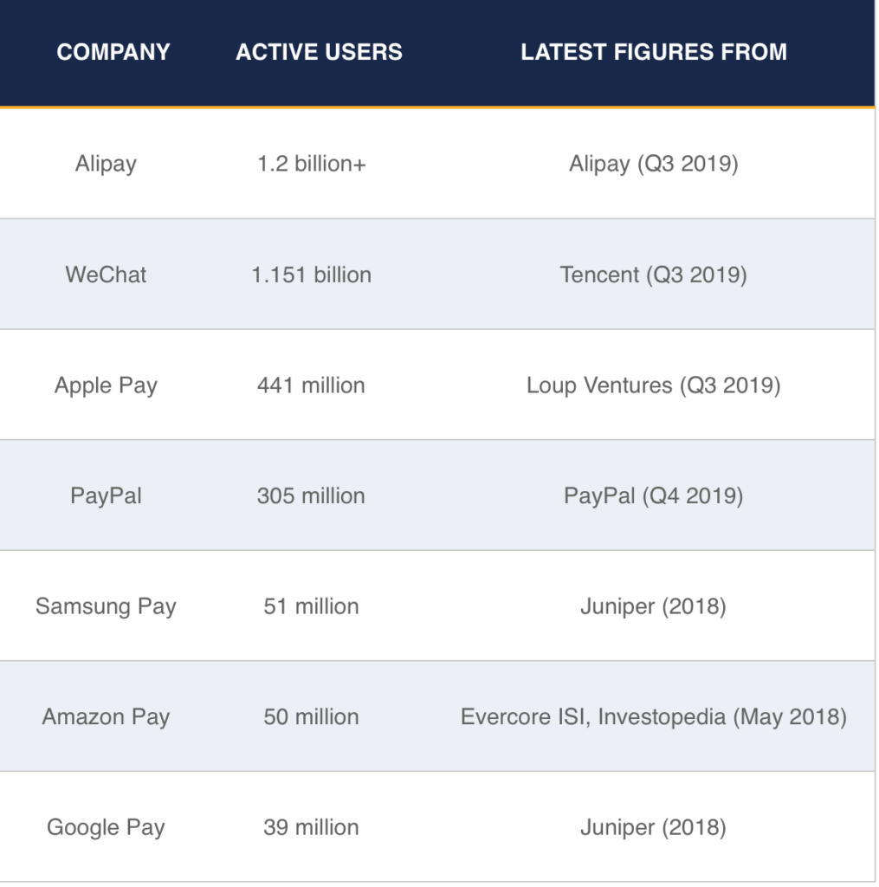
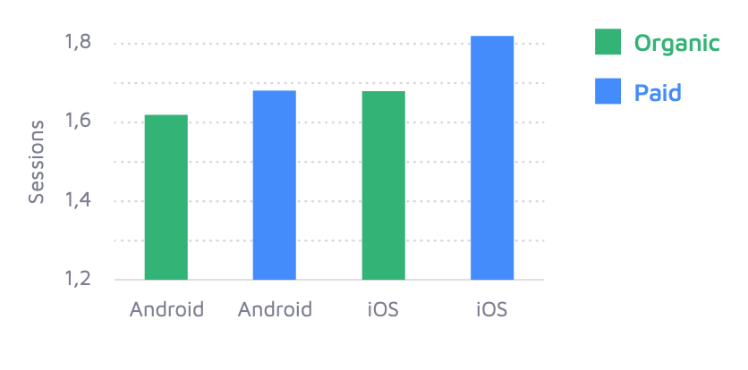
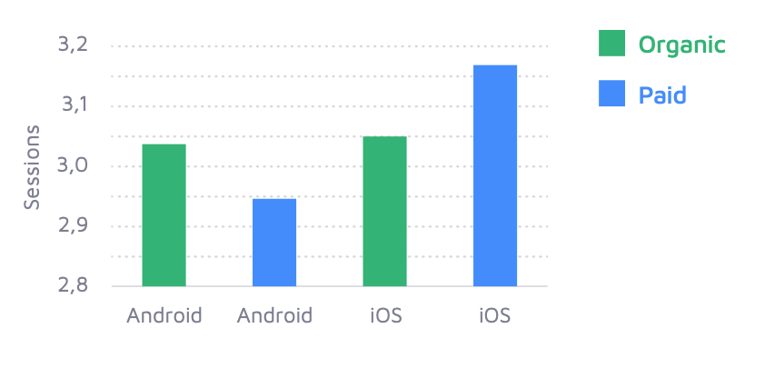
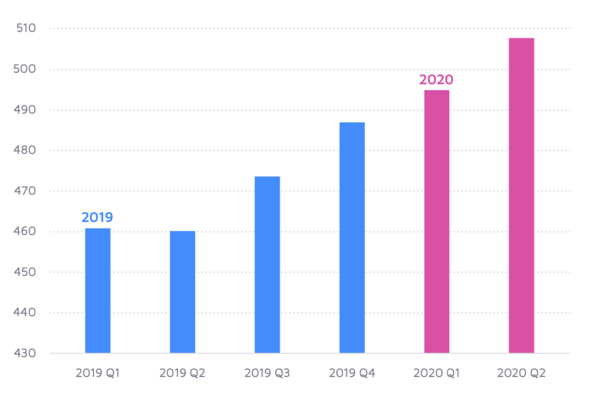

Mobile phones are becoming a central hub in managing our finances. From banking and payment apps to stock management and investment apps the finance industry is seeing significant activity through apps.

Globally, consumers accessed finance apps over 1 trillion times in 2019, up 100% from 2017. 2020 is also seeing a significant increase in activity with time spent in finance apps increasing between 35% and 85%.

Adjust and Apptopia’s [Mobile Finance Report 2020](https://www.adjust.com/blog/mobile-finance-report-2020/) highlights the activity between payment, banking and investment apps globally after a 30-day period.

#### Payment Apps Activity

The number of sessions in payment apps increased by 49% globally in 2020. This is a market that traditional banking needs to take note of.

Both paid and organic Android users are more active than iOS paid and organic users after 30 days in payment apps.

Organic and paid iOS users both register the same number of sessions after 30 days.

#### Payment Apps - Average Daily Sessions for Organic and Paid user after 30 days

These numbers correlate with the split of Android and iOS devices on the market and their geographic location. There are currently [2.5 billion](https://www.theverge.com/2019/5/7/18528297/google-io-2019-android-devices-play-store-total-number-statistic-keynote) Android devices and [1.5 billion](https://9to5mac.com/2020/01/28/apple-hits-1-5-billion-active-devices-with-80-of-recent-iphones-and-ipads-running-ios-13/) iOS devices.

Payment apps dominate in the east, where the highest concentration of Android devices are. They are slower to catch on in the US, which is dominated by iOS devices. Compared with China, India and other parts of the world, the [US is way behind](https://www.cnbc.com/2019/08/29/why-mobile-payments-have-barely-caught-on-in-the-us.html) in adopting mobile payments. 

#### iOS and Android Device Split by Country

[Source](https://deviceatlas.com/blog/android-v-ios-market-share)

Below is the number of active users in the top payments apps.

[Source](https://www.merchantsavvy.co.uk/mobile-payment-stats-trends/)

#### Banking Apps

Sessions for banking and payment apps combined increased 26% globally.

Paid users are more active on both Android and iOS after 30 days in banking apps. iOS organic users are more active than organic Android users. iOS paid users are the most active users after 30 days of all categories.

Again, these figures aren’t surprising given the location of the [top banking apps globally](https://www.thebalance.com/best-banking-apps-4580289) and the device of choice in these countries. Banking apps are more likely to be used in the US than payment apps and iOS is the device of choice here.

#### Banking Apps - Average Daily Sessions for Organic and Paid user after 30 days

#### Investment Apps

Investment apps are the busiest apps of the finance app category and have seen an 88% growth in average sessions per day between January to June 2020. Globally, investment apps are the second-fastest-growing vertical. 

iOS paid users are the most active after 30 days. Users in investment apps register three sessions per day, which is one more session than in payment or banking apps.

Paid Android users are the least active after 30 days.

#### Investment Apps - Average Daily Sessions for Organic and Paid user after 30 days

#### Time Spent in Apps

2020 saw an increase in sessions, installs and time spent in-app for apps across the finance sector. There was an 8.9% increase in time spent in apps from 2019 to 2020. In 2019 users spent an average of 7.7 minutes per session in-app, while in 2020 this has risen to 8.35 minutes per session in-app.

COVID-19 is the main factor driving time spent in finance apps with the most significant growth occurring in Q2 2020, as lockdown began worldwide - but data also suggests that growth was already trending here.

According to [Forbes](https://www.forbes.com/sites/simonchandler/2020/03/30/coronavirus-drives-72-rise-in-use-of-fintech-a), the growth in Fintech apps in Europe is up 72% as a direct result of COVID-19. [91% of Americans](https://www.prnewswire.com/news-releases/covid-19-pandemic-triggers-spike-in-online-banking-91-of-americans-bank-virtually-in-july-301124267.html) banked on their mobile in August 2020. While 57% of Gen X used their banking app more than before. 52% of Americans are visiting their branch less because of the pandemic and 49% are happy to never visit it again.

#### Time Spent in App Per User

Maria Colgan

Digital Marketing Manager
