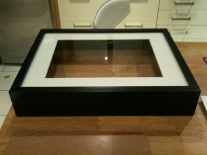
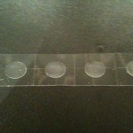

I've been itching to do this for some time. Work pressures have meant I haven't been able to prioritise it. But, its easter, and I've tried to have some time at home with the family.

I've often mentioned where it all started for me; I wrote my first code on a Sinclair ZX Spectrum, in 1984. Back then myself and friends used to code up "adventure" games written in Basic, and saved onto Cassette Tapes. We even toyed with Z80 assembler for a while.

Well, many years back, that machine gave up the ghost, but I knew it was not thrown out. So I asked my parents to have a look around the attic and give me back my beloved speccy.

A few weeks back, may dad arrived with said spectrum in hand. I was delighted to have it back, as I had this project in mind.

You see, I consider it an 80s design classic. From the grey rubber keyboard, designed to keep the price low enough to put computers in every home, to the rainbow across the front to signify the fact that it was a colour computer. (Sinclair's earlier offerings, the ZX80 and ZX81 where monochrome affairs).

So...Here's how I've turned my first computer into a "piece" which is going to get prominent placement in the tapadoo offices. I want a constant reminder of why I love writing code.

Firstly, I purchased a standard black frame from Ikea. This was not deep enough, but I'm lucky enough to have a brother who is a craft carpenter, running his own [shop fitting company](http://shinnay.com). I asked John to see what he could do, and he came back with a new, deeper frame build from the original. \[caption id="attachment\_401" align="aligncenter" width="300" caption="New deeper frame"\]\[/caption\] From here, I needed a white backing, as the supplied backing was an ugly brown. I got a piece of mounting board from an art shop in Thomas St.; A steal at €2.99. I also needed something to hold the computer in place; The best I could find were "Sticky Dots"; I was unsure if they could work, but worth a try. I was good to go \[caption id="attachment\_402" align="aligncenter" width="300" caption="All the bits"\]\[/caption\] Here's the steps I carried out

1. I cut the mounting board down to size, using the original backing as a template
2. Figuring I'd need a sturdy mounting, I glued the original backing to the white backing using Pritt-Stick and some standard Bostik glue. I placed my toolbox on top of them to add some pressure.
3. I placed the sticky dots on the original rubber feet on the computer. I considered taking off the rubber feet, so I could use plenty of dots around the base of the computer, but I wanted to leave the computer as intact as I could
\[caption id="attachment\_403" align="aligncenter" width="150" caption="Sticky Dots"\]\[/caption\]5. I meaasured on the mounting board where the computer would be centred.
\[caption id="attachment\_404" align="aligncenter" width="150" caption="Marked Out"\]\[/caption\]7. I then stuck the computer onto the mounting board
8. Next, I didn't feel comfortable with the sticky dots, so I decided to add some support under the computer itself. A couple of screws put through the backing sorted this
9. I could then put the backing back into the frame, and using some small tacks, hold the back in place

Here, is a grainy, finished product \[caption id="attachment\_405" align="aligncenter" width="300" caption="Finished product"\]\[/caption\]

The only thing I'd add at this point, is I would like to add some lighting within the frame. I'm open to suggestions; If anyone has ideas, please leave me a comment!

* * *

You're reading the tapadoo blog. Did you know that as well as publishing our own applications, we offer iPhone development services and consultancy? If you have an idea, project or something you think we can help you with, please get in touch through [our contact page](https://tapadoo.wpengine.com/contact/).
