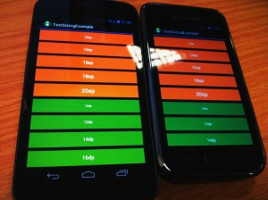

This morning I wanted to demo how android sizes text for our designer. So I wrote a quick app that displayed text sizes in a few ranges 10-20 sp , dp, and pt. A nice side effect was it also showed how well android handles the vast differences in screen sizes and densities out there.

Some quick photos showing how android handles displaying things at a particular size across screens of different densities. Here’s a galaxy nexus with a 1280x720 (~316 ppi) xhdpi screen and a galaxy s+ with a 800x480 (~233 ppi) hdpi screen both displaying the same app.

The text blocks are all 48dp high, also the suggested sweet-spot for hitbox heights. They are demoing different text sizes that one might set in both sp and dp measurements. (sp will grow if someone turns on large text in the system settings, dp won't). These screens are very different in terms of pixel counts and physical sizes, yet android performs very well in making them almost physically identical to my eyes and fingers. The nexus screen does look better of course.

The later images shows the difference in using px or dp dimensions for a views width. There’s a noticeable difference setting a px width between devices. Hopefully few people are laying out stuff with px anyway. The docs and the tools point it out straight away as a ‘don't do that’ moment.

However dp performs nicely and just like the heights, the blocks with a dp width are pretty much physically identical on both.

Android does get a bit of a bashing about the diversity of devices that exist, but the sdk does a very good job in trying to help the developer out as much as possible.

\[gallery columns="4"\]
