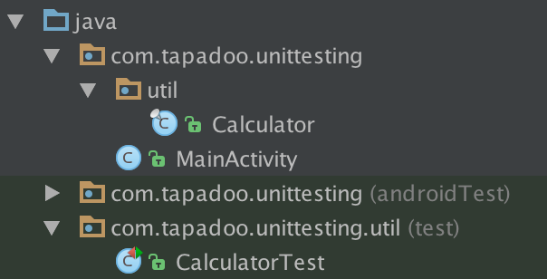
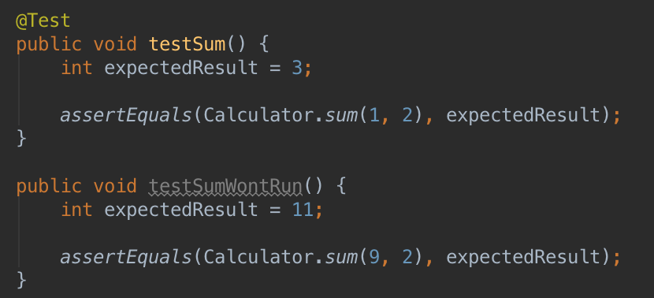
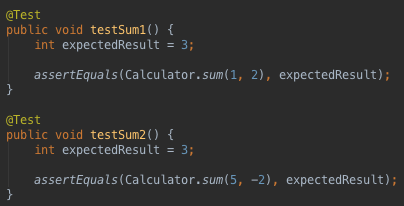
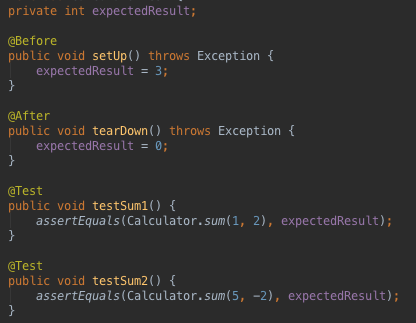
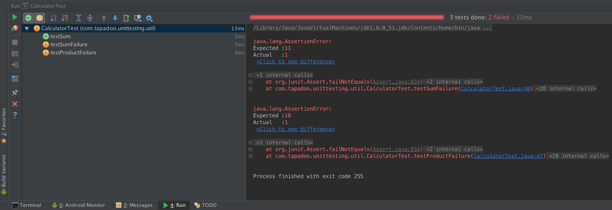
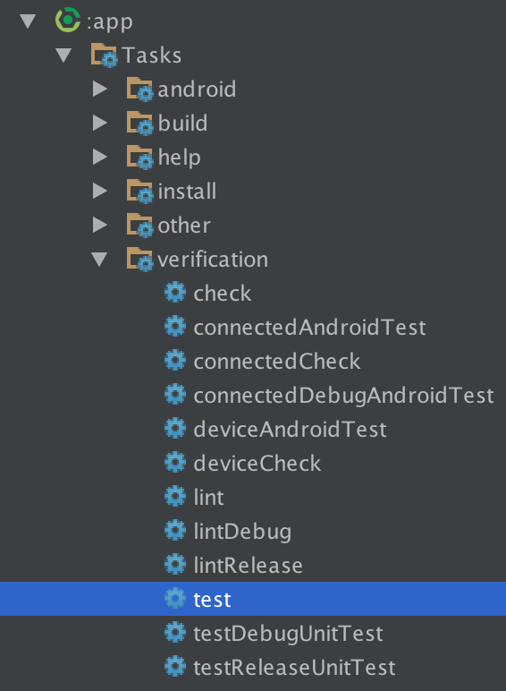

On a recent project for [Kitman Labs](http://www.kitmanlabs.com/) we were asked to add automated testing to the application we were developing. It is rare that a client would ask for this - mostly because of the additional cost of including automated testing to a project. However, the increase in initial costs should be viewed as a sensible investment in your app. Over the lifetime of any product there will invariably be multiple maintenance cycles and several updates. Automated testing has the potential to save time and in turn money, by allowing a developer to quickly verify that the app is functioning as intended. What could take hours or days to be tested manually only takes minutes to complete with automated testing.

**What is Unit Testing?**

In simple terms, unit testing is a process by which individual units of code (a single method within your application) are tested to determine whether they are fit for use. To complete a unit test, call the method from within your test class and pass the results into an assertion (a type of IF statement) along with the expected result. This will then return a Boolean value depending on whether the expected result matches the actual result. For Android unit testing you only test the Java APIs used within the application. This distinguishes it from [instrumentation testing](http://developer.android.com/training/testing/unit-testing/instrumented-unit-tests.html) which has access to Instrumentation information, such as the Context of the app under test.

**Prerequisites**

When you create a new project in Android Studio, Google by default adds the [jUnit](http://developer.android.com/reference/junit/framework/package-summary.html) dependency. There are other libraries that can be added to give you more power when testing, but for purposes of this blog we will focus on jUnit. If it is not already present in your project, add the following to you app/build.gradle under dependencies:

`testCompile ‘junit:junit:4.12’`

Notice that we use ‘testCompile’  instead of ‘compile’ when adding the library. This denotes that the dependency will be used for unit testing and will only allow the library to be compiled for the relevant usage. A library with ‘testCompile’ will not be available to regular classes outside of the unit test package. When writing test classes there are two separate packages available to you that again are auto generated.

You have:

`app/src/androidTest` (Used for instrumentation testing)

and

`app/src/test` (Used for unit testing)

These are the packages Gradle will use to run the relevant test environments and generate HTML documents based on the results. These reports can be found at:

`app/build/reports/`

When creating test classes it is a good idea to mirror the folder structure of the classes being tested with the class name. This will make it easier to know which class is being tested and where they are located in the main application.

For example, if you had a class at the below location:

`app/src/main/…/util/Calculator.java`

You would create a test class at the following location:

`app/src/test/…/util/CalculatorTest.java`

Note the ‘Test’ label is appended to the end of the class name, this is to differentiate it from a 'normal' class.

When writing test methods within the test class, you must annotate them with @Test. If a method does not have this annotation it will not be called when you run your tests. In the below example only the first method will called - the second will not.

As we are using the  jUnit method ‘assertEquals’, we need to statically import this method using the below code:

`import static org.junit.Assert.assertEquals;`

A full list of the methods in the jUnit Assert class are available [here](http://developer.android.com/reference/junit/framework/Assert.html).

There are two more annotations available to you: `@Before` and `@After`. Methods annotated with @Before will get called before every test method while methods annotated @After will get called after every test method. These are used to ‘setUp’ (@Before) and ‘tearDown’ (@After) the test environment and while they are not necessary they can cut down on the amount of code required for each test method.

For example, consider the below test methods that are both expecting their assertions to return the same value.

By adding a setUp method to your class you can assign a value to the variable 'expectedResult' which is now callable by the test methods. The tearDown method will reset the variable so when setUp is next called it will be starting afresh.

**Running the Tests**

There are three different ways to run your unit tests:

- Option 1: Run a single test method. Beside the method name in the left-hand margin there is a green circle and ‘play’ button. Click the 'play' button and select Run ‘methodName()’ to run this single test method.

- Option 2: Run a single test class. Beside the class name there is the same symbol with the same menu option. This will run all the test methods within the class you've selected. With this option you will be shown a status window (see below) giving various types of data feedback. On the left is a list of the test methods that were called, an indicator as to whether they passed or failed, and the amount of time taken for each method to run. On the right there is a progress bar that will indicate how many tests were completed successfully and how many failed. If all the tests passed this won't contain any relevant information. If however, a method failed it will show you the expected result, the actual result and line where the failure occurred.

- Option 3: Run all tests classes through Gradle. You can use the Gradle menu on the right and navigate to  ‘Tasks/verification/test’ - below this will be a list of available build variants. Only the selected variation will run the test. Alternatively you can select ‘test’ which will run all the tests against all build variants. Some users will prefer to use the command line which follows the same naming conventions as are available in the GUI list. For example,  `./gradlew testDebugUnitTest`, will run all unit tests against the Debug variant of you app.

If you'd like to discuss adding unit tests to your app then get in [touch](https://tapadoo.wpengine.com/contact/)!

Image Credit: [Kham Tran on Flickr](https://www.flickr.com/photos/khamtran/)
