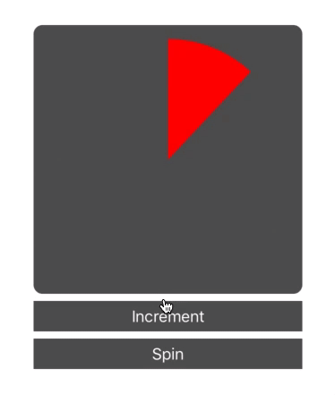

Custom CALayer progress indicator

Creating custom CALayers in your iOS apps can be very useful, and animating them can add some polish to the final result. CALayers are everywhere in UIKit - every UIView has a layer to draw its contents on. Layers have been around forever, and you’ll find many existing posts on animating them, such as [https://blog.codecentric.de/en/2016/07/custom-property-uiview-block-animation/](https://blog.codecentric.de/en/2016/07/custom-property-uiview-block-animation/) or [https://www.objc.io/issues/12-animations/animating-custom-layer-properties/](https://www.objc.io/issues/12-animations/animating-custom-layer-properties/)

This post is not a full guide on how to animate your CALayers, instead I want to highlight something very simple that might cause you issues, as it did for me. If anything, this might trip up those developers coming from Objective C development even more, as if you are like me you've animated many layers over the years and thought you knew all the tricks.

## The Problem

So you've created a custom CALayer, in swift this time, and you are pretty sure you've done everything. You have your init method to initialise with another layer. You have displayForKey implemented. You've even added the actionForKey method incase you want to try some implicit animations. You've impemented your custom drawing. And your layer works! It's in a view, it has a frame, you set your properties, display the layer and the content appears.

However, it doesn't animate. You create a CABasicAnimation, set the name of the property, double checked the spelling, but no animations.

Perhaps you have something like this:

```
class LoadingLayer: CALayer {
    
    var tintColor: UIColor? = UIColor.black
    var percentage: CGFloat = 0
    
    override init() {
        super.init()
    }
    
    override init(layer: Any) {
 
        if let other = layer as? LoadingLayer {
            self.tintColor = other.tintColor
            self.percentage = other.percentage
        }
        else {
            fatalError()
        }
        
        super.init(layer: layer)
    }

    required init?(coder aDecoder: NSCoder) {
        super.init(coder: aDecoder)
    }
    
    override func draw(in ctx: CGContext) {
        let center = CGPoint(x: self.bounds.width/2.0, y: self.bounds.height/2.0)
        
        let radius = (self.bounds.width*0.9)/2.0
        let fillColor = self.tintColor ?? UIColor.black
        
        ctx.setStrokeColor(UIColor.black.cgColor)
        ctx.setFillColor(fillColor.cgColor)
        
        ctx.beginPath()
        ctx.translateBy(x: center.x, y: center.y)
        ctx.rotate(by: -.pi/2.0)
        
        ctx.move(to: CGPoint(x: 0, y: 0))
        ctx.addArc(center: CGPoint(x: 0, y: 0),
                   radius: radius,
                   startAngle: 0,
                   endAngle: (2*CGFloat.pi)*self.percentage,
                   clockwise: false)
        
        ctx.closePath()
        
        ctx.drawPath(using: .fill)
    }
    
    
    override class func needsDisplay(forKey key: String) -> Bool {
        if key == "percentage" {
            return true
        }
        
        return super.needsDisplay(forKey: key)
    }
    
    override func action(forKey event: String) -> CAAction? {
        
        if event == "percentage" {
            let anim = CABasicAnimation(keyPath: "percentage")
            anim.byValue = 0.01
            anim.timingFunction = CAMediaTimingFunction(name: .linear)
            anim.fromValue = presentation()?.percentage ?? 0
            return anim
        }
        return super.action(forKey: event)
    }
}
```

This works fine when setting the property and drawing once, but when you animate like below, nothing happens:

```
let anim = CABasicAnimation(keyPath: "percentage")
anim.fromValue = 0
anim.toValue =  1.0
anim.byValue = 0.01
anim.duration = 2.0
anim.repeatCount = MAXFLOAT
        
loadingLayer.add(anim, forKey: "spin")
```

Maybe you even look at some old Objective-C code, and see no difference.

## The Solution

The fix is as follows: Make sure the property you are trying to animate is accessible from Objective-C by adding `@objc` in the declaration like so. Maybe even make it dynamic for some other CALayer bonuses like not needing to copy its value during init:

```
@objc dynamic var percentage: CGFloat = 0
```

Now your animation should be working. It’s a small thing thats easy to forget.

This does highlight something else however - another bad habit in here. In the needsDisplay function, and the CABasicAnimation the percentage key is used as a literal string. One way to add some additional safety to your custom CALayer code and animations would be to use the `#keyPath` feature of swift to create that string for us. With two advantages - if we rename the property later xcode will point out where we need to change it. And it will also warn you if your property isn’t accessbile from Objective-C with a warning like the following:

```
error: CALayerAnimationExample.playground:52:41: error: argument of '#keyPath' refers to non-'@objc' property 'percentage'
        if key == #keyPath(LoadingLayer.percentage) {
                                        ^

CALayerAnimationExample.playground:2:9: note: add '@objc' to expose this var to Objective-C
    var percentage: CGFloat = 0
```

So remembering to use `#keyPath` instead of literal strings might help catch this error sooner.  

A playground example containing this sample CALayer and View can be found on github here: [https://github.com/Tapadoo/CALayerAnimationPlayground](https://github.com/Tapadoo/CALayerAnimationPlayground)

Jason Connery

Lead iOS Developer
