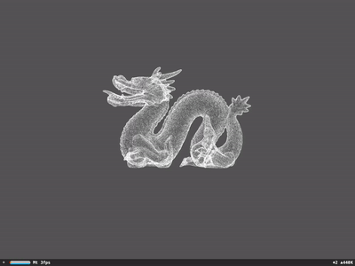
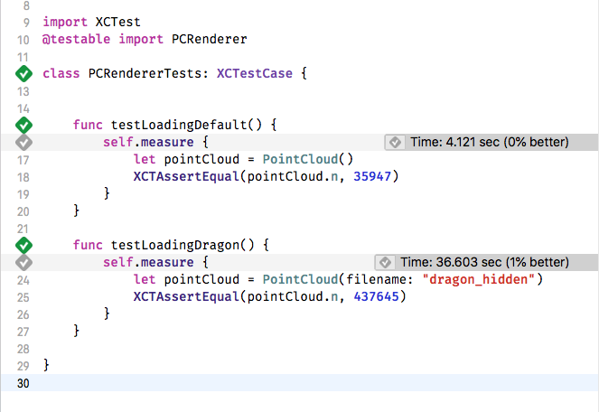
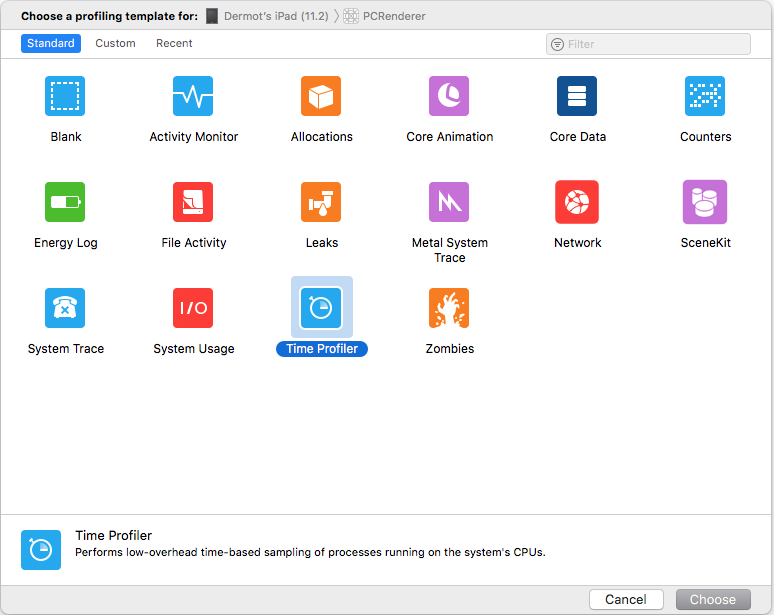
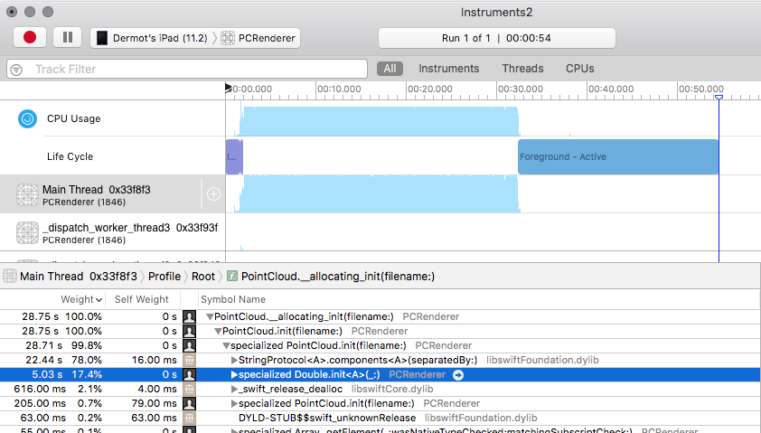
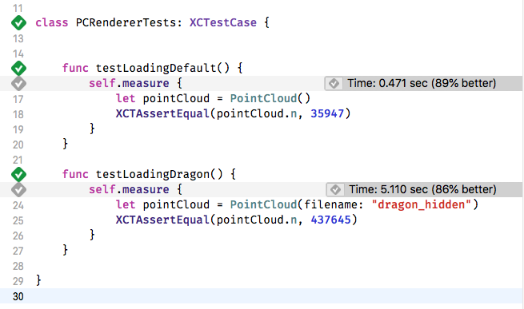
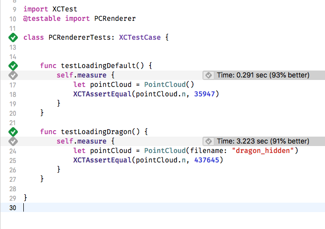
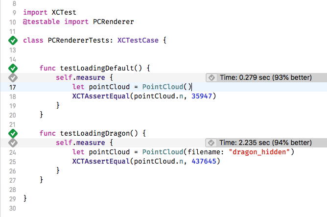

A new client came to us recently with a project that would test our ability on app performance.

They had a sample iOS app, which loaded a point cloud into a 3D model. They wanted to build a proof of concept app and incorporate this 3D model into it as a nice visual. App performance was important to them.

We got to work building the app itself. But once we started to integrate the existing 3D model, issues arose. The time it took for the model to load was quite long, nearly 40 seconds and it froze the app at start up. Not a great start for app performance.

Obviously this wasn't good enough, so we set about fixing it. With some tweaks to string handling and parsing, we were able to gain a measurable 16X app performance improvement.

The code the client brought with them was based on this code on [GitHub.](https://github.com/eugeneu/PoindCloudRenderer) It works by reading in a .ply file containing the x,y,z coordinates of points, then forms a scene kit node from these points. The SceneKit node generated in the sample project looks like this:

There are a few downsides to this point cloud loader; it’s slow, it makes assumptions on the data in the .ply file, ignores additional data like normals and colours.

However, the model would not always be known ahead of time and this was a short project. We weren’t going to completely change how the 3D models were stored or loaded on such a tight deadline. So, we decided to see if we could improve this existing code.

To do this we needed to look at some app measurement techniques in order to improve app performance.

## Time to improve app performance

Our first task was to speed up this PointCloudRenderer project.

The meat of this example is the PointCloud class. On initialisation it reads in a ply file (hard coded name), parses the header, then takes each line of data, splits into three parts, and converts each part to a Floating point number. It gathers these floats in an array of structs representing the points.

Now, we are guessing this is slow, but as the saying goes, you can’t improve what you don’t measure. So before we go fixing anything, let’s first measure its current performance. We’ll also want to see if our changes are making things better as we go.

It’s a perfect time to use unit tests and Xcode’s measure feature.

## Measuring Initial Loading

The sample on GitHub ships with a couple of example .ply files, a bunny and a dragon. The bunny only has ~36K points in its data but the dragon has 437,645 points. This is close enough to our clients, which was 532,993 points. We can use the dragon model for our tests as it performed similarly to our client’s model.

First, we make a small tweak to the PointCloud class, to allow us to specify the name of the model file to load. Then we write a unit test class, as shown below and run it. The measure test block executes the code 10 times and gives an average.

 

Running these new tests a few times on an iPad gives us a baseline to work with. The Dragon is taking 36 seconds to load on average.

We can also run the app under the Time Profiler to get an idea of what parts of the init method are taking so long.

 

Here's the initialization method for PointCloud:

    init(filename: String = "bun\_zipper\_points") {
        super.init()
        
        self.n = 0
        var x, y, z : Double
        (x,y,z) = (0,0,0)
        
        // Open file
        if let path = Bundle.main.path(forResource: filename, ofType: "ply") {
            do {
                let data = try String(contentsOfFile: path, encoding: .ascii)
                var myStrings = data.components(separatedBy: "\\n")
                
                // Read header
                while !myStrings.isEmpty {
                    let line = myStrings.removeFirst()
                    if line.hasPrefix("element vertex ") {
                        n = Int(line.components(separatedBy: " ")\[2\])!
                        continue
                    }
                    if line.hasPrefix("end\_header") {
                        break
                    }
                }
                
                pointCloud = Array<SCNVector3>(repeating: SCNVector3(x:0,y:0,z:0), count: n)
                
                // Read data
                for i in 0...(self.n-1) {
                    let line = myStrings\[i\]
                    x = Double(line.components(separatedBy: " ")\[0\])!
                    y = Double(line.components(separatedBy: " ")\[1\])!
                    z = Double(line.components(separatedBy: " ")\[2\])!
                    
                    pointCloud\[i\].x = Float(x)
                    pointCloud\[i\].y = Float(y)
                    pointCloud\[i\].z = Float(z)
                }
                NSLog("Point cloud data loaded: %d points",n)
            } catch {
                print(error)
            }
        }
        
    }

And here’s what the ply file looks like:

ply
format ascii 1.0
comment VCGLIB generated
element vertex 437645
property float x
property float y
property float z
element face 0
property list uchar int vertex\_indices
end\_header
0.1791272 -0.2087705 -0.2279476
0.1780086 -0.2087705 -0.2278163
0.1808354 -0.2088217 -0.2278163
0.1808354 -0.2087705 -0.2278363
0.1809296 -0.2087705 -0.2278163
0.1791272 -0.2070623 -0.227975
0.1808354 -0.2070623 -0.2281433
0.1825437 -0.2074703 -0.2278163
0.1825437 -0.2070623 -0.2279193
0.1808354 -0.205354 -0.2280911
\[....\]

Hopefully it's easy enough to follow.

It firsts reads the entire file into a String variable. Then it splits the string into lines. Next it reads the start of the .ply file looking for a line containing “element vertex”. This line contains a count of the number of rows of data. Once it knows how many vectors it's going to be creating, it creates an array of vectors with values of 0,0,0. Finally, it loops over the remaining lines to parse the X,Y,Z values for the vector.

## Reading with sscanf

So let’s get to improving things.

The profiling above, shows that 95% of the time was used on splitting strings with the components method and creating Doubles.

The biggest use of these is in the loop that creates our vectors. It’s splitting one string into three strings (three times), then creating Doubles, then creating floats from those doubles, then updating a vector struct. This works. It’s readable and if it was only a couple of uses I wouldn’t mind. But it’s happening half a million times in our example. It's likely to be wasting time and memory creating new strings at the very least.

If we replace those calls to split the string, we might end up with something quicker. The first thing that comes to mind when I think of reading three floats from a string is the sscanf function from C. But we are coding in swift here. We can call a scanf function, but it’s a bit uglier. It looks like the following.

 

pointCloud.reserveCapacity(n)
var floatBuffer = UnsafeMutablePointer<Float>.allocate(capacity: 3)

// Read data
for i in 0...(self.n-1) {
    
    let line = myStrings\[i\]
    
    let vector = withVaList(\[floatBuffer,floatBuffer.advanced(by: 1),floatBuffer.advanced(by: 2)\]) { valList -> SCNVector3 in
        vsscanf(line,"%f %f %f", valList)
        
        return SCNVector3(x:floatBuffer\[0\],y:floatBuffer\[1\],z:floatBuffer\[2\])
    }
    
    pointCloud.append(vector)
}

 

First, we allocate space in our array, and create a buffer for three floats. We will reuse the memory for the floats on each run of the loop, as the creation of the struct will copy their values anyway. Next, we use the withValList function to create a pointer we can pass to the vsscanf function. Once that returns we can now read the three floats from the buffer.

It runs. The model still looks correct. But is it faster?

Thankfully we can just rerun our tests on the same hardware.

The results are promising:

From 36 seconds to five seconds.

This is a welcome improvement. We include this change in our proof of concept app and move on for now.

## Using NSScanner

But our new solution isn’t great.

Later we get a chance to come back and try to improve things a little more.

While it’s faster, it’s also more ugly with the unwieldy UnsafeMutableBuffers and valList pointers that swift makes us use there. Our leap back to C style programming may have been the wrong path to take. What we need is a better way to read numbers from a string.

NSScanner is a Foundation class, which you initialise with a string and can then read number or substrings from it as it moves over the string while skipping the spaces and new lines. It's exactly what we need here. Rewriting our loop again, it now looks like this:

pointCloud.reserveCapacity(n)

var x: Float = 0
var y: Float = 0
var z: Float = 0
// Read data
for i in 0 ..< n {
    let scanner = Scanner(string: myStrings\[i\])
    scanner.scanFloat(&x)
    scanner.scanFloat(&y)
    scanner.scanFloat(&z)
    
    let vector = SCNVector3(x: x , y: y, z: z)
    pointCloud.append(vector)
}

 

OK, that reads much nicer. In fact, it even reads nicer than the original code.

But what are the chances it’s faster?

Lets run our tests and find out.

Even better again. From 36 seconds to three, it’s an order of magnitude better. It’s running in less than a tenth of the time it originally took.

Before running the test, part of me was expecting a worse performance. This highlights the importance of measuring your improvements as you go. If both code snippets were shown to me and I was asked to choose the fastest, I probably would have chosen the scanf version as it looked closer to C.

## A Single Scanner

There is still potential here for more improvements. One thing that's still happening in our initialisation function, is excessive string manipulation. The entire file is read into a String initially but then it's split by line into an array of lines. Then we are removing lines from the array as we search for the number of points, until we reach the end of the header.

If we can cut out these additional strings and the array manipulation we could see further improvements.

While there's nothing wrong with handling each line of the header, we aren’t actually using any of them. We are only hunting for one specific value. Also, as we loop over all the remaining lines we are creating a new Scanner for each line.

What if we could instead extract the point count from the string without splitting the lines into an array. And then use one scanner for the entire set of vertex data.

We can find the parts of the header we are interested in using the range and substring methods on String. Substrings in swift do not take up extra memory.

Here is our new init method with these changes:

init(filename: String = "bun\_zipper\_points") {
    super.init()
    
    // Open file
    if let path = Bundle.main.path(forResource: filename, ofType: "ply") {
        do {
            let data = try String(contentsOfFile: path, encoding: .ascii)
            
            //Without a header, we dont know our point count
            guard let headerEndRange = data.range(of: "end\_header") else {return }
            
            //We need to extract the point count from the header. Lets get the header as a substring to work with
            let headerSubString = data\[data.startIndex ... headerEndRange.upperBound\]
            
            guard let elementVertexRange = headerSubString.range(of: "element vertex ") else {return }
            
            //This is the substring container the number followed by the rest of the header
            let vertexCountParialString = headerSubString.suffix(from: elementVertexRange.upperBound)
            
            //Find the next line break and create a substring with just the vertex count
            let vertexEndIndex = vertexCountParialString.index(of: "\\n") ?? vertexCountParialString.endIndex
            let vertexCountString = vertexCountParialString\[..<vertexEndIndex\]
            
            n = Int(vertexCountString) ?? 0
            
            pointCloud.reserveCapacity(n)
            
            var x: Float = 0
            var y: Float = 0
            var z: Float = 0
            
            let pointStartIndex = headerEndRange.upperBound
            
            let pointDataSubString = data\[pointStartIndex...\]

            let dataScanner = Scanner(string: String(pointDataSubString))
            
            // Read data
            for \_ in 0 ..< n {

                dataScanner.scanFloat(&x)
                dataScanner.scanFloat(&y)
                dataScanner.scanFloat(&z)
                
                //bunny model for example has extra data for normals and color. lets ignore anything but the first 3 floats for now by skipping the rest of the line
                dataScanner.scanUpToCharacters(from: CharacterSet.newlines, into: nil)
                
                let vector = SCNVector3(x: x , y: y, z: z)
                pointCloud.append(vector)
            }
            NSLog("Point cloud data loaded: %d points", n)
        } catch {
            print(error)
        }
    }
    
}

We create a substring for the header, which is more efficient to work with than splitting the string. Then we find the range of the element vertex text we were previously searching for. Once we find that, we can extract the rest of the line and convert it to an Int for our point count. Next, we get the substring containing just the lines of data we need to parse and create a single Scanner that we use in our data parsing loop.

Just hunting for one value in the header isn’t great but it’s all we need. A better ply parser might correctly scan the full header here to determine exactly how many properties to read on each data line and the type of data. But for our proof of concept app we don’t need that, so we skip straight to the values we are interested in.

Once again, our tests can reveal if we are heading in the right direction or not:

The dragon is down to 2.2 seconds, a further improvement.

So, with some refactoring of string handling and parsing and some XCTests to help us measure and repeatedly test, we’ve taken the parsing of the dragon sample file from 36 seconds, to 2.2 seconds.

94% better.

Over 16 times faster.

Its tempting to keep going - there’s undoubtedly more savings to be had but this will do for now.

The original code can be found on [GitHub](https://github.com/eugeneu/PoindCloudRenderer), it was published with a GPL License. A version with the final improvements shown here can be found here : [https://github.com/Tapadoo/PoindCloudRenderer](https://github.com/Tapadoo/PoindCloudRenderer)

You can also [get in touch](https://tapadoo.wpengine.com/contact/) with us if you need help with developing your app.

Jason Connery

Lead iOS Developer
