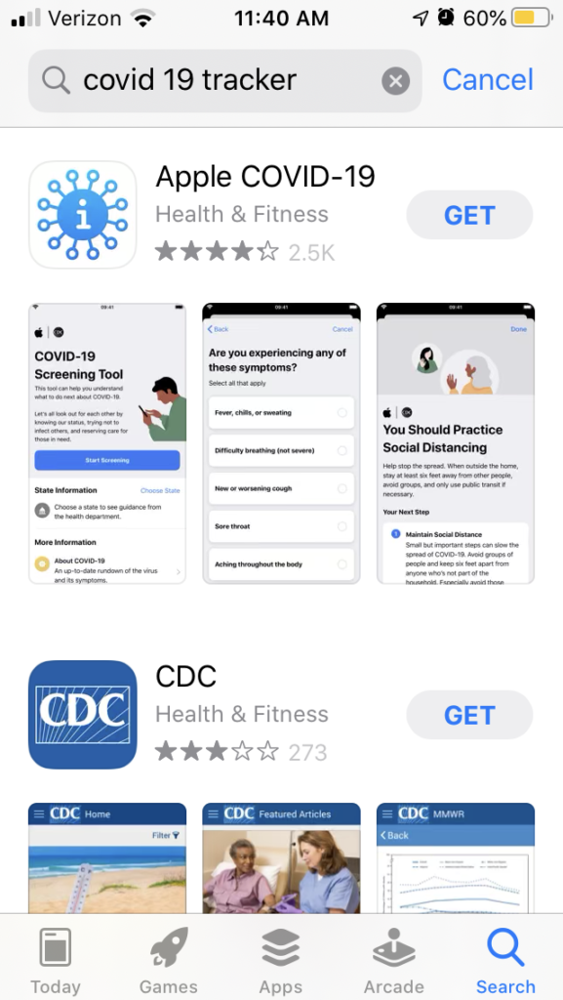
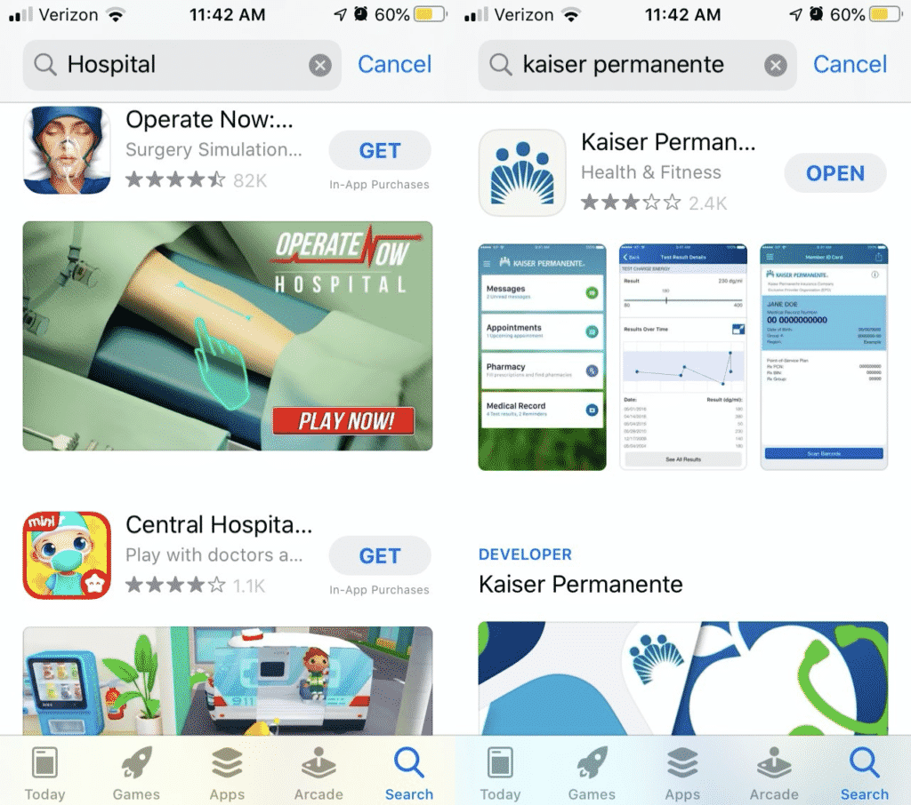
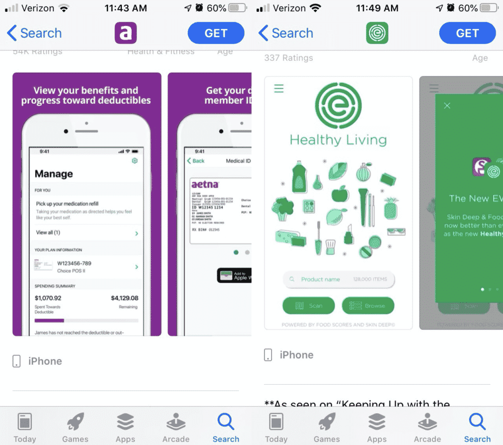

Medical apps can be useful tools for helping users manage their health, appointments and medicine. Medical app developers have many things to take into consideration when launching their app, including: how will users find it?

You can’t help anyone if your app isn’t scaling and reaching users. Fortunately, there is a cure for that, and it begins with your [App Store Optimization strategies](http://www.gummicube.com/).

The question, then, is where do you begin with optimization? When optimizing medical apps, there are a few guidelines and best practices you’ll want to keep in mind. Read on and learn how you can keep your app healthy.

## Compliance Guidelines to Remember

The medical field has strict guidelines and regulations, as do apps focusing on medical issues. Since apps are available to a wide number of users around the world, the stores that provide them need to ensure they’re reliable and will not mislead users. Doctors have to worry about malpractice suits, while medical app [developers](https://tapadoo.com/) worry about being removed from the app stores.

Health and medical apps must adhere to [guidelines](https://blog.gummicube.com/2019/06/apple-announces-app-store-policy-updates/) designed to protect users’ privacy and safety. Failing to comply with these can result in the app being rejected upon submission or removed from the store.

### Information Gathering

What specific rules are relevant to health and medical apps? There are several sections in the App Store Review Guidelines that specifically call out health and medical apps, such as those regarding information gathering.

> Apps may not use or disclose to third parties data gathered in the health, fitness, and medical research context… for advertising, marketing, or other use-based data mining purposes other than improving health management, or for the purpose of health research, and then only with permission. 
> 
> [Source](https://developer.apple.com/app-store/review/guidelines/#health-and-health-research)

While some health apps may gather information on the user for purposes such as reducing their insurance premiums, they must be submitted by the entity providing the benefit. Even then, if data is shared with outside parties for the sake of advertising at any point, the app risks removal.

While users can grant permission to share data, that is only for health research or management purposes. In other words, any information the apps gather should be for health purposes.

### Risk Prevention

Health apps are meant to help users and provide a benefit. If the app reviewer feels the app presents a risk of physical harm, it will be rejected.

**1.4.1** Medical apps that could provide inaccurate data or information, or that could be used for diagnosing or treating patients may be reviewed with greater scrutiny:

> Apps must clearly disclose data and methodology to support accuracy claims relating to health measurements, and if the level of accuracy or methodology cannot be validated, we will reject your app. For example, apps that claim to take x-rays, measure blood pressure, body temperature, blood glucose levels, or blood oxygen levels using only the sensors on the device are not permitted.
> 
> Apps should remind users to check with a doctor in addition to using the app and before making medical decisions.
> 
> [Source](https://developer.apple.com/app-store/review/guidelines/#physical-harm)

We can see this guideline come into play outside of the health category as well; it’s why apps cannot promote the use of tobacco, alcohol or similar products. Even apps that facilitate the sale of marijuana or controlled substances must be from a licensed pharmacy.

### COVID-19

As COVID-19 continues to spread, app users may turn to medical apps for information and guidance. In order to prevent the spread of misinformation, the App Store is enforcing strict guidelines on any apps that may try to utilize the pandemic to gain downloads.

_Approved COVID-19 apps are Apple’s own contact tracing app and the official CDC app._  

Any apps that mention COVID-19 must be from “recognized entities” such as government bodies and credentialed medical institutions. Apps from developers that do not meet those guidelines will be rejected.

Using “COVID” or “Coronavirus” keywords can even result in an app being rejected. Any entertainment apps with a Coronavirus theme will be rejected outright – it is a serious matter and Apple wants to avoid filling the search results with games or photo filters when users are searching for health information. Even apps that don’t specifically refer to COVID-19 may be on thin ice, such as how [Plague Inc.](https://www.washingtonpost.com/video-games/2020/02/28/plague-inc-removed-chinas-app-store/) was removed from the App Store in China.

### High Stakes, High Standards

Apps in the health and medical categories are held to especially high standards, and for good reason. Users turn to these apps to gain insights into their health and well-being, so they need to be able to download and use the apps with confidence.

Developers must follow each guideline to the letter. Failing to follow them can result in outright rejection, meaning your app won’t reach any users while your competitors get ahead.

## Marketing in the Medical Space

When you market your medical app, your marketing strategy needs to be catered to it. Focus on the specific kind of app you’re promoting and find the marketing strategies that work for your audience. This is where your App Store Optimization strategies will really come into play.

### A Wide Field

There are a wide range of apps in the “Medical” and “Health & Fitness” categories, including:

\-   Medicine tracking

\-   General provider information

\-   Fitness tracking

\-   Hearing tests

\-   Clinical care

\-   Healthcare/Insurance provider apps

If you want to reach users, you need to convey what type of app yours is. From there, you can identify what search and conversion trends work well for apps in that field.

### Optimizing for Your App

This extends to both the keywords and creative sets you use for your app. Using the wrong keywords can prevent your app from appearing in relevant searches, while ineffective creative sets can reduce the amount of installs you receive.

#### Keyword Targeting

While apps designed for monitoring physical health may want to include “fitness” and “weight loss” keywords, those are unlikely to help apps made for managing doctor appointments.

_While searching for “hospital” results in hospital games in the top results, specific provider names give more relevant search results._  

Research what keywords relate to your app and have a high search volume – those are the ones you’ll want to target. While some keywords seem to make sense like “hospital,” the top results in App Store Search are for a very different demographic than those looking for a medical app. See what terms your competitors rank for and what the top apps in your category target - what’s the top app for “medicine” and why? This will help guide your keyword targeting.

#### Creative Sets

Similarly, your creative set can make the difference between users installing your app or moving to the next competitor.

While screenshots showing users meditating on the beach may convert well for yoga apps, they will do little to appeal to users looking for health insurance apps.

_Health-focused apps require vastly different screenshots, depending on their content._  

#### Target Your Marketing

You need to structure a marketing approach based around the specific kind of health app you provide. Research what keywords and creative trends perform well in your category, and use that as your starting point to optimize your app.

Failing to optimize effectively for your category will only result in your app appearing low in search results or in the wrong searches altogether. If that happens, you’ll be struggling to gain users.

## Localize When Expanding

People around the world have health and medical needs, so medical apps have room to expand. Yet when you market in new territories, you need to localize.

This requires adapting your app and its listing to each region it launches in. This is more than translating word for word or changing prices based on the exchange rate, as it takes cultural differences into account.

### Localizing Your Terminology

Medical terminology may differ between regions, even in countries that speak the same language. For instance, what we call “primary care” in the US would be called “general practice” in the UK.

Even localized spelling can make a difference. US users will want doctors to analyze their test results, while UK users will want one to analyse them.

### Why Localizing Matters

Why does localization matter? Simply put, localizing an app will make it appear more genuine to users in the new region.

Your store listing needs to appear relevant to users in your region. If a user in England sees your app can help users with Medicare, they might go “But I use the NHS” and ignore it. You need to research the terminology used in each territory and accurately represent what users are searching for.

Using incorrect terms will come across as disingenuous, leading to poor conversions and a low ranking.

## Overall

Medical apps are held to high standards, especially as the world deals with the COVID-19 pandemic. If you want your medical app to succeed, you must ensure you follow all guidelines, optimize for your field and localize for each territory you’re in.

With proper App Store Optimization strategies, you can reach interested users wherever you launch. Without optimizing, your app will lack the visibility it needs for a healthy growth.

About the Author

Gummicube Co-Founder & CEO, Dave Bell

Gummicube is a global leader in App Store Optimization with more than 11 years of experience optimizing and marketing apps. We offer the leading enterprise ASO technology and agency services, providing support to clients around the world. Our company is trusted by thousands of enterprise brands and leading startups including Microsoft, LinkedIn, Bethesda, SWEAT, GrubHub, McAfee and many others.
