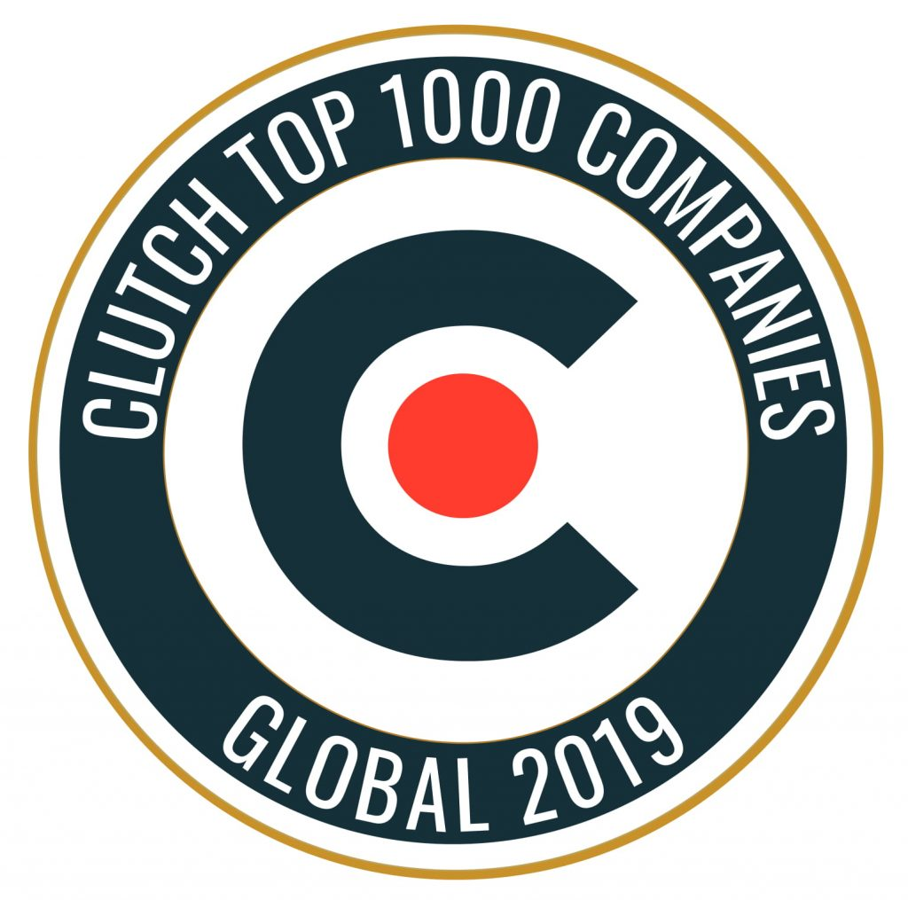
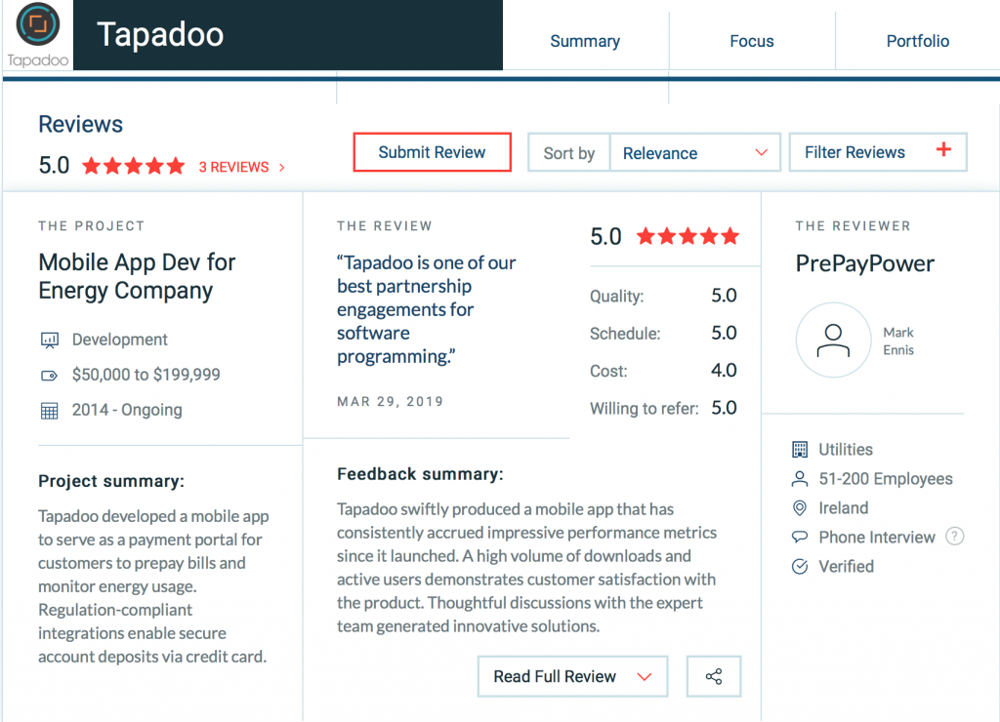

When the Apple App Store launched in 2008 there were 500 apps. As of the third quarter of 2019, there are [1.8 million on the Apple App Store](https://www.statista.com/statistics/276623/number-of-apps-available-in-leading-app-stores/), [2.47 million on the Google Play Store](https://www.statista.com/statistics/276623/number-of-apps-available-in-leading-app-stores/), [669 thousand on the Window Store](https://www.statista.com/statistics/276623/number-of-apps-available-in-leading-app-stores/) and [487 thousand on the Amazon Appstore](https://www.statista.com/statistics/276623/number-of-apps-available-in-leading-app-stores/).

We've played our part in this.

So much so, we've been recognised as one of the top 1000 B2B companies on Clutch. This may not seem like a lot, but considering they're over 160,000 services providers on Clutch this puts is pretty much ahead of a lot. In fact, we are now in the **top 1% of B2B companies on Clutch**.

**Tapadoo Named Among Top 1000 B2B Global Companies on Clutch**

The Clutch 1000 is a list of the top 1,000 B2B companies listed on their site.

Tapadoo is one of over 200 mobile app development companies in the Clutch 1000 and the only company from Dublin, [Ireland](https://clutch.co/ie/app-developers)!

This award means a lot. It is based on the opinions of our clients.

Clutch conducts independent research with the past clients of companies to ensure all rankings on their site are fair and verified. This award and our 5-star rating on Clutch are all thanks to the clients we have partnered with, who have chosen to acknowledge us in such a public way.

Here's an example of a review from one of our clients

You can read our reviews on Clutch [here](https://clutch.co/profile/tapadoo).

We're proud and honoured to be part of the Clutch Top 1000 Companies Globally. As a small software company from Dublin sharing this recognition with some of the largest and heavily funded companies in the world is a big achievement for us.

Our work is also featured on sister sites of Clutch including the [Manifest](https://themanifest.com/app-development/android/companies) and [Visual Objects](https://visualobjects.com/profile/tapadoo).

### Award-Winning App Development Company

2019 has been a good year for us and we certainly feel like an award-winning app development company. We've been fortunate to have won a number of awards from Clutch. Back in June of this year, we won an award for a [Top Wearable App Developer for Wearable Technology](https://tapadoo.wpengine.com/tapadoo-named-top-wearable-app-developer-2019/).

We've also been noted as part of the [top 100 Android app developers](https://themanifest.com/app-development/android/companies) on the Manifest.

If you'd like us to develop your app project [get in touch](https://tapadoo.wpengine.com/contact/).

Maria Colgan

Digital Marketing Manager
