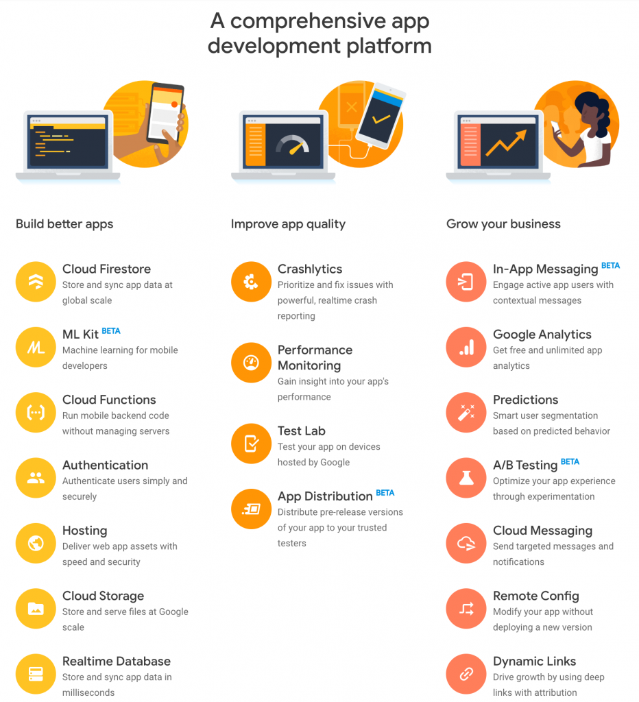
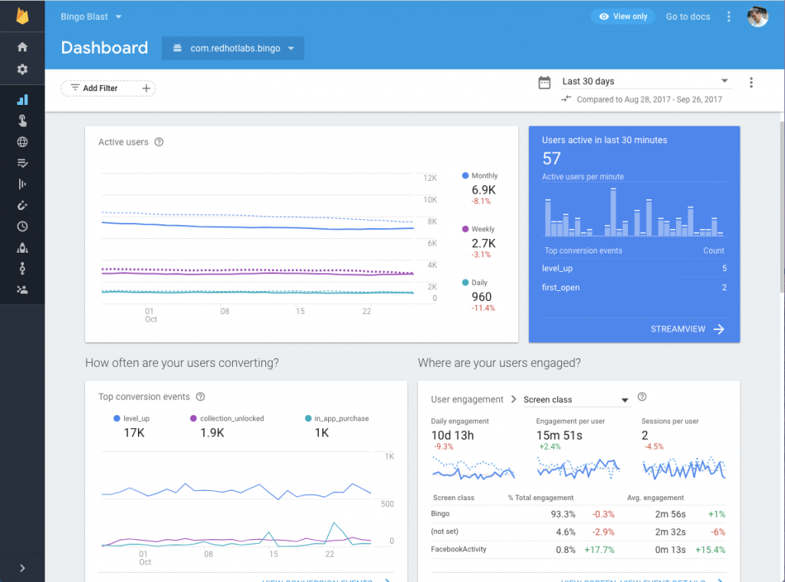
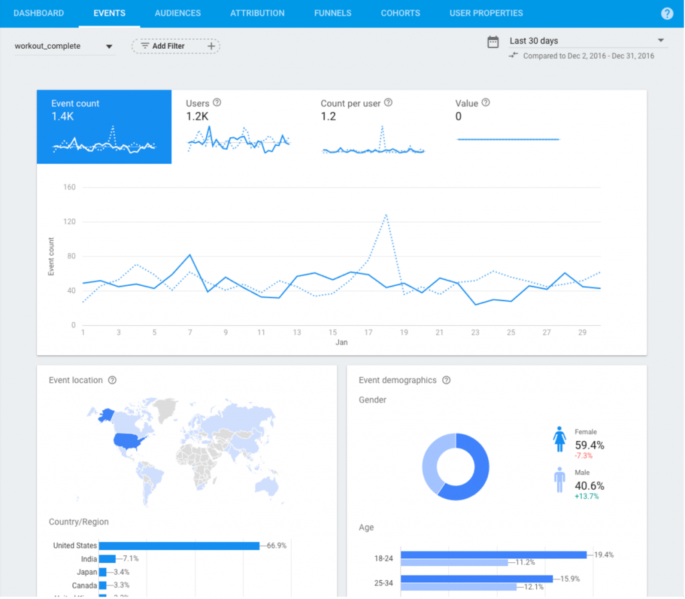
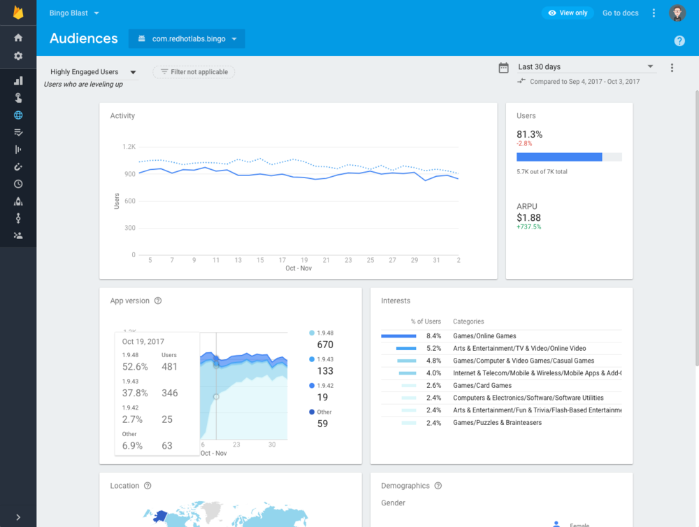

Google Analytics for Firebase is a free analytics tool used to gain a better understanding of how users interact with your app. It's a great analytics tool for marketers, developers and project managers to help grow and monetise an app.

[Source](https://firebase.google.com/)

### Setting up Google Analytics for Firebase

Setting up Google Analytics for Firebase in your app is simple and quick.  Just add the Firebase SDK to your app and it will begin to capture data.

Start by adding your project in the Firebase Console. Once you click 'add project' you will be asked to add details about your project. Enter the name of your app as the project name and complete the other required fields.

When the project has been created you then register your app. If you have both an iOS and Android version of your app you should register both so you get to see a full picture of your app's activity. You just enter the bundle ID for each of them along with a nickname and their different app store IDs.

If you'd like specific step by step instruction for adding Firebase to your iOS project you can read this [document](https://firebase.google.com/docs/ios/setup) or watch the video below.

https://www.youtube.com/watch?time\_continue=9&v=mPBBNi2Ou6o&feature=emb\_logo

If you'd like specific step by step instructions for adding Firebase to your Android project you can read this [document](https://firebase.google.com/docs/android/setup) or watch the video below.

https://www.youtube.com/watch?time\_continue=1&v=cNPCgJW8c-E&feature=emb\_logo

After this is completed you will see a configuration file that you can download. This is the file you add to your Xcode project. Firebase gives instructions on how to download the SDK and add the libraries into your project. Launch your app after this so Firebase can confirm you have integrated it.

That's it! Your app is now set up with Google Analytics for Firebase.

### Google Analytics for Firebase Dashboard

The data captured on your app can be viewed from the dashboard in the Firebase console from here on. You'll see predefined events that have automatically been captured by the SDK, such as active users, demographics and app engagement.

If you have both an iOS and Android version you will see the data for both of them on the dashboard. You can look at the data for just one version by clicking on 'filters'. Filters also allow you to analyse the data for different audiences you have set up.

By default, the dashboard will show you the last 30 days of data, but you can change this by using the date picker control.

There's a lot of different data and information on the dashboard to help you understand your app. It starts with active users i.e. how many users are in your app on a daily, weekly and monthly basis. As well as how many users are active in the last 30 minutes.

It shows user engagement, such as how much time people spend within your app. It also shows conversion metrics. If you have in-app purchasing you see this data along with information on Admob if you're generating revenue.

There's a section on the stability of your app. It shows the percentage of crash-free users.

Another card on the dashboard shows the latest release of your app along with the status of that release. The status allows you to click into it to investigate any issues.

The final three cards on the dashboard are user acquisition, retention and audience information.

https://www.youtube.com/watch?v=QDOZbhXWfQI

### Events in Google Analytics for Firebase

Google Analytics for Firebase allows unlimited reporting on up to 500 custom events, such as a user adding an item to the cart, and allowing you to customise the captured data to your business and goals.

Events are the most important feature of Google Analytics for Firebase. Many of them are captured automatically. When you log into Google Analytics for Firebase you will see the events captured on the main dashboard, such as a first open event, in-app purchases, user engagement and sessions.

You can also see who has uninstalled your app and crash reporting events if your app is integrated with Crashlytics.

There are events for push notifications so you can see how users are responding to the notifications.

You can see a list of the automatically collected events [here](https://support.google.com/analytics/answer/9234069).

As well as automatic events there are a number of suggested events provided. The suggested events are divided up by verticals such as gaming, retail, travel etc. The Help Centre within Google Analytics for Firebase provides different sections of all the suggested events for you to view.

If you log these suggested events as prescribed you will receive reporting for each of them.

You can also add your own custom events by using the custom event API. It's recommended, however, that you become familiar with the automatic and suggested events before setting up custom events.

https://www.youtube.com/watch?v=cn1Vx9pX-yQ

### Audiences in Google Analytics for Firebase

Once the data within your app is captured, you're able to create audiences, and group users based on certain attributes like 'purchasing users'.

Audiences are particularly useful when used in conjunction with other Firebase features. For example, you can send custom notifications using Firebase Notifications. Notifications can even be used to target users with Google’s ad platform.

The events data captures the overall performance of your app, but 'user properties' and 'audiences' drills down further into specific behaviour. By using user properties and audiences you can segment the data captured for better insights into how your app is being used.

When you click the 'user properties' table you can register a property, such as the profession of your users. You then use the API to call that specific information.

You can create audiences of users who meet certain criteria and user property criteria. Once you set up the audience it will start to accumulate users who meet these criteria. You can then target these audiences with particular campaigns.

When your audiences are set up you can click on each one to get an individual report on that audience.

This data provides great insight into how well a certain aspect of your app is performing. It gives detailed information on how users are using your app.

https://www.youtube.com/watch?v=50zTCzySXEg

### Conclusion

Google Analytics for Firebase is highly customisable. Its dashboard provides a single location for data collection, analysing and performing actions based on the captured data in an easy to read structure. Filtering makes it easy to process the data. It is also highly scalable so will work with the biggest of apps.

Firebase itself has many additional functionalities outside of analytics such as database, crash reports and messaging. This helps provide a bigger picture of app performance.

Caoife Davis
