There are numerous app analytics tools on the market so how do you choose the right one for your app?

To help you find the answer we’ve put together a list of app analytics tools that can support your app in 2020 and beyond. We’re focusing on in-app analytics here but will cover app marketing analytics tools in another post. Some of the app analytics tools listed here are also marketing analytics tools.

The reviews are in no particular order as you can't really compare a fee-paying tool to a non-fee paying one. In saying that, all these app analytics tools do a similar job, some better than others. But then you need to factor in the cost.

So the decision on which tool you should use comes down to your requirements, your in-house capabilities and your budget. If you are a one-man show trying to gather a bit of insight into the usage of your app then obviously a free tool is for you. You could also use a 'free plan' in a paid tool that allows you track so many events per month before charges kick in.

If you are an SME or enterprise with a budget then there are quite a few tools to choose from, so it all comes down to your requirements and in\-house capabilities. But as many enterprises have commented on the reviewing sites, they use more than one tool to monitor the usage of their apps.

The particular tools covered here come with numerous reviews based on real users. You can see the pro's and cons of each tool on different ratings and reviews platforms. I've highlighted the reoccurring pro and con in this post.

If you want a more detailed review I recommend you look at each individual reviewing platform. This will help you make a well-informed decision based on your specific requirements.

## Best App Analytics Tools for 2020 and Beyond

## 1 Appsee

[Appsee](https://www.appsee.com/) is a qualitative app analytics tool that gives you great insight into user behaviour. Its heatmapping is ideal for user experience design.

Appsee offers many features but probably one of its most unique features is user recordings. This is where you get to see your app through your users' eyes. The recordings are analysed on a single-user level so you see all taps, swipes, and actions. This helps you understand why users aren’t signing up, why they are abandoning a session and why they aren’t making in-app purchases.

Their touch heat maps allow you to assess your app’s UI helping you make an informed decision about which elements to remove. You see why certain screens are more popular than others and why particular features are not being used.

The analytics are in real-time and allow you to monitor alerts on metric changes within your app. The alerts allow you to keep track of your KPIs. You can set up crash report alerts and even alerts for when your sales purchases funnel drops below a certain percentage. They also offer conversion funnel analytics.

Appsee was acquired by ServiceNow in 2019. The purpose of the acquisition is to add Appsee’s intellectual property and key staff to the Now Platform.

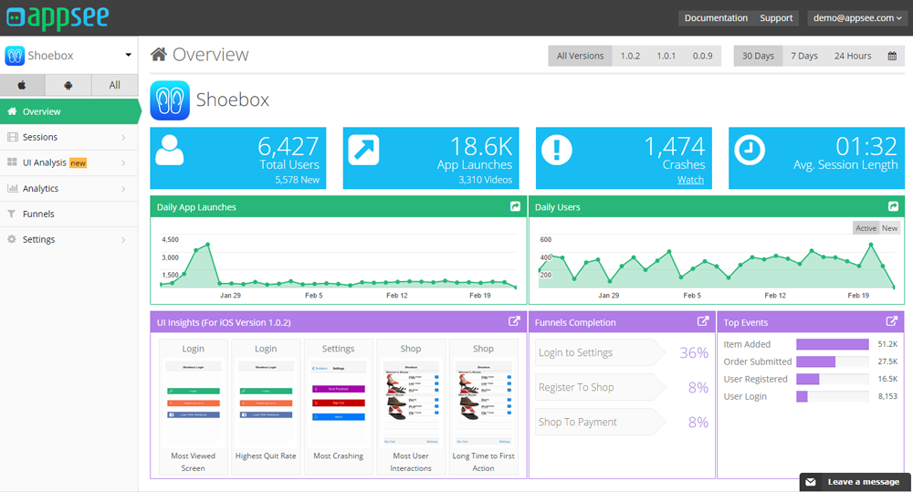

[Source](https://www.appsee.com)

### Appsee Features

> User Recordings
> 
> Touch Heatmaps
> 
> Realtime App Analytics & Alerts
> 
> Conversion Funnels
> 
> Action Cohorts
> 
> Automatic Event Tagging
> 
> Crash Recordings & Symbolication 
> 
> Retention Analytics
> 
> Users Flow
> 
> Navigation Paths
> 
> ANR Analytics
> 
> Offline Tracking

### Appsee Pricing

How much does Appsee cost?

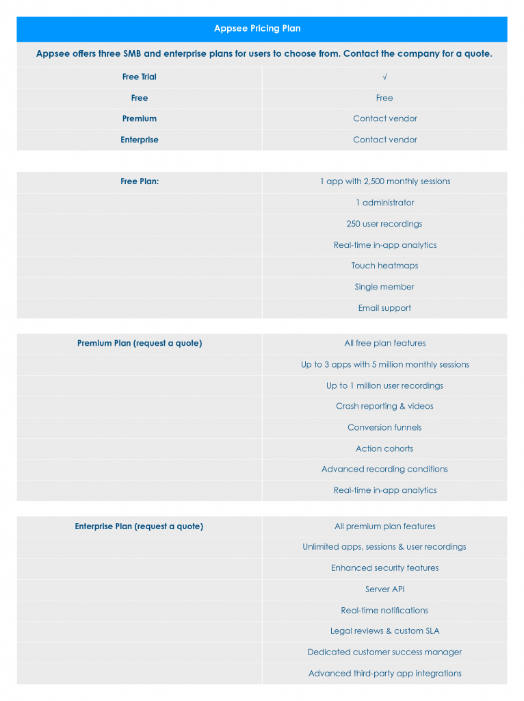

### Appsee Reviews

Appsee has received between 4 and 5-stars on many reviewing platforms. Many reviewers rave about the live video recordings and heatmaps. These allow you to see exactly what users are doing while in your app. One product manager [commented](https://www.capterra.com/p/132817/Appsee-Mobile-Analytics/#reviews), "I, as a product manager, love to have the UI analysis dashboard so I can FINALLY understand what my UX designer is talking about when he says we have an issue with the checkout screen's design."

A reviewer on [G2](https://www.g2.com/products/appsee/reviews) said, "Appsee is a real-time mobile analytics platform helping user’s with a thorough analysis of user’s behaviour. This furnishes a great user experience within your fingers reach." 

Appsee takes your mobile analytics to the next level. It's UI and UX heat maps really allow you to monitor user behaviour. Reviewers have commented on how seeing every tap, swipe and gesture has helped them to create better UI and a better user experience for their users. Many have also commented on how easy it is to create funnels and cohorts.

There are some comments relating to price but this seems to be offset by what you get. Basically, you are paying for what you get here. If these are the types of analytics you need then they are worth the price. A review on price said: "It's not cheap, so unless you take UI and UX analytics very seriously and constantly monitor and change things, then I would say this software is not for you."

You can also check out the product recommendation community Slant for [further reviews](https://www.slant.co/topics/12631/~mobile-analytics-tools).

## 2\. Smartlook

[Smartlook](https://www.smartlook.com/) is another qualitative app analytics tool for your app. It's similar to Appsee in that it records the interaction with your app so you see the users journey through the app. The analytics allow you to improve the user experience of your app in the hope that you can increase revenue and ROI, while decreasing churn and retaining users.

Smartlook isn't all about numbers and graphs. It shows you exactly why users behave the way they do through their always-on visitor recordings and heatmaps. The automatic event tracking and conversion funnels allows you see trends in behaviour.

Smartlook provides you with a full extensive platform. It also integrates with numerous external business apps and services

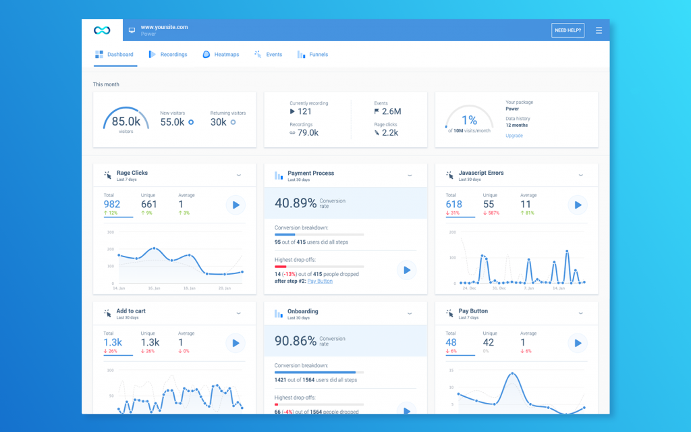

[Source](https://segment.com/integrations/smartlook/)

### Smartlook Features

> Always-on Visitor Recordings
> 
> In-Context Recordings
> 
> Heatmaps
> 
> Automatic Event Tracking
> 
> Conversion Funnels
> 
> Conversion Data
> 
> JP Console
> 
> Filtering & Segmentation
> 
> Integrations
> 
> Multi-Device Compatible
> 
> Collaboration & Sharing
> 
> Event Picker
> 
> Events Data
> 
> Data History

### Smartlook Pricing

How much does Smartlook cost?

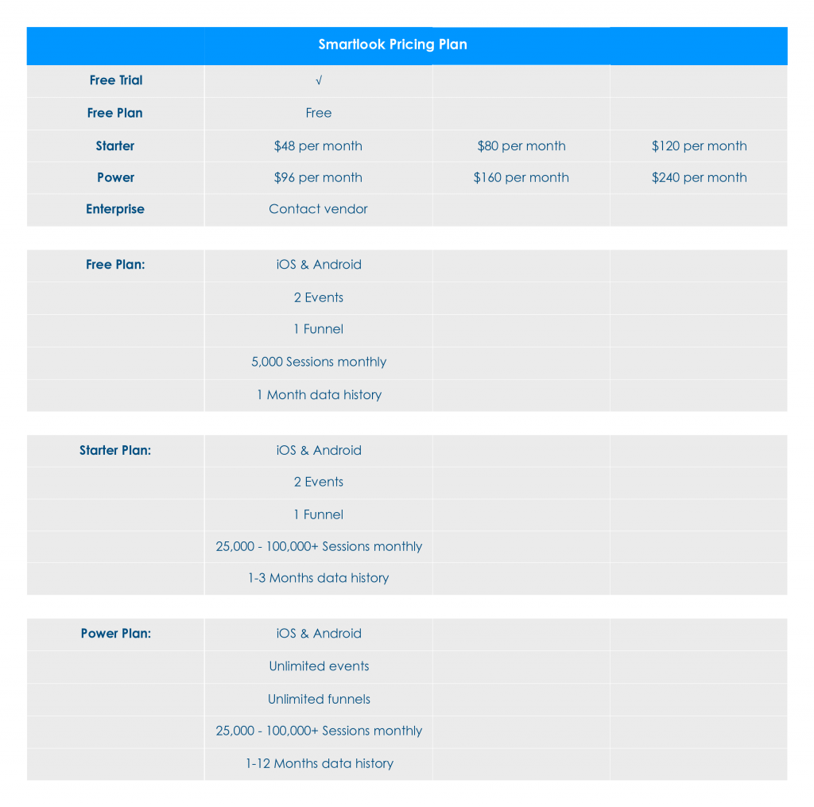

### Smartlook Reviews

Smartlook has received hundreds if not thousands of reviews across different platforms. Many of these are 4.5-stars with users extremely likely to recommend. Smartlook is also used for websites so many of the reviews are related to web also.

Some reviewers have said that this is the best tool they have ever used. Some still use it in conjunction with Google Analytics and others have moved from Mixpanel and are happy with the switch. It has been hailed as the most user\-friendly and best tool to use to monitor user experience.

One [reviewer](https://www.g2.com/products/smartlook/reviews/smartlook-review-2825388) said: "Smartlook session recordings with funnels is the best feature which makes it a much superior platform in the mobile app analytics domain. Its integration with crashlytics makes issue debugging effortless. Session recording feature with intricate details like where user tapped and what component actually responded to the tap. Hiding sensitive data to protect user's privacy also helped us to adopt Smartlook in all of our products. All in all, I found it to be a complete solution for mobile app analytics."

Another comment on Smartlook: "Customer retention was our biggest problem and it was getting very hard for us to determine the issue. We tried adding events, sending logs, talking to our customers but nothing worked. Our company was on the verge of collapse because of our poor customer retention. Smartlook turned out to be a God-send tool for us which not only helped us to fix the issue but also save our company."

There really aren't any bad reviews on Smartlook. For some of the tools price was definitely a bone of contention, but this doesn't seem to be the case for Smartlook. One commenter said: "Price should scale with the amount of users tracked rather than having a fixed price. For a start-up, tracking both website and app for a product is costly."

Most of the analytics tools reviewed in this post set price based on events, whereas Heap Analytics, which you can read about below, charges per user.

Another comment read: "While it does give fantastic insights it can be hard to filter through and mark certain user types. I would like to see improvements into segmenting recordings, name recordings and users with nicknames, create virtual folders and be able to add recordings into them."

On the whole, the reviews have mainly been positive for Smartlook.

## 3\. Mixpanel

[Mixpanel](https://mixpanel.com/) is similar to Smartlook in that it monitors both mobile and web. Their big claim is that they designed and developed their product to enable companies of any size monitor and effectively analyse user behaviour. In effect, it's a tool for companies that aren't heavily funded. It picks up where Google Analytics leaves off.

Mixpanel has designed the user interface to make data analysis more simple and straightforward. Their interface is easy to understand, allowing you to discover how people behave within your app. It's an events-centric platform that tracks billions of event each month. It tracks user interactions on your app and you can watch events as they are sent through their live view allowing you to test what works.

It helps companies see acquisition, activation, retention, revenue and referral in their app. It allows you create funnels and see the performance breakdown of those funnels. It also allows you run sophisticated cohort analyses to see the impact of features within your app.

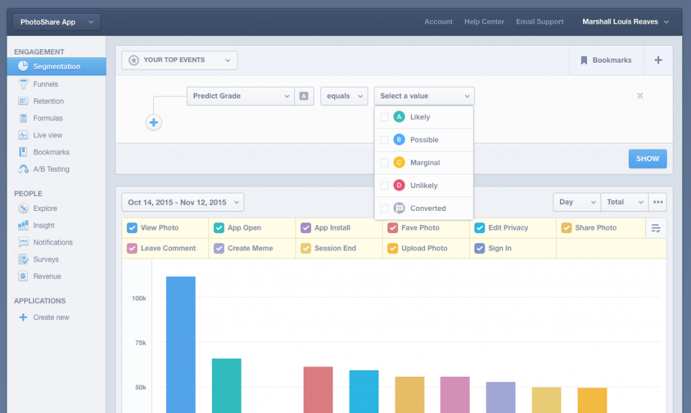

[Source](https://mixpanel.com/blog/2015/11/17/introducing-predict-see-who-will-convert-before-they-do/)

### Mixpanel Features

> Notifications
> 
> A/B Testing
> 
> Bookmarks
> 
> Annotations
> 
> Versatile Data Visualisation
> 
> Point & Click Analytics
> 
> Visual Coding
> 
> iOS & Android Compatibility
> 
> Mobile Surveys
> 
> Autotrack
> 
> Retention Features
> 
> Customer Engagement

### Mixpanel Pricing

How much does Mixpanel cost?

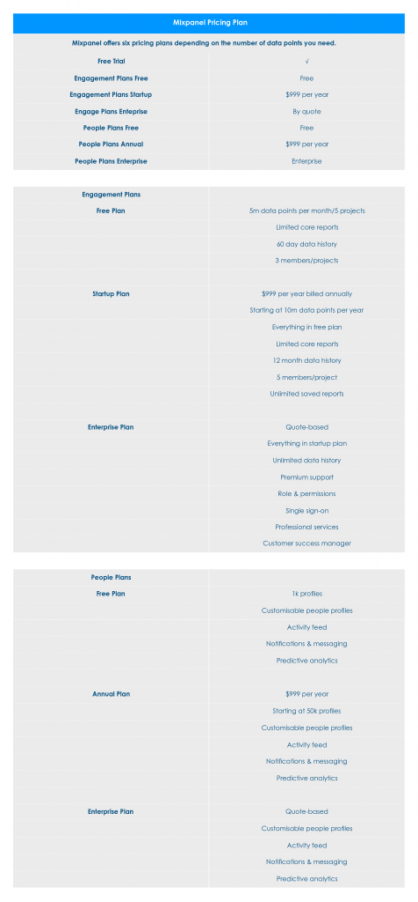

### Mixpanel Reviews

As much as Mixpanel like to say they are for everyone, they are not. They are certainly not for beginners or one-man app owners. Many reviewers have not recommended using Mixpanl unless you are experienced with analytics and know what you are doing. Especially as the smallest price plan is $150 per month and allows for only 500k events.

Instead, wait until you know exactly what your KPIs are and if you do decide to go for Mixpanel make sure you have a data scientist monitoring the data. Although some have commented on the Signal feature, which they use as a guideline instead of employing a full-time data scientist.

Mixpanel has [243 reviews on G2](https://www.g2.com/products/mixpanel/reviews) with mainly 4-stars and many more reviews across other platforms. On the positive side one reviewer said, "I like that I can create any type of funnel and follow it, and also see the performance breakdown of the funnel by different groups, for example, by age or by country. The tool is very suitable for e-commerce platforms."

With another reviewer saying "I would recommend primarily considering it for analysis and optimization, and not relying too much on some of the secondary features."

On the negative side, some have commented on the dashboard not being great and the information being quite complex. You either need to give over a lot of time to learning this platform or hiring a data scientist.

One reviewer said, "Building useful graphs can be challenging and sometimes counter-intuitive. Of course, I could watch all their education videos, but I simply don't have enough time. I think there's a lot that can be done in the "getting started quickly" category. Also, I somehow can not pin a flow-diagram to the dashboard or even save it."

Mixpanel is definitely not an out-of-box solution. That's probably the reason why some have moved to Smartlook from this platform. In saying that, others have moved from Heap Analytics to Mixpanel, so it all comes down to your requirements and in-house capabilities. There's a learning curve with Mixpanel and it may require expert data analysts.

## 4\. Localytics

[Localytics](https://www.localytics.com/) is another app analytics tool that also covers marketing analytics. It provides real-time insights into user behaviour on mobile apps and websites. Localytics real-time app analytics allows you spot trends and correlations. It also allows you see how engagement is working within the app.

The usage metrics such as sessions, session length and average sessions per user give a detailed view of your users sessions within the app. You see all actions within your app and what triggers caused specific actions.

As [Localytics](https://www.localytics.com/features/analytics/) say "our platform's mobile app analytics are designed to surface the insights you need to drive your engagement strategy in the right direction." Localytics is very much focused on app engagement.

Events allow you to track any user interaction within your app, so you see which content users engage with the most.

Localytics also allows you access the raw data allowing you to run custom queries to get deeper analytics insights. You can export this data to an existing CRM, DMP or [partner platforms](https://www.localytics.com/company/partners/) using their API.

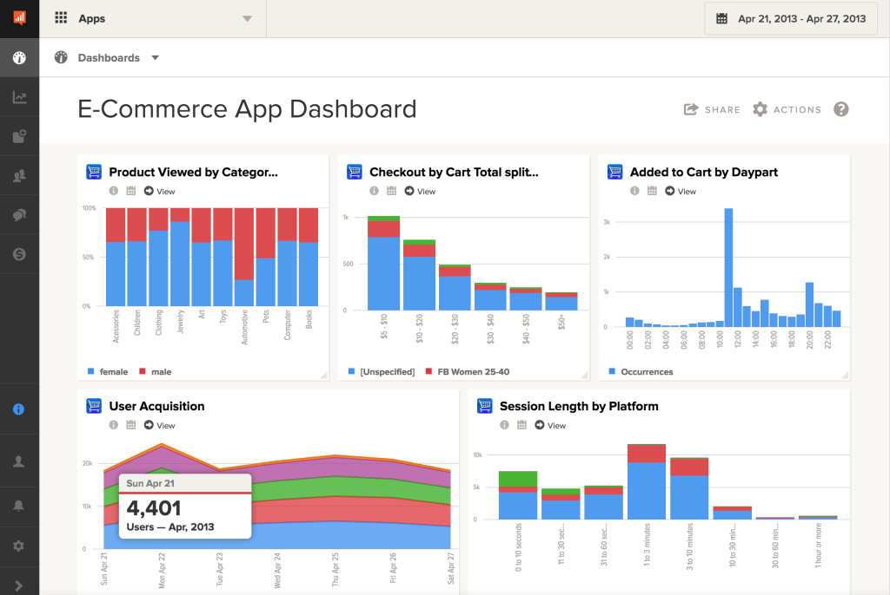

[Source](http://info.localytics.com/blog/new-localytics-feature-custom-dashboards)

### Localytics Features

> Usage
> 
> Engagement
> 
> Events
> 
> Retention
> 
> Funnels
> 
> Flows
> 
> Location
> 
> Segments
> 
> LTV
> 
> Custom Dashboards
> 
> Query Builder
> 
> Exporting Data
> 
> Predictions
> 
> Attribution
> 
> Mobile CRM
> 
> APIs
> 
> Marketing Clouds
> 
> A/B Testing
> 
> True Impact

### Localytics Pricing

How much does Localytics cost?

Localytics pricing is not readily available on their website but according to [Mobile Dev Memo](https://mobiledevmemo.com/localytics/) they have a Free plan. Then their pricing starts at $95 per month per app for their Premium Plan. Their Enterprise Plan starts at $895 per month for all apps. The Enterprise & Marketing Plan starts at $1,790 per month.

### Localytics Reviews

Localytics have received many positive reviews for their usage reports giving app developers and marketers great insight into their app usage. It has also been praised for its acquisition tracking and audience engagement. Localytics has received 4.5 stars on most review platforms including [Capterra](https://www.capterra.com/p/149023/Localytics/) and [G2](https://www.g2.com/products/localytics/reviews).

One reviewer said "Localytics is a fantastic tool for everything ranging from acquisition tracking to engagement cohorts to retention and reactivation. Not only does it function as a great dashboard for all cross-platform user data but also allows for actions on the outcome of this data in the form of campaigns of different kinds (App Push, Email, etc.)

A few reviewers have complained about their pricing structure, so make sure you really look into this to find what's best for your business.

## 5\. Flurry

[Flurry](https://www.flurry.com/) is a FREE app analytics tool that allows you measure and analyse activity across your app. Its aim is to allow developers optimise the experience within their app. You get to view your users experience in real-time and discover information such as session length, frequency, retention, audience persona and demographic.

Flurry allows you get basic insights into your users and the performance of your app within a matter of minutes. You can also set up advanced analysis of complex events to get a deeper understanding of everything your users are doing within your app. Their restricted features version gives you crash reporting and usage tracking without collecting too much personal information.

Flurry is also a marketing tool that allows you track how your ads are performing.

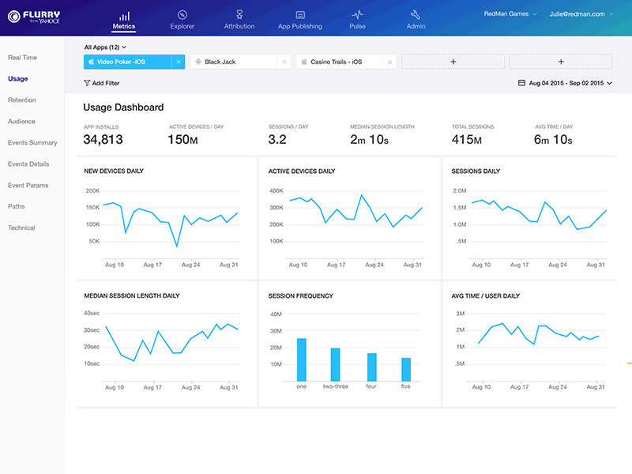

[Source](https://dribbble.com/shots/2569514-The-all-new-Flurry-Analytics-user-experience)

### Flurry Features

> User Identification Demographics
> 
> User Segmentation
> 
> Geolocation
> 
> Crash Reporting
> 
> Custom Event Tracking
> 
> Real-Time Insights
> 
> Attribution
> 
> Dashboard
> 
> User Path Tracking
> 
> User Activity History
> 
> Session Analytics
> 
> Engagement
> 
> Exit Tracing
> 
> Events
> 
> Retention
> 
> Returns
> 
> Conversions
> 
> Funnels

### Flurry Pricing

How much does Flurry cost?

Flurry is FREE! The hope is that you use AppCircle, AppSpot and other products to help grow your business. They charge a fee for all these services.

### Flurry Reviews

There are some negative reviews starting to trickle in since Flurry was taken over by Yahoo but on the whole, the comments are still positive. Flurry was one of the first companies to provide full mobile analytics.

Their crash reporting is a positive feature. One reviewer said "The information on their crash reports is huge. For instance, in Android, you get the number of users that have crashed, the device, the carrier, a Java stack trace, the date and the time, and much more information. Similar for iOS."

The negative comments are that their own interface needs some tweaking and their SKD can be difficult to integrate compared to Google Analytics.

If you are a programmer and need to check the mathematical graphs then this is the best site you can use. Flurry is often compared to Google Analytics, mainly because they are both free, but Flurry is primarily mobile-focused. Whereas Google is web first but also tracks mobiles.

## 6\. Kumulos

[Kumulos](https://www.kumulos.com/) another app analytics tool is a mobile app management platform built for app development companies and software companies. Its features include crash reporting and diagnostics, push notifications, analytics and reporting, App Store optimisation, client portal, agency console and much more.

Kumulos allows you manage the technical and commercial aspects of your app. The crash reporting and diagnostics allows you see how crashes are impacting and retaining your installs. The in-depth analytics allows you analyse user acquisition, audience, engagement, retention and conversion metrics. You can see where installs are coming from and if these are being retained.

Kumulos is a white label platform, meaning your brand will appear at all touch points. Their SDK easily integrates into new or existing projects and gives instant actionable insights.

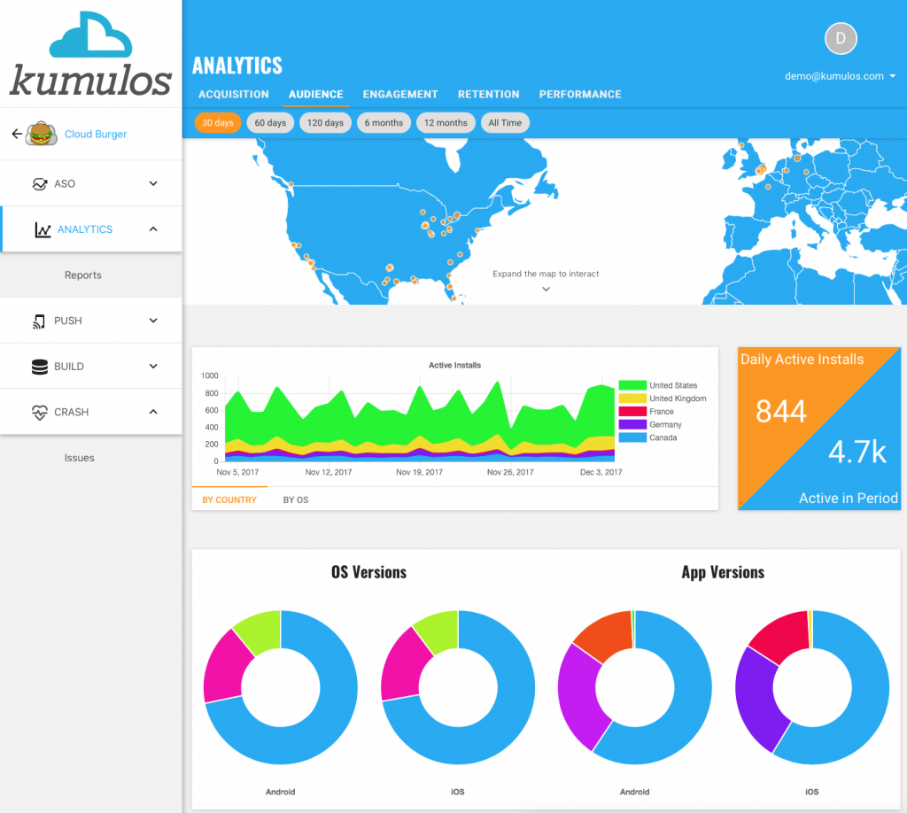

[Source](https://docs.kumulos.com/analytics/overview/)

### Kumulos Features

> A/B Testing
> 
> Channel Attribution
> 
> Cohort Analysis
> 
> Funnel Analysis
> 
> In-app Events Tracking
> 
> Push Notifications
> 
> Retention Tracking

### Kumulos Pricing

How much does Kumulos cost?

### Kumulos Reviews

Kumulos has received mainly 4.5 and 5 stars across many review platforms. On the plus side, it has been noted for its ease of use, great UX/UI, ease of integration into apps and a fully responsive support team.

One reviewer noted, "It's nice to have all the services integrated with only one SDK which saved us a lot of time and money on implementation. Love the fact that it microservices and that we only pay for what we use, and services can also be switched on and off if need be.

On the negative side, there have been complaints about pricing. Pricing is charged on the features you use. Although it starts from only €50 per month you can see this increase rapidly over time.

We recommend trying the free version and being fully clear on the features you require when moving to the paid version.

## 7\. Countly

Countly is an enterprise-grade app analytics tool and marketing platform for mobile, web, desktop and IoT applications with a focus on data liberation and security. Countly is available in two different editions. A self-hosted or private cloud Enterprise Edition with premium plugins and customisable SLA. And Community Edition with basic plugins and a free-to-use non-commercial license.

Countly provides a wide range of features that allows you track events, internal errors, and user actions. Tracking the user's journey in the app allows you improve the user experience. You can set up alerts that send a push notification to your phone or an email. Their detailed dashboard tells you when the alert happened and what triggered it.

They have a comprehensive [plugin architecture](https://count.ly/plugins) and work best when you are able to put code into your app.

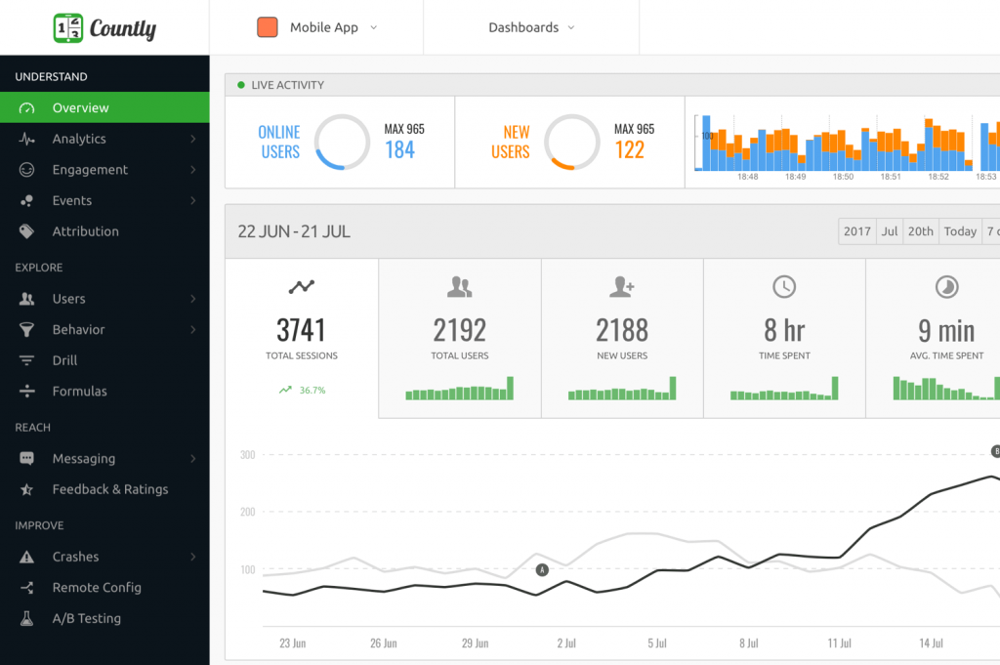

[Source](https://count.ly)

### Countly Features

> Enterprise Analytics
> 
> Crash Reporting
> 
> Rich Push Notifications
> 
> User Profiles
> 
> Referral Analytics
> 
> Funnels
> 
> Drill & Segmentation
> 
> On-premise
> 
> While Label Analytics
> 
> Remote Config
> 
> Dashboards
> 
> Cohorts
> 
> Automated Push
> 
> Heatmaps
> 
> Alerts
> 
> Assistant
> 
> Geo-Locations
> 
> A/B Testing
> 
> In-app Notifications

### Countly Pricing

How much does Countly cost?

### Countly Reviews

Countly has received mainly 5 star reviews are and are highly recommended. You can read some reviews [here](https://www.capterra.ie/software/140992/countly) and [here](https://www.slant.co/topics/12631/~mobile-analytics-tools#5).

One [reviewer](https://www.g2.com/products/countly/reviews) noted, "Countly is recognized for its enterprise mobile analytics and marketing platform. It definitely does best in mobile data analysis, and directly works with customers to increase engagement. Its key function in “user retention” helps understand custom activity in any feature of your application and send that information to the server. It enhances customer satisfaction through its intuitive and well-designed app features. Unique features such as tracking and analysis of in-app activity can improve in-app usability and user experience, thus aggregating retention and increasing in-app revenue."

On the negative side, "Google API is not its best feature. Requires a better configuration view page and customization features are not clear as well as limited control on some demographics."

It has also been noted that its user interface is not the best with one reviewer saying, "Awesome analytic's software with a bad user interface."

## 8\. Adjust

[Adjust](https://www.adjust.com) another app analytics tool provides real-time app analytics to measure and drive performance. Adjust knows too well that bringing users to your app is only the first step. The real success comes from retaining them and converting them. With Adjust you can understand your users and their intent. This allows you to make intelligent marketing and product decisions that boost conversion, retention and lifetime value.

Adjust allows you track events within your app. You can have an unlimited amount of events with Adjust. This is different to some of the other platforms. You can tailor your events to you apps specific goals. These goals can include signups, purchases, uplevels and more.

When you set up your KPIs you can understand cohort behaviour. This allows you to identify trends and changes in the way users engage with your app. With your specific KPIs you can measure user retention, revenue, event conversion and the lifetime value of your users.

The Adjust dashboard allows you aggregate all user data. You can then drill down your analysis with user-level data. Also Adjust is the only provider who offers a holistic way to sync all your data at once in real time — with no limitations or extra costs.

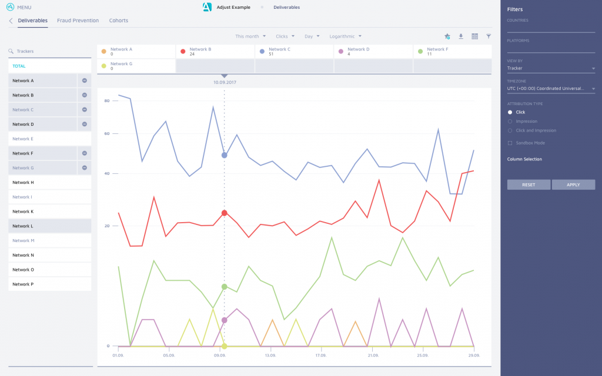

[Source](https://www.adjust.com)

### Adjust Features

> Comprehensive In-App Analytics
> 
> Mobile App Attribution
> 
> Measure Campaigns
> 
> Track every Marketing Channel
> 
> Bring Web & Mobile Marketing Efforts Together
> 
> Real-Time TV Attribution
> 
> Audience Builder
> 
> Create Audience Segments
> 
> Serve Audience The Right Ads
> 
> Mobile Advertising Fraud Prevention
> 
> Anonymous IP Filtering
> 
> Hyper Engagement Filter
> 
> Reject Fake Installs and Traffic
> 
> Block Click Spam
> 
> Customisable Event Tracking
> 
> Adjust Dashboard

### Adjust Pricing

Adjust offers a free trial and then it is a quote-based plan thereafter. Adjust is for SMEs and Enterprise. You can contact the [vendor](https://www.adjust.com) directly for a quote.

### Adjust Reviews

Adjust is a bit of a mixed bag when it comes to reviews. They don't have as many of them as other platforms. In saying that, they've still received 4.5 and 5 stars across reviewing platforms.

As Adjust is a marketing analytics platform many of the reviews are in relation to this.

The price also seems to be a contradiction, but again this comes down to your requirements, internal budgets and level of skill in-house.

On the positive side, one reviewer said, "You get powerful measurements that all mobile app marketers need, such as how your customers install your app and from which source. It's very user-friendly and also very powerful in that you can implement all your requirements."

On the negative side, some have complained about the price. This tool isn't for freelancers or personally owned apps. It's aimed at businesses who have a budget to spend. Also if you're used to website tracking with many custom reports and views, Adjust seems a bit limited and doesn't offer a lot of flexibility.

On the opposite of this, another [reviewer](https://www.g2.com/products/adjust/reviews#survey-response-1945458) noted, "If you're looking for a basic, affordable product that gets the job done then go with Adjust. If you're quite tech-savvy and looking to make updates/changes frequently and on the fly then this product might not be for you."

## 9\. App Dynamics

[App Dynamics](https://www.appdynamics.com) is an application performance monitoring tool. It allows you to dive deep to monitor your end user. You can also measure and track specific business performance goals and have complete infrastructure visibility.

App Dynamics was named an industry leader in Gartner's 2018 Magic Quadrant for Application Performance Monitoring Suites. They've won this award for six years in a row.

AppDynamics was acquired by Cisco in 2017 with the aim of making it the best in-app monitoring tool on the market.

App Dynamics is an app analytics tools focused on delivering business-focused analytics. It's ease of use and insightful dashboard provides users with the right information to make informed decisions. It seamlessly integrates with a variety of systems and apps.

App Dynamics allows you customise your own dashboard. This powerful feature allows you group together your monitoring metrics in one central dashboard.

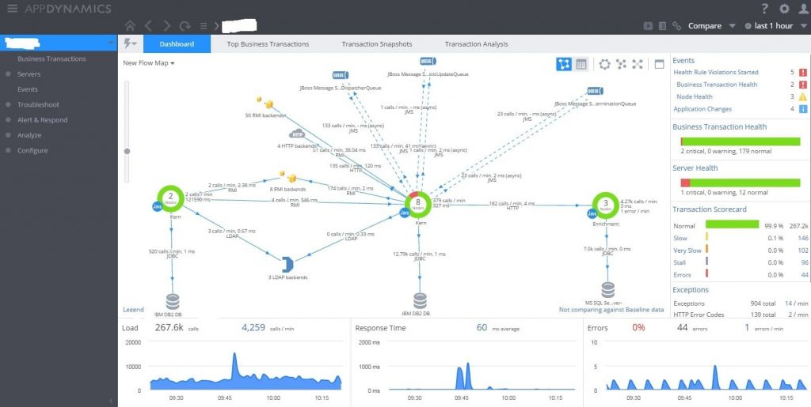

### App Dynamics Features

> Code Level Visibility
> 
> Dynamic Baselining & Powerful Alerting
> 
> Visibility & Control
> 
> Application Performance Management Agents
> 
> Data Retention
> 
> Monitor Multiple Platforms
> 
> Troubleshoot Performance issues in production
> 
> Trend Database Performance over time
> 
> Continuously Monitor in High-Volume Enviornment
> 
> Install & Use Immediately
> 
> Database Agents
> 
> Server Visibility
> 
> Synthetic Monitoring
> 
> Mobile Real-User Monitoring
> 
> Browser Real-User Monitoring

### App Dynamics Pricing

App Dynamics offers a free trial period and then a Lite Plan which is free. For the Pro Plan you need to go direct to the [vendor](https://www.appdynamics.com) for a quote.

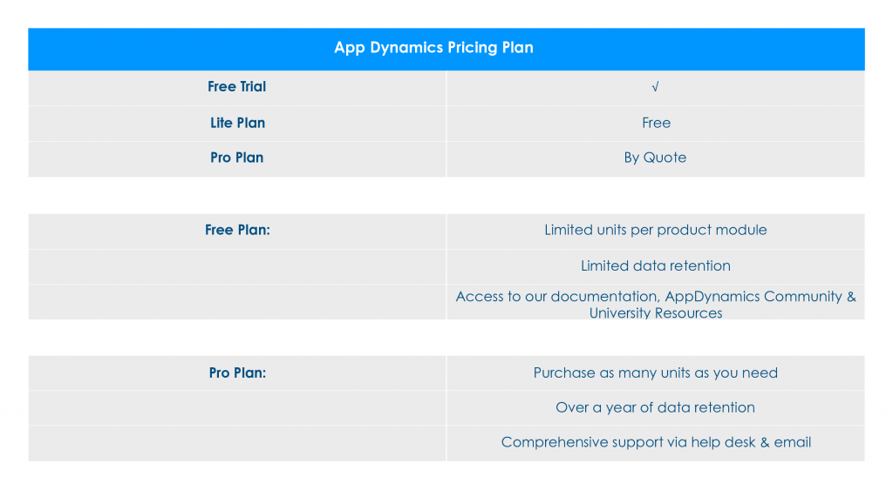

### App Dynamics Reviews

App Dynamics have received a lot of positive reviews with many giving 5 stars. On [Gartner](https://www.gartner.com/reviews/market/application-performance-monitoring/vendor/appdynamics/product/appdynamics-pro) they have received 351 reviews alone. Some of these reviews go into great detail. They've 231 reviews on [G2](https://www.g2.com/products/appdynamics/reviews#reviews) ranging between 4 and 5 stars. Many have rated it the best APM tool on the market.

One reviewer said, "It has changed the way we do monitoring, shrunk our MTTR, and is literally making IT fun again".

The pros include autodiscovery of application topology based on real user traffic, baselining of all metrics, easy to use API and customizable extensions. There's great SaaS support including performance and uptime. There's also a great support team in place.

On the downside, the biggest con so to speak is the learning curve required to understand this platform. Many have also commented on the price. It seems to be pricier than its competitors. It's definitely not a tool for small to medium-sized businesses.

It's aimed mainly at enterprise level who are managing multiple integrated apps. [PC Mag UK](https://uk.pcmag.com/cloud-services/72232/appdynamics) has noted, as have others, that even at enterprise level it can get very pricey when stacking up product units.

## 10\. Heap Analytics

Heap app analytics tool captures all user interactions within your app. They capture everything from clicks, taps, swipes, form submissions and many more. This analytics tool is aimed at medium to enterprise-level and there's no need for IT integration. It's an out of the box tool. It's simple point and click interface allows you tag your mobile app without knowing any code.

Heap Analytics is often compared to Google Analytics or even Mixpanel. The differences with Heap Analytics and Google Analytics (which is free) is that Heap tracks events automatically. So Heap tracks every touch, tap, swipe and any other gesture event automatically. Google Analytics only tracks page views automatically. You can track other events with it but it requires custom instrumentation.

Heap Analytics is purposefully built for modern apps with a focus on user experience, conversion, retention and lifetime value. It's behavioural cohorting features, multi-touch attribution, event-based conversion funnels and segmentation analysis provides a powerful insight into user behaviours.

Its simple point and click interface allows you to tag your mobile app without knowing any code. You can set-up tags, run conversion funnels and do segmentation analysis immediately.

With Heap Analytics everything is done for you. Unlike Google Analytics, where every action requires complex custom development.

Heap Analytics provides comprehensive [docs and guides](https://docs.heap.io/docs) to support you while using Heap.

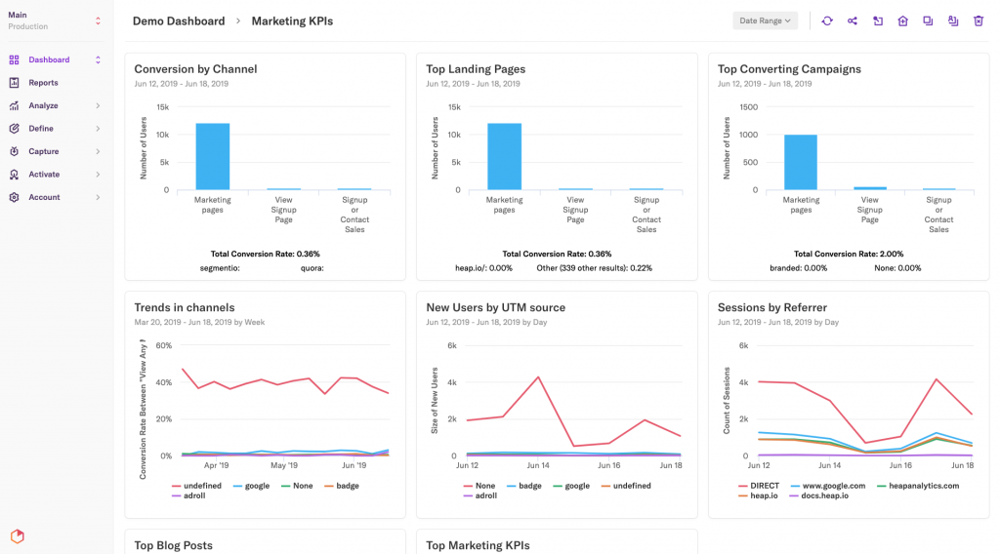

### Heap Analytics Features

> Data Capture
> 
> Event Visualiizer
> 
> Users
> 
> Graphs
> 
> Funnels
> 
> SQL

### Heap Analytics Pricing

How much does Heap Analytics cost?

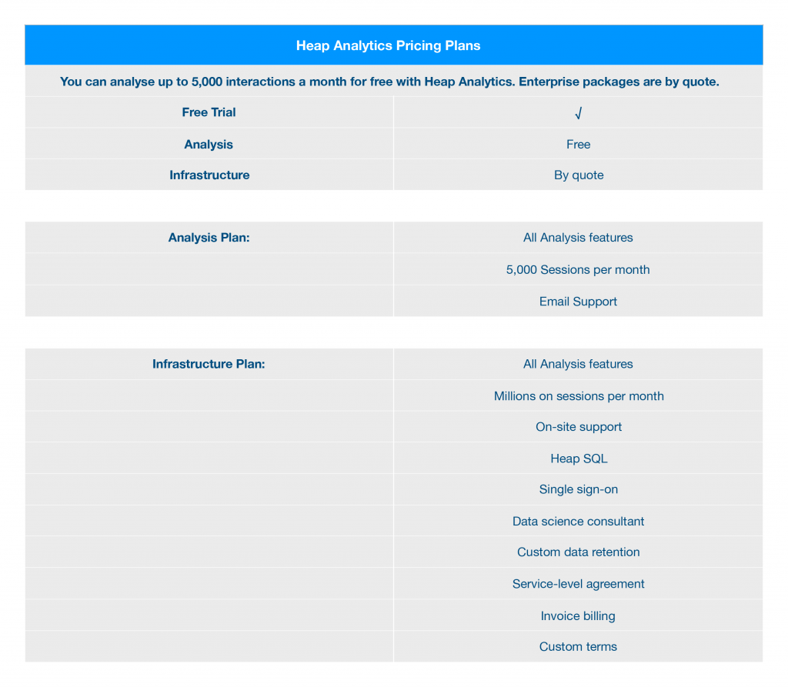

### Heap Analytics Reviews

Heap Analytics has received 335 reviews on [G2](https://www.g2.com/products/heap/reviews#reviews) with many of them being 5-stars. This is similar across all other reviewing platforms. Many of the reviews compare it to Google Analytics and for those that can afford the pricing packages and make the move are very pleased they did. There's no comparison in the information captured, particularly as Heaps analytics provides much more meaningful data.

On the positive side, many reviewers have commented on the ease and immediacy of setting up the click tracking. Also, how you can make well-informed decisions based on insightful user data. Heap Analytics doesn't charge you per event. This is different to many other analytics platforms.

Heap's prices are based on the number of visitors you have. So users can do as many activities as they like within your app without you being charged for analysing every single one.

On the negative side, reading the data and setting up reports is a learning curve. And even though the set up is simple, it takes a long time.

Unlike other high price paying tools, there aren't many comments in relation to price being an issue for Heap Analytics. Probably because many of the companies using Heap are familiar with such data reporting tools, and are well aware of the costs associated with data-driven software.

## Conclusion

So which in-app analytics tool is best for your app?

We recommend deciding based on your goals for your app then putting this against the features, pricing and reviews of each platform. Some analytics tools are better than others, some are free while other incur a hefty price. It all comes down to your requirements, budget and in-house capabilities.

We've only scratched the surface with what we've included here. To give you an indication of the choice you have here are some other in-app analytics tools for you to consider.

[UXCam](https://uxcam.com)

[Leanplum](https://www.leanplum.com/)

[GameAnalytics](https://gameanalytics.com/)

[Swrve](https://www.swrve.com/)

[Apptimize](https://apptimize.com/)

[Taplytics](https://taplytics.com/)

[Apptentitive](https://www.apptentive.com/)

[Braze](https://www.braze.com)

[MoEngage](https://www.moengage.com)

[Firebase](https://firebase.google.com)
