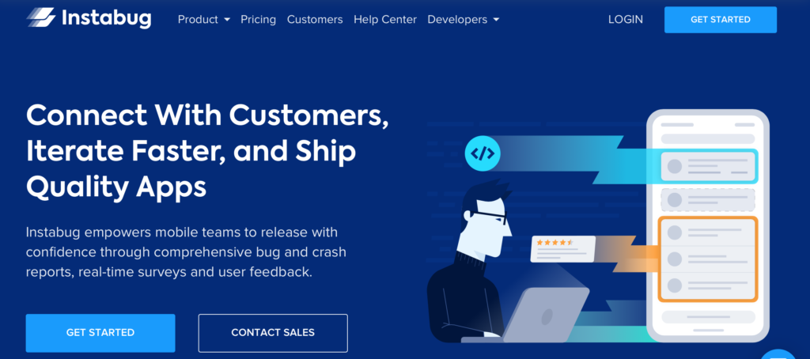
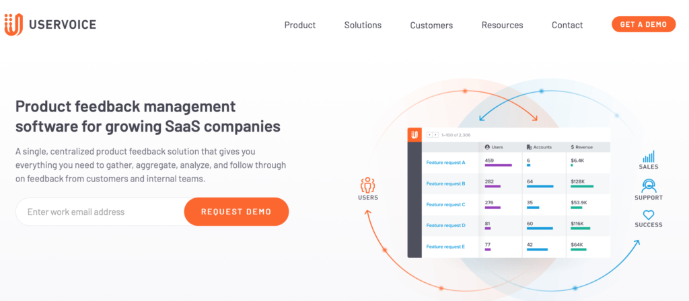

In-app feedback is a great way of capturing users’ paint points within your app, along with their overall thoughts, ideas and specific requests for improvement. In-app feedback tools capture this data in real-time, making it an ideal way to interact with users. These tools give insight into how you can improve the usability of your app. They can also be the start of deep-dive discussions with users to help get a detailed understanding of your app from a users point of view.

Here are some of the top tools for 2020.

### **Instabug**

[Instabug](https://instabug.com)

[Instabug](https://instabug.com/) is a mobile in-app feedback tool as well as a bug detection tool. You can use this tool if your app is in beta or in production. Instabug makes it easy for users to send feedback right from inside your app, and you’ll receive more and better quality comments. You can send custom surveys with different questions and answer types or use pre-built templates like NPS and App Rating to measure user loyalty and satisfaction. You can also target the survey to the right users at the right time.

The tool allows you to analyse the feedback you receive so you can make data-driven decisions. You can then prioritise fixes based on user feedback. It also allows you to speak with unhappy users in a private conversation and identify happy users so you can ask them for a review. Its features include screenshot annotations, voice notes, screen recording, user profiles, network logging and third-party integrations.

Instabug is used by the likes of PayPal, BuzzFeed, Asana, Samsung, NextDoor, OnePlue and Sound Cloud. It’s a great tool to allow users and beta testers notify you of bugs in your app.

Pricing starts at $124 per month for the basic package and you can try for free. The Pro package starts at $208 per month and you can also try for free. You need to contact the company directly for their Enterprise level package.

### **UserVoice**

[UserVoice](https://www.uservoice.com)

[UserVoice](https://www.uservoice.com/) is a centralised product feedback solution that allows you to gather, aggregate, analyse, and follow through on feedback from users of your mobile app. Customers use UserVoice for product launches, beta testing, building a customer-centric strategy and collecting internal feedback. By using UserVoice for product launches it allows you to ensure the success of new features or release and create a process to capture feedback and data from the start. You can also capture feedback in beta testing and quickly iterate before your product goes live.

UserVoice has a process of Collect, Contextualise and Communicate. It allows you to effortlessly collect user feedback. Its in-app feedback widget and API allows you to capture feedback without interrupting users. Users can share this feedback from within the mobile app. You can keep customers up to date as their feedback moves through the product development process. You can also notify users when something they’ve asked for is in progress, in beta, or has been launched. Other features include gauging users’ excitement about what you’re working on and predict future adoption, as well as connecting with the supporters of an idea to uncover the underlying problems and recruit beta users with ease.

UserVoice is popular with Slack, Salesforce, Marketo, Hubspot, Zendesk, Azure DevOps and Microsoft Dynamics 365.

You need to contact the company directly for pricing.

### Mopinion

[Mopinion](https://mopinion.com/)

Mopinion is an 'all-in-one user feedback software for digital channels'. With Mopinion you can fully understand why users do what they do by collecting feedback from your native apps with their flexible and easy-to-install SDKs for iOS and Android. This feedback allows for better decision making and an informed digital strategy.

Mopinion allows you to capture feedback in real-time with their intuitive feedback forms and advanced triggering rules. These customisable feedback forms can be triggered based on rules such as mouse movement, time on page, exit intent and much more. Their comprehensive visualization and analysis of open text and scores allow you to explore the story behind your feedback data. The comprehensive visualisation is in customisable dashboards. You can discuss feedback with your team, assign automated exports, create reports and enable proactive communication.

Mopinion is used by companies such as Walmart, Hotels.com, Siemens, Ahold, Mediacorp Ltd and many more.

They have a number of pricing packages to suit many budgets. Under their Free & Small bundle, they have a free plan, a basic plan from €29 per month, and a starter plan from €79 per month. On their Business & Growth bundle, they have a Growth plan that starts at €199 per month, a Turbo Growth plan that starts at €499 per month, and for enterprise clients, you need to contact them directly for a tailored plan and pricing.

Maria Colgan

Digital Marketing Manager
