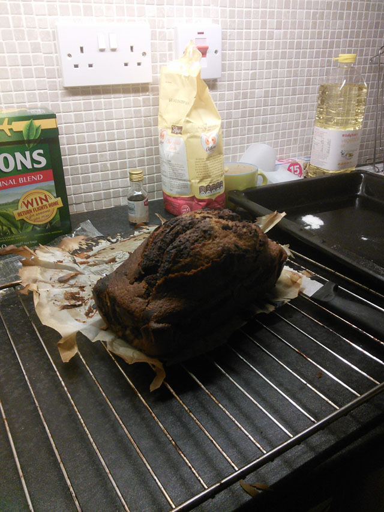
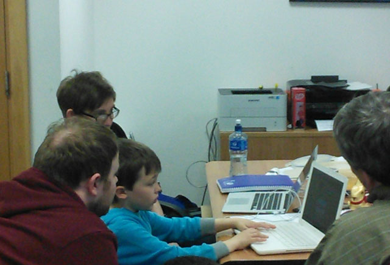

Having gone home for the long weekend, this week seems to have gone by very quickly. We're quite busy here at the moment at Tapadoo HQ, but this was probably one of my more productive weeks of work. Now that I've got a grip on the (very) basics of iOS, I find myself looking up StackOverflow less frequently (although still very frequently!), and I'm getting more familiar with iOS APIs and how apps are structured.

When we first arrived at Tapadoo, we were mainly fixing bugs and making small changes here and there to features that had already been implemented but needed some final tweaks before release. Now we are working on an app that is younger in it's development stage, and so needs full features to be implemented. This was a little daunting at first, but I think I've learned a great deal by just getting stuck in and focusing on one task at time.

Last week was my turn to bake a cake. Having never baked a cake before, I started Youtubing some recipes for low-risk cakes and settled upon marble cake - which in hindsight was probably a bit ambitious! Seeing as myself and Kevin barely have an oven in our new place, I pretty much had to get every ingredient/tool on Saturday. The plan was to buy ingredients on Saturday, buy anything I forgot to buy on Sunday and have a dry run Sunday evening. I would then repeat the process Tuesday evening so my cake would be ready for "cake-day" Wednesday morning.

The "Cake"

However, the dry run took so much time and ingredients that I made the classic software mistake of turning the prototype into the product and just bringing my cake in on Monday morning instead! At first the team were a little confused, but it's hard to complain about a cake being in the office too early! The "cake" was a little burnt on top, and extremely dry - like, I can't emphasise enough how dry it was, but for a first attempt, wasn't too bad! In my defence though the Youtube lady in the recipe's video said it would be dry if you didn't whip the eggs well, and we didn't have an electric mixer so I had to whip them with a fork for like 20 minutes! Having said that she also listed "love" as one of the ingredients so you should take what she says with a pinch of salt (bam! cooking pun).

Kevin made a lovely Banoffee pie for his cake day this week which went down really well with the team so congrats to him for that!

We also had a visitor this week at Tapadoo HQ - Niall Kehoe,  a 10 year old game developer and future Notch in the making. He was having some trouble getting his Space Invaders game into the app store which Tapadoo were more than happy to lend a hand with. His game is currently waiting for approval from Apple and will be available to download soon!

Niall and the team working hard - picture taken by Kevin

[Úll](http://2014.ull.ie/ "Úll") is fast approaching, and the team will be making it's way down to Kilkenny on Monday for the conference. Having never been to a conference like this before, I'm not really sure what to expect, but I'm really looking forward to it. The speakers sound very interesting!

That's everything from this week at Tapadoo, tune in next week for an update from Kevin on the events of Úll!
