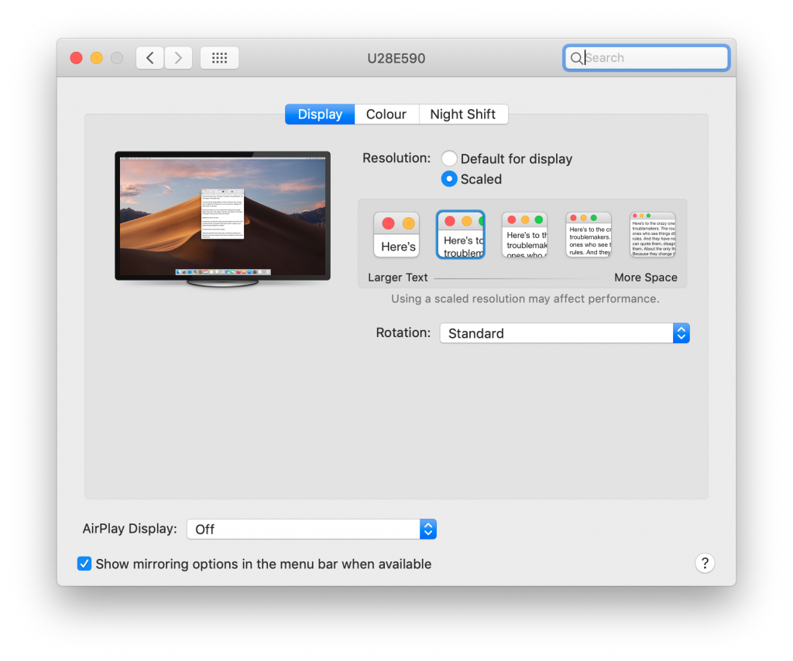
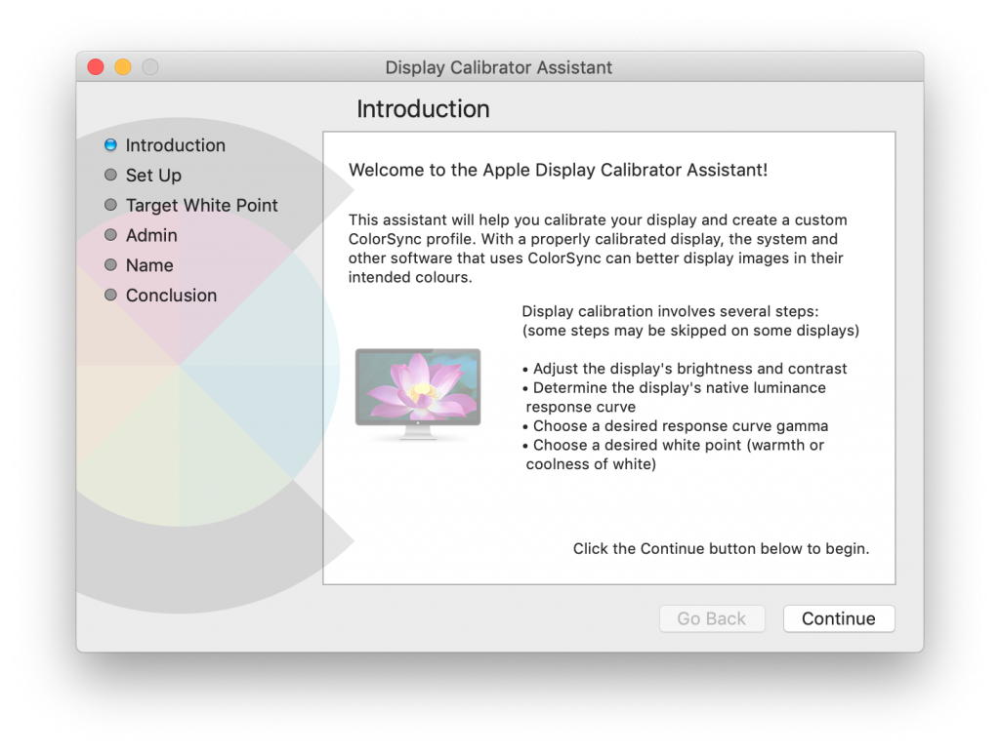
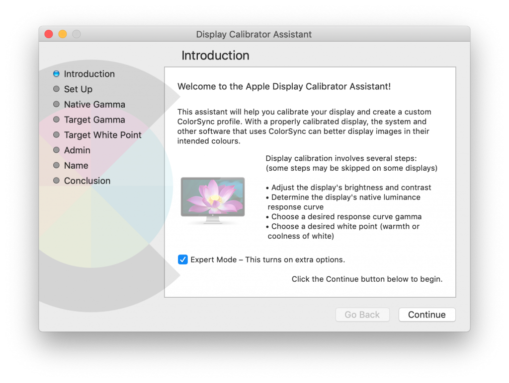
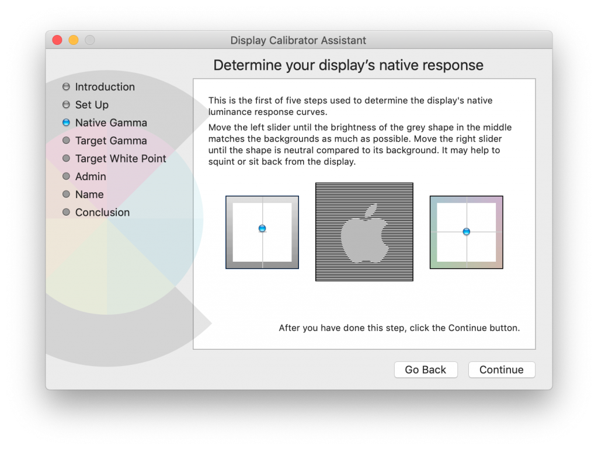
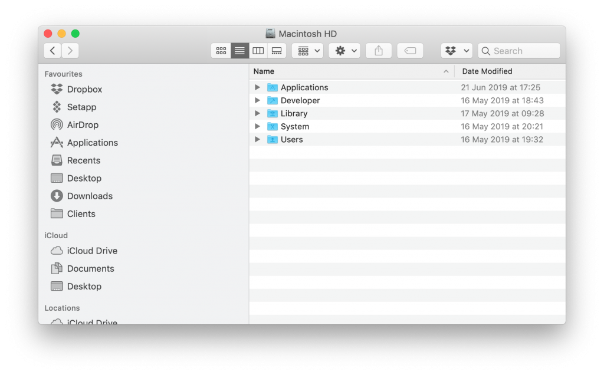

As 4K monitors go, Samsung's [U28E590D](https://www.samsung.com/us/computing/monitors/uhd-and-wqhd/samsung-uhd-28-monitor-with-high-glossy-black-finish-lu28e590ds-za/) is pretty good value. Due to a recent change in my laptop (I've moved from a MacBook Pro to the new MacBook Air), I had to swap out my trusty (and old!) Apple Cinema Display, so I chose the Samsung 4K device.

Out of the box, I really didn't like it. The colours were off, the contrast was bad, and overall, the experience felt too bright and washed out.

Tom's Hardware has a [short article](https://www.tomshardware.com/reviews/samsung-u28d590d-4k-ultra-hd-monitor,4033-3.html) on calibration of the slightly earlier model (U28D590D), which I followed, but I still wasn't happy.

After a bit of digging, I found that Apple's Display Calibrator Assistant has an advanced mode, and after following it, I'm much happier with the results.

To start, follow the advice on the Tom's Hardware article cited above to get close to optimal brightness and contrast, then follow the instructions below to full calibration.

1. Launch Displays Preferences. This is obtained from the Apple Menu..System Preferences..Displays.
2. You should see the following on your Samsung Display

3\. Next, click on the colour tab, where you'll be presented with a set of display profiles. Here's where we're going to build a _better_ one. Don't press "Calibrate". Instead, hold down the option key, and then press "Calibrate". This will open the Apple Display Calibrator Assistant in "Advanced Mode". See the images below for the difference between normal mode and advanced mode

Display Calibrator Assistant in Normal Mode

Display Calibrator Assistant in "Advanced Mode"

Now, it's a matter of following the instructions on screen. Pay particular attention to the screens where you set up Native Gamma.

Sit back, squint and get your native gamma correct

To get this right, it's best to sit back slightly from your screen and squint at your screen (really!). In my experience, and had to drop the left hand control quite significantly to make the Apple blend. I didn't need to alter the right hand control, as it really changed the greys into more of a coloured hue.

You'll be taken through this process a couple of times, where the calibration is getting more sensitive.

In my experience, choosing the target gamma was simply a matter of accepting the one offered by the system, as was choosing the white point.

Once completed, apply the calibration and everything should be better now!

Other tips:

1. **Get your contrast right**. This monitor tends to be quite bright, and can wash out pale colours. Setting the contrast right will help here. When setting your contrast, open up the Finder. It has alternating grey and white lines. Changing contrast such that they are both obvious to you can really help here

Use the alternating grey and white shading to help find the correct contrast.

2\. **Choose the right cable**. My MacBook Air uses a [Satechi USB C 8 in 1 Hub](https://satechi.net/collections/usb-type-c/products/type-c-multi-port-adapter-with-ethernet-v2). When I connected to the monitor via HDMI, it would only provide a 30Hz refresh rate. Scrolling was a little laggy and jumpy. So, instead for the monitor connection, I'm using a [USBC to Display-port cable](https://www.amazon.co.uk/gp/product/B075Q5T6JT/ref=ppx_yo_dt_b_asin_title_o00_s00?ie=UTF8&psc=1), which gives me 60Hz refresh rate.

3\. **Calibrate from your everyday usage position**. When doing your calibration sit where you will be sitting when using the monitor. As we calibrated in the office, we found very different results from people who were viewing from another angle. People who were standing had a very different opinion on the quality of the calibration than those sitting directly in front of the monitor. The monitor backlights seem to vary top to bottom on the unit, so try to optimise for how you are going to use it every day.

If you don't want to do to all the trouble, you can download ours. To use it, download it, unzip it and drop it in ~/Library/ColorSync/Profiles. Open the display settings, navigate to the color tab and it should show up in the list of profiles. Simply chose it to apply this profile.

Of course, this is a subjective concept so your mileage may vary.

[U28E590-Calibrated-Tapadoo.icc\_](https://tapadoo.wpengine.com/wp-content/uploads/2019/06/U28E590-Calibrated-Tapadoo.icc_.zip)[Download](https://tapadoo.wpengine.com/wp-content/uploads/2019/06/U28E590-Calibrated-Tapadoo.icc_.zip)
