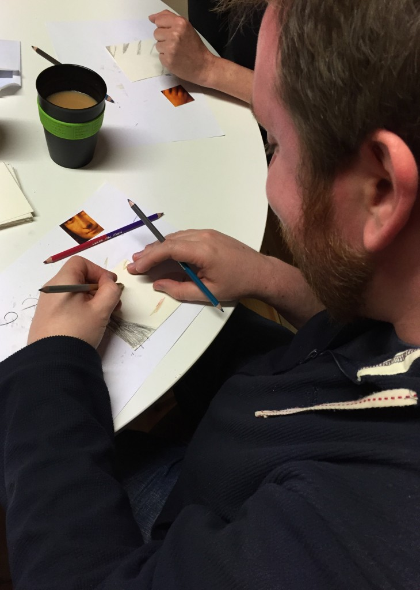
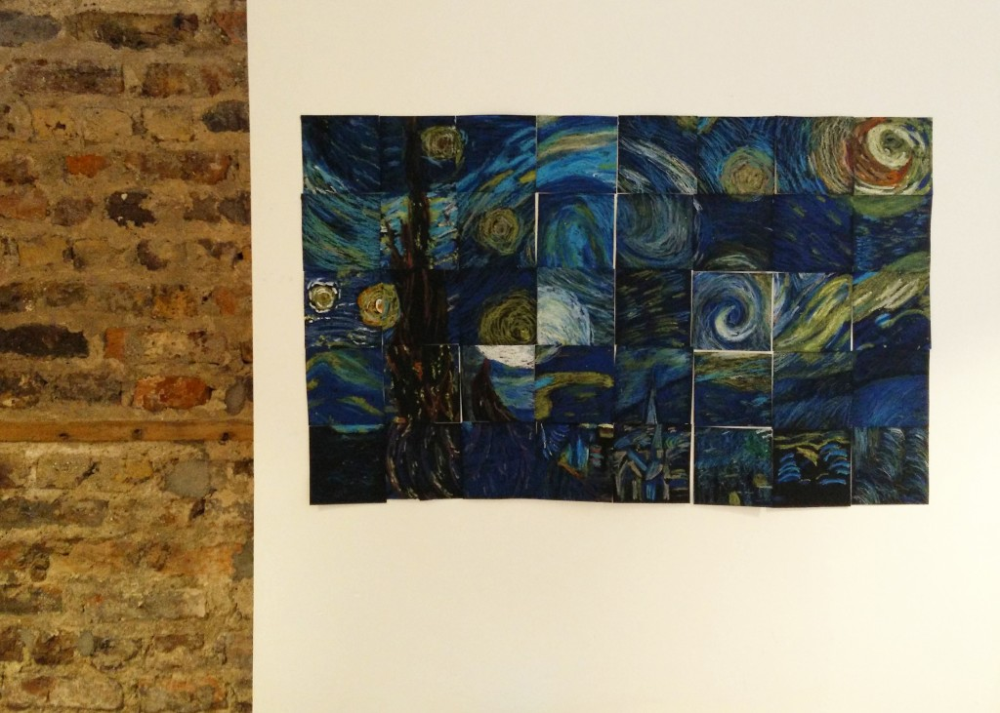

Last month we got our brains thinking in different ways by making [faces out of type](https://tapadoo.wpengine.com/2015/type-faces/). For our second Creative Morning, I decided to make things a little easier. All the team had to do was recreate Leonardo da Vinci's Mona Lisa and Vincent van Gogh's The Starry Night. Simple?

Now, knowing my workmates, had I told them in advance that they would have to replicate a masterpiece, I'm sure I would have been met with comments like "I can't draw a straight line". But in true [Meecasso](https://twitter.com/meecasso) nature I told them nothing but the name of the workshop (Picture Imperfect) in advance. I know how uncomfortable some people can feel about drawing, so I broke this task down into bitesize steps.

First I cut both paintings up (this was an A3 colour copy, not the originals!) into 4cm x 4cm pieces. These pieces were mixed up and placed face down. Each ‘artist’ would chose a square at random and then attempt to recreate this on a larger piece of paper. The Tapadoo version of The Starry Night was completed using oil pastels while the Mona Lisa got the coloured pencils treatment. There were only a limited number of colours available which meant the team had be creative to blend or interpret colours.

\[gallery type="slideshow" ids="1606,1607,1608,1609,1610,1611,1612,1614,1617"\]

As each square was being recreated on a larger square, our artists had to focus on placement and scale. Breaking the image down into smaller pieces allowed the participants to focus on what they had in front of them. They didn't have to worry about whether a face was in proportion, or if the fingers looked weird - it was all just shapes on a square.

For the most part this was not too intimidating but there is an exception to every rule! One team member would have to recreate the most famous smile in art. [Jason](https://twitter.com/JasonConnery) was that ‘lucky’ person and although he wasn't too happy, we had a good laugh about it!

_Jason Draws the Short Straw_

The last step was a great team-building exercise. The groups would work together to assemble the final painting jigsaw puzzle. At first this might seem quite straight forward but many of the pieces were very similar and only had slight differences. This forced the team to look at each square and see how the lines, colours and shapes flow from one piece to the next. There was some fierce debate as to where and why people thought a certain piece went in that place. However, in the end, assembling the final artworks was a really satisfying moment.

Looking at both pieces, we can see how people interpret things differently but despite having eleven different sets of hands involved, there is a sense of consistency. The expectation wasn't to make _picture perfect_ replicas, the goal was to show that breaking a sizeable project into manageable chunks, really works.

_The Mona Lisa by Tapadoo_

The results are now “hanging” up in the Tapadoo studio. They look great, we had fun doing it, and it was a fantastic way to kickstart our week. Oh, and it was also cake day! FTW.

_The Starry Night by Tapadoo_
