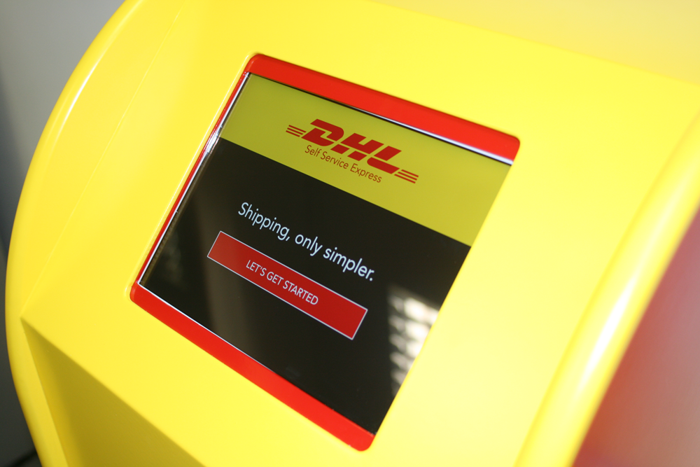

We love a challenge at Tapadoo. Recently we were approached by the good people at DHL. They explained that they have drop-in facilities where people come to send packages worldwide.

The drop-in facilities rely heavily on paper forms, and with this, some transcribing problems. They knew there was a better way and asked if we could do and app for a kiosk.

> gulp

Well, we do apps. So we partnered with Shinnay, the good people who already refurbished our office to have a custom cabinet manufactured to our specifications.

We're delighted with the end result and DHL are too. It now has pride-of-place in their Pearse Street drop in center 
