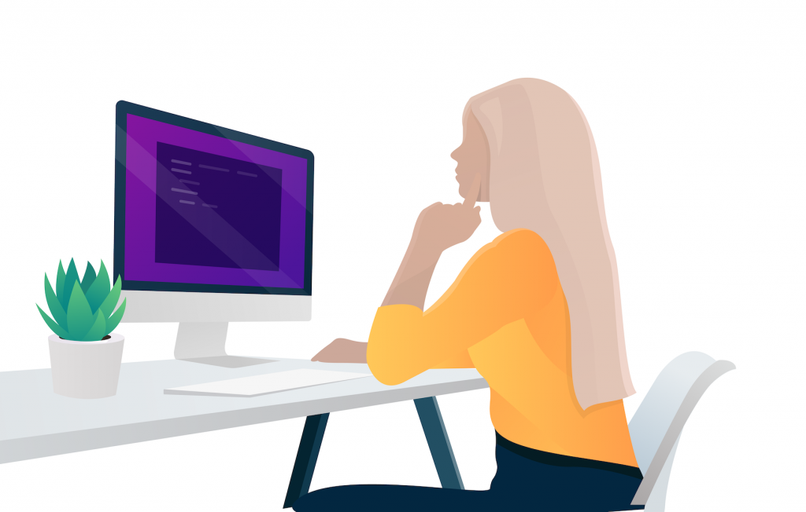

We don’t like to burst any bubbles here in Tapadoo, but at the same time, we get a lot of enquiries from people who have an ‘app idea’.

As exciting as this may seem….we need to be clear with you about what’s involved in developing an app. This isn’t to put you off your idea, it’s to educate you on exactly what's involved in bringing that idea to life.

An app is like owning a business. The same effort goes into owning an app as it does owning a business. If you aren’t prepared to treat your app like starting a business then maybe pursuing this idea is not for you.

However, if you are still keen and believe your idea is worth pursuing then read on.

### **I’ve got an app idea, what’s next?**

Let’s look at how we develop apps, and really, how most development companies develop apps. We break app development into three phases; design, development and ongoing maintenance and support. 

We’ll start with this because when we get a phone call this is the first thing people want to know. Well, actually, that’s not entirely true. The first thing they want to know is ‘how much an app will cost?’, but I’ll tackle that one in a moment.

## **App Development**

### Phase 1 - Design

Phase 1 of our app development process is what we call our discovery phase. It’s during this phase that we really get to understand what your app idea is. We begin this phase with a half-day workshop where we bring you and anyone else involved in your business in for a deep dive session.

We have a lot of experience with developing apps, so we generally have a very good idea of what will work and won’t work within your app.

The objective of this workshop is to establish the features within your app. Remember we mentioned costs earlier? Costs are dependent on the features of your app.

You obviously want your app to be successful, so do we. We are not in the business of building apps just for the sake of it. We build apps we believe have potential. So during this workshop, we often play devil's advocate. This isn’t to make you feel uncomfortable. It’s because we are trying to draw out the best ideas and turn these into the right features for your end-user.

#### User-centred Approach

We take a user-centred approach when developing apps. This means that we focus on the end-user. The features within your app should only be what they want. Not what you want, or even what you think should be in it. Yes, you will come with a rough idea, but you’ll see very early on how your idea of what should be in the app and what an end-user will find useful can be very different.

Our lead UX designer wrote a great [blog post](https://tapadoo.wpengine.com/focused-engagement-through-ux-design-strategy/) explaining this scenario. She said that generally an ‘app idea’ is born out a real need, but somewhere along the lines, this need gets diluted. Suddenly you have an app that was about to solve one problem is now trying to solve a multitude of problems. In other words, your app is now ‘everything but the kitchen sink’.

She gives the analogy of a babysitting app.

Imagine viewing a parenting app. It has every type of information you need on parenting from feeding, sleeping, play, tonnes of in-app purchases and also babysitting thrown in on top. These apps are normally heavily funded by one of the bigger companies who are using it as a branding exercise. 

Then you have another app that focuses purely on babysitting. It vets each babysitter and specialises in offering qualified babysitters in your area. 

If you were looking for a babysitter, which app would you pick? 

It’s a no brainer. An app that has no real focus, other than maybe a ‘branding exercise’ or an app that focuses fully on babysitting. 

You’re obviously going to pick the second one. 

Well, that’s exactly what we help you do when developing your app. We get you to focus on delivering one key aspect to your end-user. Your app may still have a number of different features, but the overall function of the app is focused.

#### After the Workshop

After this workshop, we work internally. You can see our design process infographic [here](https://tapadoo.wpengine.com/ux-ui-design-process-infographic/). It covers all the stages involved in the design.

This entire process can take between 4-6 days and we set a cost per day for this. Other development companies do the same. They might say something like ‘we offer a 5-day Design Sprint Workshop that costs €5K’.

Bottom line, most app development companies offer the same process. See below for how you decide which one to go with.

#### **What can you expect from this first phase?**

You walk away from this phase with the full features of your app mapped out in a set of wireframes, the costs to develop your app along with an estimate of the timeframe. 

### **Phase 2 - Development**

From the design phase, you jump into the development phase. This is where our designers hand everything over to our developers and they begin their work.

At Tapadoo our sole focus is on mobile app development. We aren’t an agency that does web and other marketing services for clients. We focus solely on app development and our entire business model has been set up to support this.

During this phase, you are given a project manager who will manage your project from start to finish. 

We work on a system of continuous integration, which means you can take a look at a new build every day as the project progresses. We also give you our issue tracker database which allows you to report any issues you encounter during the development.

The development phase can take between 3-6 months, depending on the complexity of the project.

#### Here’s a step by step process of how we develop apps

Step 1:  We turn the user experience wireframes into a set of full-fledged user interface designs. This is when your app is brought to life and you get to see exactly what your users will experience with your app. Our in-house designers have a wealth of experience in designing the user interface for mobile apps. They know what works and what doesn’t, they'll cover all eventualities and won’t leave screens idle. Any opportunity to engage with the clients and present your company in a professional light is utilised. 

Step 2: A style guide is developed based on the designed user interface.

Step 3: Our developers begin work, adhering carefully to the agreed style guide and in-house company code guide.

Step 4: All code is peer-reviewed. We don’t allow for error in our code development.

Step 5: A rigorous QA process is applied.

Step 6: We provide our clients with a finished app for acceptance testing.

Step 7: Once acceptance testing is complete we help our clients launch their app on the app stores.

### **Phase 3 - Ongoing Maintenance & Support**

This phase is rarely considered by those with an 'app idea'. 

What happens after your app is developed? 

Does it need to be maintained and updated?

Most definitely.

Your app needs to keep up to date with both the operating system changes and the number of new devices coming to the market. If you don’t do this you are going to run into difficulties with your app.

How do you pay for this? 

This is something you need to factor in your pre-development phase. 

Even though design, development, and ongoing maintenance and support is actually the second phase of your project, I wanted to give you an idea of what’s involved. That way you’ll have a better appreciation for what should really be phase 1 or the pre-development phase.

## **Pre-Development Phase**

### **Research**

Research is another phase that isn’t considered too heavily. Most people who have an idea for an app think it’s totally original. It’s unique to them and nobody else has thought about it.

The reality is that there are a number of similar apps on the market. 

This is why ‘proper’ research should be undertaken before ringing any app development company.

Research the market you want to launch your app in. If your idea hasn’t been executed there, then see what other markets it has been executed in. 

Is there such a thing as an original app idea?

Possibly not! But what wins are the features, how well it works and how it’s marketed. And obviously, how committed you are to treating this as a business. 

The first thing any [local enterprise board](https://www.localenterprise.ie/) or [Enterprise Ireland](https://enterprise-ireland.com/en/) will want to know if you have an app idea is ‘what’s your revenue model?’. How is your app going to make money?

If you don’t know that then you don’t have a business and you don’t have an app, which leads me to my next point.

### Funding

Who’s going to pay for your ‘app idea’? 

Are you putting your life savings into it?

Or, are you hoping that you get funded?

Or even worse, do you think an app costs €1K to build? 

It surprises us how little people know about what it costs to build an app. The question we get asked most frequently is ‘how much does an app cost?’. While it’s impossible to answer this until the design phase we spoke about above is completed, we can tell you that apps can cost about €20K.

Then you need to consider if you want an iOS and Android app.

If you do, that means twice the costs because you are building for two different platforms. It’s essentially two apps.

You can of course look into cross-platform development, but if you read one of the [best blog posts written on cross-platform development](https://medium.com/airbnb-engineering/sunsetting-react-native-1868ba28e30a) you soon realise that this will end up costing you more.

And don’t forget that you need money for the ongoing maintenance and support of your app.

We are not in the business of taking money for apps we don’t think have a chance of succeeding. We don’t recommend that you throw all of your life savings into an app.

If your ‘app idea’ is good enough, you’ve done your research, and come up with a revenue model then there’s a high chance that you’ll be accepted onto some type of accelerator programme whereby you can pitch to investors for funding. 

We’ve worked with such clients, but generally, they’ve been heavily funded.

## **Post Development Phase**

### **Marketing**

Technically this phase happens after the app is developed, but really the entire marketing of your app should be considered at the outset. Doing this helps with certain decisions you need to make in the design phase. 

Most apps we have built don’t need to do this, as they’ve already a well-established audience in place and their app is solving a real-life problem. In effect, their app is making life easier for their already established customers. Even if their customers didn't know they needed an app it is a welcome relief, so marketing is much easier and targeted. They just target all their existing customers with their app and grow from there.

This isn’t the case for anyone with an ‘app idea’. This ‘I have an app idea’ generally means they are starting from scratch with no existing audience and no business model. 

You don’t develop an app unless you know already how it’s going to make money. You start with your business first, then you bring it into an app.

We’ve written an eBook on ‘How to market your mobile app’. It covers the different stages of marketing an app; [planning](https://tapadoo.wpengine.com/mobile-app-marketing-planning/), [user acquisition](https://tapadoo.wpengine.com/8-user-acquisition-tactics-app-marketing/), [user activation](https://tapadoo.wpengine.com/user-activation-mobile-app-marketing/), [user retention](https://tapadoo.wpengine.com/user-retention-tactics-mobile-app-marketing/) and [brand advocates](https://tapadoo.wpengine.com/brand-advocates-mobile-app-marketing/).

If you have an ‘app idea’ we strongly recommend you read this first, so you know exactly what’s involved in marketing an app. It gives lots of examples of apps that started out as ‘an idea’ and that succeeded with little or no marketing budgets.  

## **How to choose the right app development company?**

If you’ve read this far and you still want to pursue your app idea, the next thing you need to do is pick the right app development company.

If you’ve got a good idea, you are treating it as a business and you have the funding, then you should really pick a development company that focuses solely on app development. And we aren’t saying that because that’s what we do! It's like the example above we gave about babysitting. It’s also what we say to our clients about their app. You want to work with a company that has a focus on something in particular. Their focus makes them the expert in that particular field. 

Developing a website is not the same as developing an app. Designing a website is not the same as designing an app. We know this. We don’t put our hand to designing and developing websites to generate revenue streams for our business. We are the experts in our industry because of our sole focus on mobile app development.

This is what you are looking for in a mobile app development company.

If you look to an agency who has a person or two developing mobile apps then you are not going to get the same focus. More than likely the same designer will do both web and apps. This is not focused. There’s a big difference between both, and a web designer will miss the subtle differences and nuances between both platforms. 

Do your research and pick a mobile app development company that’s sole focus is on app development. They’ll also be able to do all the backend services required.

## Would you like to put your app idea through a Tapadoo workshop?

As I said previously, we are not in the business of taking people’s money and developing apps when there’s a better version already developed, you're using all your life savings to develop this, you’ve no route to market or we really don’t think your app is a good idea.

In fact, Dermot our founder gives a really good talk on [‘why your business may not need an app’](https://www.youtube.com/watch?v=YJt3b62YgdU&list=PLilWfRvnyxzZGID9nkPgAgtO4rx3YPGsi). Yes, it’s a bit of an oxymoron considering we are in the business of developing apps. But, we only take apps to market that we know genuinely solves a problem and will succeed. 

When someone phones or emails with an ‘app idea’, we generally tell them out straight if it’s worth pursuing. This may have burst some bubbles in the past, but people have come back and thanked us for this at a later date. 

So if you want to attend a Tapadoo 'App Idea' Workshop then do your research first, set up your business, get your funding and we'd be more than happy to take your idea to market.

## **Finally**

I hope this post hasn’t put you off pursuing your ‘app idea’. It’s not meant to. It’s meant to get you thinking in the right way and doing your necessary research before you even begin making phone calls to app development companies about your idea.

Arm yourself with the right information for the best chance of success.

Maria Colgan

Digital Marketing Manager
